# SECTION 1 - CRYPTOGRAPHY FOUNDATIONS

## Purpose of This Section

This section builds the foundation needed before learning PKI, X.509 certificates, TLS handshakes, certificate lifecycle automation, revocation, and large-scale edge security systems.

Cryptography can feel confusing because many concepts sound similar: encryption, hashing, signing, keys, certificates, trust, and handshakes. The clean way to understand them is to ask one question at a time:

> What problem is this concept solving?

Section 1 covers five core building blocks:

1. Symmetric Encryption
2. Asymmetric Encryption
3. Hashing
4. Digital Signatures
5. Key Exchange

These are not separate random topics. They fit together like this:


Keep this simple mental model:

| Concept | Main Question It Answers |
|---|---|
| Symmetric encryption | How do we keep data private once both sides share a secret key? |
| Asymmetric encryption | How can someone send protected data without already sharing a secret key? |
| Hashing | How do we detect whether data changed? |
| Digital signatures | How do we prove who approved or created the data? |
| Key exchange | How do two systems safely create the same secret key across an unsafe network? |

Important boundary for this file:

This file explains only cryptography foundations. It does not teach PKI, TLS, X.509 certificate fields, certificate authorities, OCSP, CRL, or RSA/ECDSA implementation details. Those topics depend on this section and come later.

---

# Topic 1 - Symmetric Encryption

## 1. The Problem

Imagine two computers communicating over a network. The network is not private. Packets can pass through routers, proxies, load balancers, Wi-Fi access points, service meshes, logging systems, or compromised machines.

If the data is sent as plain text, anyone who can observe the traffic may read it.

Example:

```text
Client -> Network -> Server

Payload:
username=alice
password=MySecretPassword123
```

The problem is confidentiality.

Confidentiality means:

> Only the intended parties should be able to understand the data.

Before symmetric encryption, if someone captured the message, the message itself revealed the secret. There was no protection once the data left the sender.

For an SDET working with APIs, certificates, and distributed systems, this matters because test traffic often contains tokens, session IDs, customer identifiers, configuration values, or certificate-related material. A secure system must protect data while it travels and often while it is stored.

## 2. Why It Was Invented

Symmetric encryption was invented to solve a simple and old problem:

> How can two parties hide a message so that only someone with the secret can read it?

Engineers needed a method where:

1. The sender transforms readable data into unreadable data.
2. The receiver transforms it back into readable data.
3. Anyone in the middle only sees meaningless output.

The pain point it solved was direct exposure of sensitive information.

Without encryption:

```text
Attacker sees: "transfer $5000 to account 1234"
```

With encryption:

```text
Attacker sees: "8fa91c4d72aa09..."
```

The attacker may still see that communication happened, but should not understand the content.

## 3. What It Actually Is

Simple definition:

> Symmetric encryption is a way to lock and unlock data using the same secret key.

The same key is used for both operations:

1. Encrypt: readable data becomes unreadable data.
2. Decrypt: unreadable data becomes readable data again.

Technical definition:

> Symmetric encryption is a cryptographic process where a shared secret key and an encryption algorithm convert plaintext into ciphertext, and the same shared secret key is used with a decryption algorithm to recover the original plaintext.

Important terms:

| Term | Meaning |
|---|---|
| Plaintext | The original readable data |
| Ciphertext | The encrypted unreadable output |
| Key | A secret value used by the algorithm |
| Encryption algorithm | The method that transforms plaintext into ciphertext |
| Decryption algorithm | The method that transforms ciphertext back into plaintext |
| Shared secret | A key known only to the trusted communicating parties |

Concept diagram:

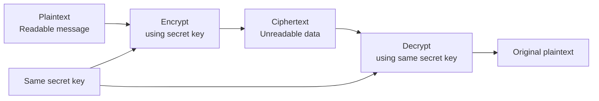

The most important idea:

> The encryption is only as private as the key is secret.

If an attacker gets the key, the encryption no longer protects the data.

## 4. How It Works Internally

At a high level, symmetric encryption works like this:

1. Sender and receiver already have the same secret key.
2. Sender takes plaintext.
3. Sender passes plaintext and secret key into an encryption algorithm.
4. The algorithm produces ciphertext.
5. Sender sends ciphertext over the network.
6. Receiver receives ciphertext.
7. Receiver passes ciphertext and the same secret key into the decryption algorithm.
8. Receiver gets the original plaintext.

Flow diagram:

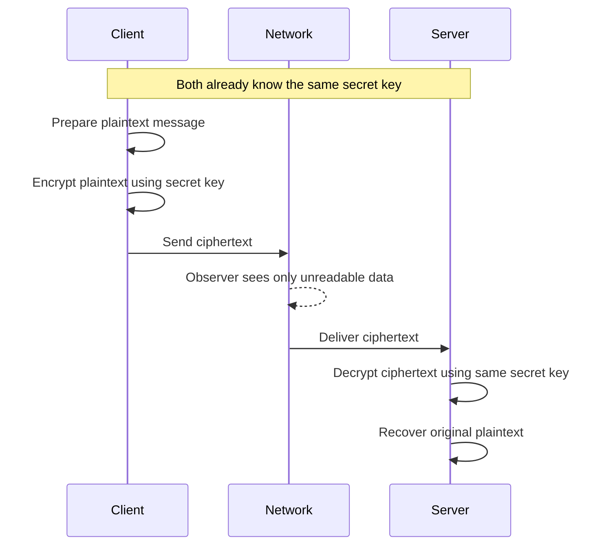

Packet-flow style example:

```text
Step 1: Client has plaintext
        "GET /account/balance"

Step 2: Client encrypts using shared secret key
        Plaintext + Key -> Ciphertext

Step 3: Network packet carries ciphertext
        "a9f13b77d02c..."

Step 4: Server decrypts using same shared secret key
        Ciphertext + Key -> Plaintext

Step 5: Server reads original request
        "GET /account/balance"
```

There are two details worth knowing now, without going too deep:

1. Modern symmetric encryption usually needs a unique value per message, often called a nonce or IV.
2. Modern secure designs often use authenticated encryption, which protects confidentiality and also detects tampering.

Important terms:

| Term | Simple Meaning |
|---|---|
| Nonce | A number used once |
| IV | Initialization value used to make encryption output different even when plaintext repeats |
| Authentication tag | A value used to detect whether ciphertext was modified |

Why a nonce or IV matters:

If the same plaintext always produced the same ciphertext, attackers could notice patterns.

Example:

```text
Plaintext: "APPROVED" -> Ciphertext: "XYZ123"
Plaintext: "APPROVED" -> Ciphertext: "XYZ123"
Plaintext: "DENIED"   -> Ciphertext: "ABC999"
```

Even without decrypting, an attacker could learn that repeated ciphertext means repeated meaning.

A nonce helps avoid that:

```text
Plaintext + Key + Nonce1 -> Ciphertext A
Plaintext + Key + Nonce2 -> Ciphertext B
```

Same message, different encrypted output.

## 5. Real World Example

Human analogy:

Two friends share one physical key to a locked box.

1. Alice writes a message.
2. Alice puts the message into the box.
3. Alice locks the box with the shared key.
4. Bob opens the box using the same key.

Anyone who steals the box but does not have the key cannot read the message.

Computer/network analogy:

A client and server share a secret session key after a secure setup process. Once both sides have that session key, they use symmetric encryption to protect application data.

```text
Client application data -> encrypted with session key -> network -> decrypted by server
```

This is why symmetric encryption matters later for TLS:

TLS uses symmetric encryption for the main data transfer after the client and server establish shared keys. The full TLS details come later, but the foundation is here.

## 6. Advantages

Symmetric encryption is fast.

That is its biggest practical advantage. It is efficient enough to protect large amounts of data, including high-volume web traffic, API traffic, files, logs, and service-to-service communication.

Main advantages:

| Advantage | Why It Matters |
|---|---|
| Fast | Good for large data and high traffic |
| Efficient | Uses less CPU than asymmetric operations |
| Simple mental model | Same secret locks and unlocks data |
| Good for bulk data | Used after secure sessions are established |

For Akamai-scale systems, speed matters because edge platforms may handle huge amounts of traffic. A slow cryptographic method for every byte would become a performance bottleneck.

## 7. Limitations

Symmetric encryption has one major problem:

> Both sides need the same secret key before secure communication starts.

This creates the key distribution problem.

Key distribution problem:

> How do you safely give the secret key to the other party without an attacker stealing it?

If the client sends the secret key over the same unsafe network, an attacker could capture it.

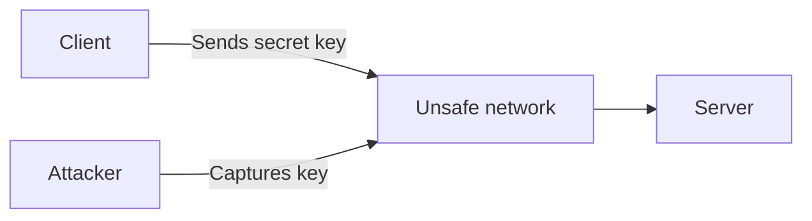

Other limitations:

| Limitation | Explanation |
|---|---|
| Key sharing is hard | The same key must reach both sides safely |
| Poor scalability by itself | Many parties require many shared secrets |
| No identity proof by itself | It does not prove who is on the other side |
| Key compromise is serious | Anyone with the key can decrypt protected data |
| Does not automatically prove integrity | Some encryption modes need separate tamper protection |

For example, if 1,000 systems each need private pairwise communication using only symmetric keys, managing those shared secrets becomes painful.

## 8. Why Later Technologies Were Needed

Symmetric encryption protects data well after both sides share a secret. But it does not solve how two strangers on the internet safely get that shared secret.

That naturally leads to asymmetric encryption.

Symmetric encryption answers:

> How do we protect data when both sides already share a secret?

Asymmetric encryption helps answer:

> How can we communicate securely when we do not already share a secret?

Comparison diagram:

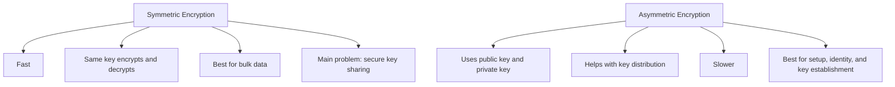

## 9. Interview Questions

### Basic Questions

1. What is symmetric encryption?
2. What is the difference between plaintext and ciphertext?
3. Why must the symmetric key remain secret?
4. Why is symmetric encryption commonly used for bulk data?
5. What happens if an attacker gets the symmetric key?

### Intermediate Questions

1. What is the key distribution problem?
2. Why is using the same key for many systems risky?
3. Why do modern encryption schemes use a nonce or IV?
4. What is the difference between encryption and authenticated encryption?
5. Why is symmetric encryption faster than asymmetric encryption in practice?

### Advanced Questions

1. In a high-traffic edge system, why would symmetric encryption be preferred for application data?
2. What types of bugs might an SDET test for in encrypted communication?
3. How could key reuse create security risks?
4. Why is confidentiality alone not enough if attackers can modify ciphertext?
5. How would you design tests to verify that sensitive API payloads are not sent in plaintext?

### Follow-up Questions

1. If symmetric encryption is fast and secure, why do we need asymmetric encryption?
2. How would two systems agree on a symmetric key over an unsafe network?
3. Does encryption prove the identity of the sender?
4. Does encryption always detect tampering?
5. What logs or packet captures would you check if encrypted communication failed?

---

# Topic 2 - Asymmetric Encryption

## 1. The Problem

Symmetric encryption has a powerful weakness:

> Both sides need the same secret key before they can communicate securely.

That is difficult on the internet.

Imagine a browser connecting to a website for the first time. The browser has never met that server before. They do not already share a secret key.

If the browser sends a symmetric key in plaintext, an attacker on the network can steal it.

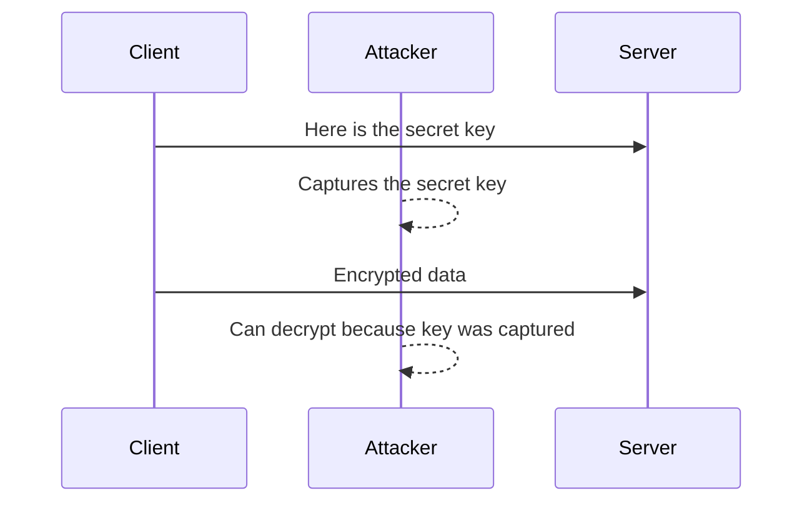

The problem is safe key distribution.

The client needs a way to send protected information to the server without first sharing a secret key.

## 2. Why It Was Invented

Asymmetric encryption was invented to reduce the pain of secret sharing.

Engineers needed a system where:

1. One key could be shared publicly.
2. Another key could remain private.
3. Data protected with the public key could only be opened with the matching private key.

This changed the mental model.

With symmetric encryption:

```text
Same secret key locks and unlocks.
```

With asymmetric encryption:

```text
Public key can lock.
Private key can unlock.
```

This makes it possible for anyone to send protected data to a receiver without already knowing a shared secret.

## 3. What It Actually Is

Simple definition:

> Asymmetric encryption uses two related keys: one public key and one private key.

The public key can be shared with anyone. The private key must be kept secret.

For encryption:

1. Sender encrypts using the receiver's public key.
2. Receiver decrypts using the receiver's private key.

Technical definition:

> Asymmetric encryption is a cryptographic process where a mathematically related public/private key pair is used so that data encrypted with the public key can only be decrypted with the corresponding private key.

Important terms:

| Term | Meaning |
|---|---|
| Public key | A key that can be shared openly |
| Private key | A key that must be protected |
| Key pair | A public key and private key that belong together |
| Encrypt to someone | Encrypt using that person's public key |
| Decrypt as owner | Decrypt using the matching private key |

Concept diagram:

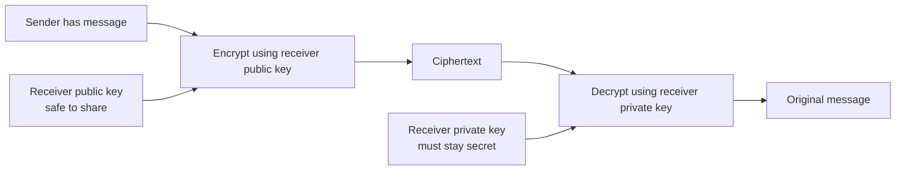

Critical intuition:

> The public key is like an open lock. Anyone can use it to lock a message for you, but only your private key can unlock it.

## 4. How It Works Internally

At a high level, asymmetric encryption works like this:

1. Receiver creates a public/private key pair.
2. Receiver shares the public key.
3. Receiver keeps the private key secret.
4. Sender obtains the receiver's public key.
5. Sender encrypts a message using that public key.
6. Sender sends ciphertext over the network.
7. Receiver decrypts the ciphertext using the private key.

Flow diagram:

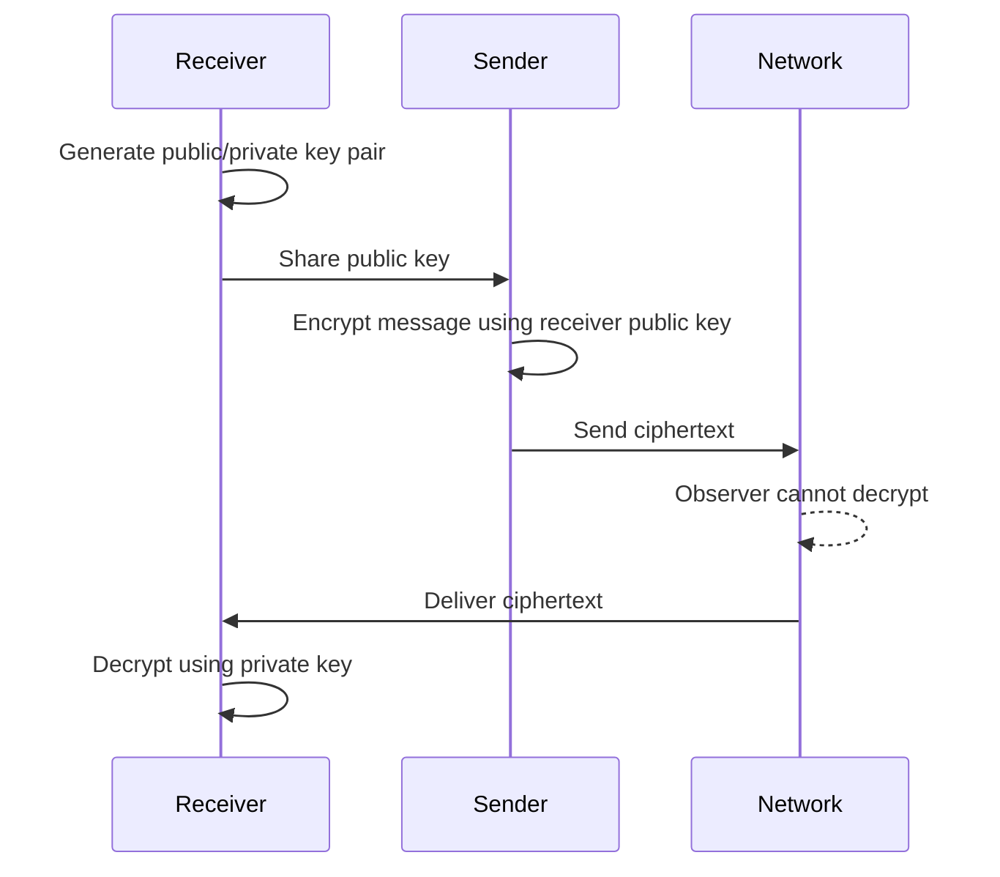

Packet-flow style example:

```text
Step 1: Server owns a key pair
        Public key: can be shared
        Private key: stays on server

Step 2: Client gets the server public key

Step 3: Client encrypts a small secret using server public key
        Secret + Server public key -> Ciphertext

Step 4: Client sends ciphertext over network

Step 5: Server decrypts using private key
        Ciphertext + Server private key -> Secret
```

Important clarification:

Asymmetric encryption is usually not used to encrypt huge amounts of application data directly. It is slower than symmetric encryption.

In real systems, asymmetric cryptography is commonly used to help establish or protect a shared secret. Then symmetric encryption protects the large data flow.

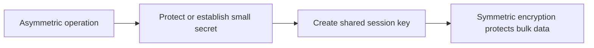

## 5. Real World Example

Human analogy:

Bob gives everyone an open padlock. Anyone can place a message in a box and lock it with Bob's padlock. But only Bob has the private key that opens the padlock.

The padlock is public. The unlocking key is private.

Computer/network analogy:

A server publishes a public key. A client uses that public key to protect a small secret intended for that server. Only the server should be able to recover it because only the server has the matching private key.

This concept becomes important later when learning how secure sessions begin.

## 6. Advantages

Asymmetric encryption solves part of the key distribution problem.

Main advantages:

| Advantage | Why It Matters |
|---|---|
| Public key can be shared | No need to hide the public key |
| Private key stays with owner | Secret material does not need to travel |
| Helps strangers communicate | Useful when systems have not met before |
| Enables identity systems later | Public/private key pairs are a foundation for signatures and certificates |
| Supports secure setup | Useful for establishing secrets used by symmetric encryption |

For internet-scale systems, this is a huge improvement. Clients can begin secure communication with servers they have never contacted before.

## 7. Limitations

Asymmetric encryption is powerful, but it does not solve every problem.

Main limitations:

| Limitation | Explanation |
|---|---|
| Slower than symmetric encryption | Not ideal for bulk data |
| Public key authenticity problem | How do you know the public key really belongs to the expected server? |
| Private key protection is critical | If the private key leaks, security breaks |
| More operational complexity | Keys must be generated, stored, rotated, and protected |
| Not enough by itself for trust | A random public key does not prove identity |

The public key authenticity problem is especially important.

Suppose a client wants the real server's public key. An attacker could intercept the connection and provide the attacker's public key instead.

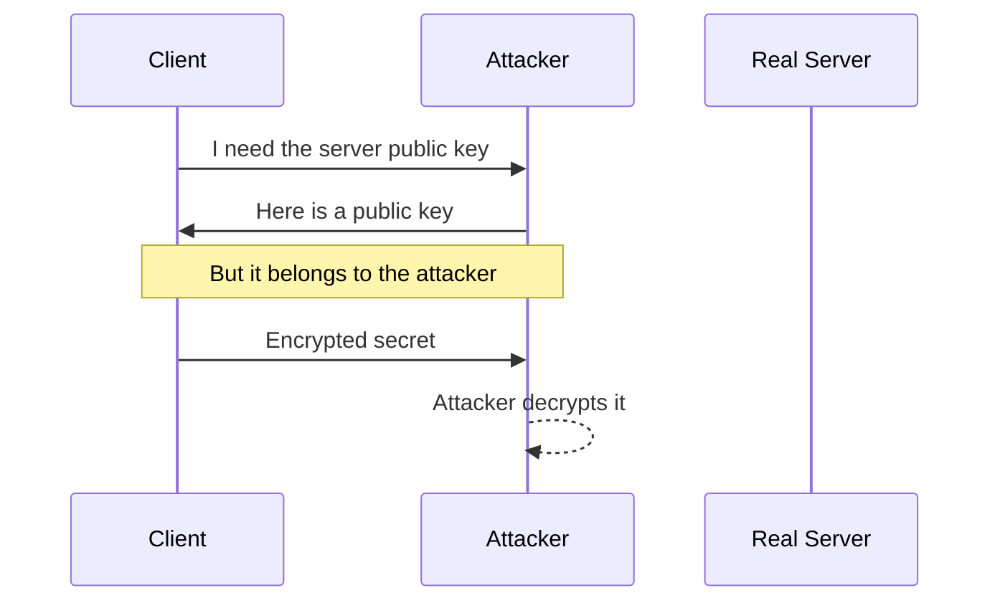

This is not a failure of asymmetric encryption itself. It is a trust problem.

Later, PKI and certificates help answer:

> How does a client know this public key really belongs to that identity?

## 8. Why Later Technologies Were Needed

Asymmetric encryption improves key distribution, but it leaves an important question unanswered:

> Who says this public key belongs to the right system?

That question leads to PKI and certificates later.

But before trust systems, we need two more primitives:

1. Hashing, to detect whether data changed.
2. Digital signatures, to prove that a private key approved specific data.

Comparison diagram:

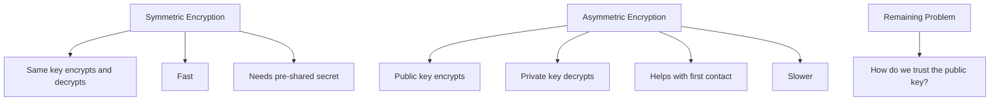

## 9. Interview Questions

### Basic Questions

1. What is asymmetric encryption?
2. What is a public key?
3. What is a private key?
4. Which key is used to encrypt data for a receiver?
5. Which key is used to decrypt data sent to the receiver?

### Intermediate Questions

1. How does asymmetric encryption help with the key distribution problem?
2. Why is asymmetric encryption usually not used for large data transfer?
3. What happens if a private key is compromised?
4. Why is it safe to share a public key?
5. What is the public key authenticity problem?

### Advanced Questions

1. How could an attacker abuse public key substitution?
2. Why does asymmetric encryption still require a trust model?
3. How would you test whether a service protects private keys properly?
4. Why do real systems often combine asymmetric and symmetric cryptography?
5. What are operational risks around key generation, storage, and rotation?

### Follow-up Questions

1. If the public key is public, why can't an attacker decrypt messages?
2. Does asymmetric encryption prove the sender's identity?
3. How is asymmetric encryption different from digital signing?
4. What later technology helps clients trust a server public key?
5. Why might a system use asymmetric crypto only during connection setup?

---

# Topic 3 - Hashing

## 1. The Problem

Encryption protects confidentiality. It hides the content.

But sometimes the problem is not secrecy. Sometimes the problem is change detection.

Questions hashing helps answer:

1. Did this file change?
2. Did this API payload get modified?
3. Is this downloaded artifact the same one the publisher intended?
4. Is this password guess equal to the stored password without storing the password itself?
5. Is this certificate or signed object exactly the same data that was approved?

Before hashing, comparing large data could be inefficient and unreliable.

Imagine downloading a 5 GB file. You want to know whether it arrived correctly. Comparing every byte manually is not practical for humans. You need a compact fingerprint of the data.

The problem is integrity.

Integrity means:

> Data has not been accidentally or maliciously changed.

## 2. Why It Was Invented

Hashing was invented to create a fixed-size fingerprint of data.

Engineers needed a way to:

1. Take data of any size.
2. Produce a compact output.
3. Make the output change dramatically if the input changes.
4. Make it hard to reverse the output back into the original input.
5. Make it hard to find two different inputs with the same output.

Hashing solved the pain point of efficient integrity checking.

Instead of comparing huge data directly, systems compare hashes.

```text
Original file hash:  3a7bd3...
Downloaded file hash: 3a7bd3...

Result: likely unchanged
```

If even one small part changes, the hash should look different.

## 3. What It Actually Is

Simple definition:

> A hash is a one-way fingerprint of data.

You put data in. You get a fixed-size value out. You should not be able to reconstruct the original data from the hash.

Technical definition:

> A cryptographic hash function maps input data of arbitrary length to a fixed-length digest in a way that is deterministic, one-way, collision-resistant, and sensitive to input changes.

Important terms:

| Term | Meaning |
|---|---|
| Input | The original data |
| Hash function | The algorithm that creates the fingerprint |
| Digest | The hash output |
| Deterministic | Same input always gives same hash |
| One-way | Hash output should not reveal the original input |
| Collision | Two different inputs producing the same hash |
| Collision resistance | It should be extremely hard to find collisions |
| Avalanche effect | A tiny input change causes a very different output |

Concept diagram:

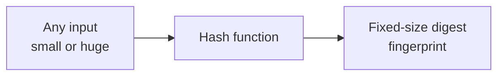

Example:

```text
Input:  "hello"
Hash:   2cf24d...

Input:  "Hello"
Hash:   185f8d...
```

Only one letter changed, but the output becomes completely different.

## 4. How It Works Internally

At a practical level, hashing works like this:

1. A system receives input data.
2. The data is processed by a hash algorithm.
3. The algorithm produces a fixed-size digest.
4. The digest is stored, transmitted, compared, or signed.

Flow diagram:

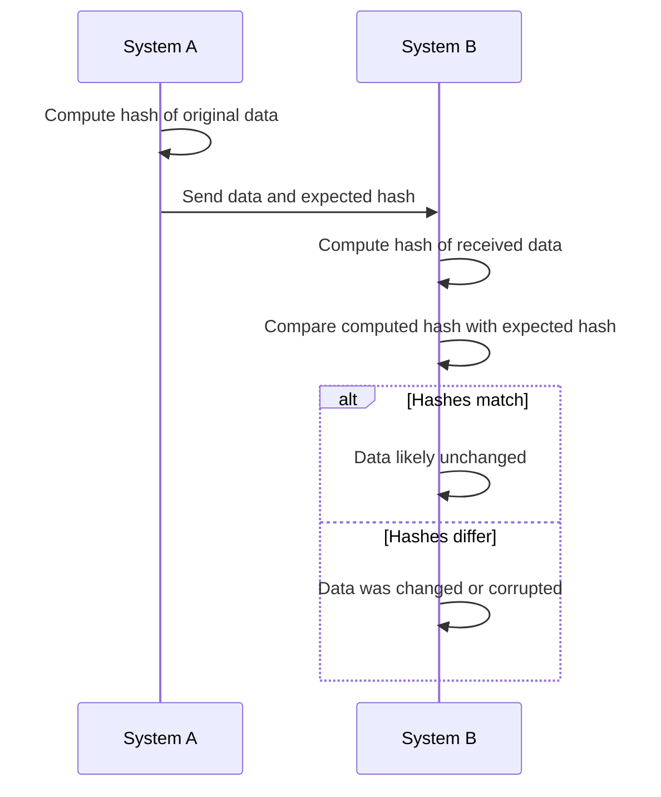

Packet-flow style example:

```text
Step 1: Server publishes file
        file.tar.gz

Step 2: Server publishes expected hash
        SHA-256: abcd1234...

Step 3: Client downloads file

Step 4: Client calculates hash of downloaded file
        SHA-256(file.tar.gz) = abcd1234...

Step 5: Client compares
        Match -> file likely intact
        No match -> file changed or corrupted
```

Hashing is not encryption.

This is a common interview trap.

Comparison diagram:

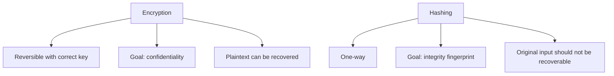

Important difference:

| Question | Encryption | Hashing |
|---|---|---|
| Can you recover original data? | Yes, with the key | No |
| Main goal | Hide content | Detect change |
| Uses a key? | Yes | Usually no |
| Output size | Depends on input and mode | Fixed size |
| Example use | Protect API payload | Verify file integrity |

One more useful concept: keyed hashes.

A normal hash proves only that data matches a digest. If an attacker can change both the data and the digest, a plain hash is not enough.

A keyed hash uses a secret key along with the data. A common design is called HMAC.

Simple idea:

```text
HMAC = hash-like integrity check using a secret key
```

Why mention it here?

Because later protocols often need integrity checks that only parties with a shared secret can create. You do not need to master HMAC now, but remember this:

> Plain hashes detect accidental or visible changes. Keyed integrity checks help detect unauthorized changes.

## 5. Real World Example

Human analogy:

Imagine every document has a unique-looking fingerprint stamp. If even one sentence changes, the stamp changes. You cannot recreate the full document from the stamp, but you can use the stamp to check whether the document is the same.

Computer/network analogy:

An SDET downloads a test build and verifies the checksum before running tests.

```text
Expected SHA-256:  9f86d081884c...
Actual SHA-256:    9f86d081884c...
Result: build artifact is intact
```

Another example:

An API receives a payload and a signature. Before verifying the signature, the system hashes the payload. The signature is checked against the hash, not usually against the full raw payload. This idea becomes important in digital signatures.

## 6. Advantages

Hashing is useful because it is compact, fast, and sensitive to changes.

Main advantages:

| Advantage | Why It Matters |
|---|---|
| Fixed-size output | Easy to store and compare |
| Fast | Works well for files, payloads, and messages |
| Detects changes | Small input changes create different digest |
| One-way | Digest should not reveal original data |
| Foundation for signatures | Digital signatures usually sign a hash of data |

For SDET work, hashing shows up in:

1. Artifact validation.
2. API request integrity.
3. Password storage concepts.
4. Certificate fingerprints.
5. Signature workflows.
6. Troubleshooting mismatched content.

## 7. Limitations

Hashing does not hide data.

If you hash a message, the original message is not encrypted. The hash is only a fingerprint.

Main limitations:

| Limitation | Explanation |
|---|---|
| No confidentiality | A hash does not hide the original data |
| No identity by itself | Anyone can hash data |
| Plain hash can be replaced | An attacker may change both data and hash if there is no trusted source |
| Weak hash algorithms can break | If collisions are practical, integrity guarantees weaken |
| Password hashing needs special care | Fast general-purpose hashes are not enough for password storage |

Important SDET mindset:

If a system says "we secured it using SHA-256," ask:

1. Secured what?
2. Against what threat?
3. Is the hash trusted?
4. Is there a key?
5. Is there a signature?

A plain hash alone does not prove who created the data.

## 8. Why Later Technologies Were Needed

Hashing detects changes, but it does not prove who approved the data.

Anyone can calculate a hash.

Example:

```text
Original:
amount=100
hash=abc123

Attacker changes:
amount=900
hash=def456
```

If the receiver has no trusted expected hash, the attacker can replace both the data and the hash.

This leads to digital signatures.

Hashing answers:

> Did the data change compared to a known digest?

Digital signatures answer:

> Did the holder of a private key approve this exact data?

Comparison diagram:

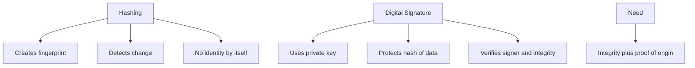

## 9. Interview Questions

### Basic Questions

1. What is a hash?
2. Is hashing reversible?
3. What is a digest?
4. What is the difference between hashing and encryption?
5. What does integrity mean?

### Intermediate Questions

1. Why does a small input change produce a very different hash?
2. What is a collision?
3. Why is collision resistance important?
4. Why is a plain hash not enough to prove who created data?
5. What is the difference between a hash and an HMAC at a high level?

### Advanced Questions

1. How would you test file integrity validation in an automation framework?
2. What security issue exists if an attacker can modify both a file and its published hash?
3. Why are fast hash functions not ideal by themselves for password storage?
4. How are hashes used inside digital signature workflows?
5. What failure symptoms might appear if two systems canonicalize payloads differently before hashing?

### Follow-up Questions

1. Can hashing protect sensitive data in transit?
2. If two hashes match, does that always prove the source is trusted?
3. Why do certificates often have fingerprints?
4. What happens if a system uses a weak hash algorithm?
5. How would you explain hashing to someone who keeps calling it encryption?

---

# Topic 4 - Digital Signatures

## 1. The Problem

Hashing detects whether data changed, but it does not prove who created or approved the data.

Asymmetric encryption helps protect data for a receiver, but encryption alone does not prove that a specific sender approved a specific message.

The missing problem is authenticity.

Authenticity means:

> We can verify that data came from, or was approved by, the expected identity or key holder.

There is also a related concept: non-repudiation.

Non-repudiation means:

> A signer should not be able to easily deny that they signed the data, assuming their private key was protected.

For interviews, say this carefully. Non-repudiation depends on private key protection, policies, audit logs, and legal/operational controls. Cryptography helps, but operations matter too.

The core problem:

> How can a receiver verify that a message was not changed and was approved by the holder of a specific private key?

## 2. Why It Was Invented

Digital signatures were invented because systems needed a way to trust data even when it travels through untrusted networks or storage.

Engineers needed a method where:

1. A sender can create proof tied to specific data.
2. The proof can be verified by others.
3. The sender does not need to reveal the private key.
4. If data changes, verification fails.

Pain points solved:

1. Software updates need proof they came from the vendor.
2. API messages may need proof they were not modified.
3. Certificates need proof that an authority approved their contents.
4. Distributed systems need trusted configuration and metadata.

Digital signatures combine two ideas you already learned:

1. Hashing: creates a fingerprint of the data.
2. Asymmetric keys: private key creates the signature, public key verifies it.

## 3. What It Actually Is

Simple definition:

> A digital signature is cryptographic proof that a private key approved a specific piece of data.

Technical definition:

> A digital signature is a value generated from data, usually from a hash of that data, using a private key, and verifiable using the corresponding public key to confirm integrity and signer authenticity.

Important terms:

| Term | Meaning |
|---|---|
| Signer | The party that creates the signature |
| Verifier | The party that checks the signature |
| Private key | Used to create the signature |
| Public key | Used to verify the signature |
| Message digest | Hash of the data being signed |
| Signature | Cryptographic proof attached to or stored with data |

Concept diagram:

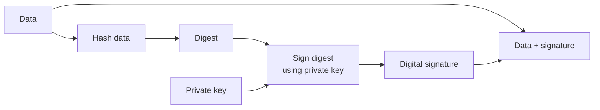

Verification concept:

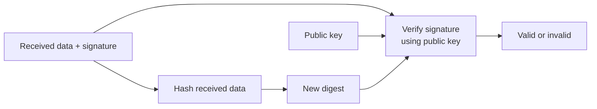

Important distinction:

Digital signing is not the same as encryption.

| Concept | Goal | Key Used First | Who Can Use Result |
|---|---|---|---|
| Encrypt for privacy | Hide data | Receiver public key or shared secret | Only someone with decrypting key |
| Sign for authenticity | Prove approval and detect change | Signer private key | Anyone with signer public key can verify |

## 4. How It Works Internally

Signature creation flow:

1. Sender prepares the data.
2. Sender hashes the data.
3. Sender signs the hash using the private key.
4. Sender sends the data and signature.

Signature verification flow:

1. Receiver gets the data and signature.
2. Receiver hashes the received data.
3. Receiver uses the signer's public key to verify the signature.
4. If verification succeeds, the receiver knows:
   - The data matches what was signed.
   - The signature was created using the matching private key.
5. If verification fails, the data, signature, or key is wrong.

Flow diagram:

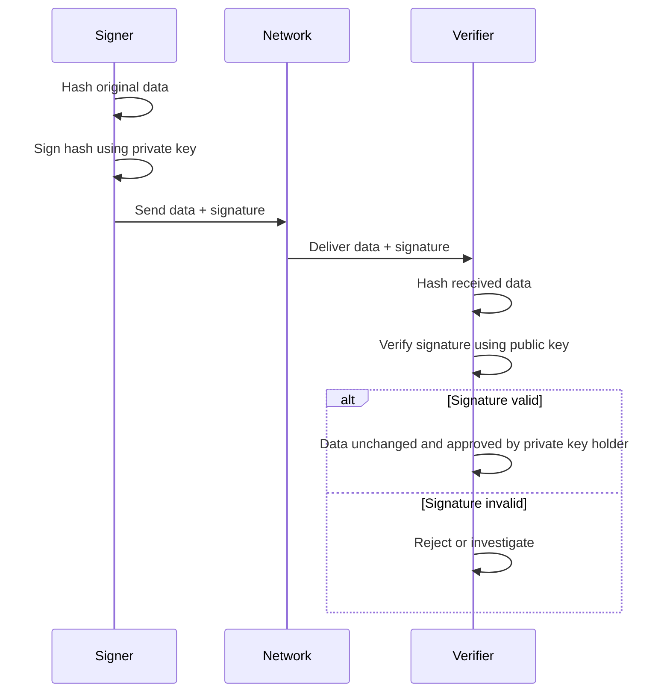

Packet-flow style example:

```text
Step 1: Server publishes config
        config = "enable_feature=true"

Step 2: Server hashes config
        digest = Hash(config)

Step 3: Server signs digest with private key
        signature = Sign(digest, private_key)

Step 4: Client receives:
        config + signature

Step 5: Client hashes received config
        digest2 = Hash(received_config)

Step 6: Client verifies signature using server public key
        Verify(signature, digest2, public_key)

Step 7:
        Valid -> accept config
        Invalid -> reject config
```

Why sign the hash instead of the full data?

Because hashing creates a compact fingerprint. Signing a small digest is efficient and still binds the signature to the full data. If the data changes, the digest changes, and verification fails.

Comparison diagram:

Signature creation vs verification:

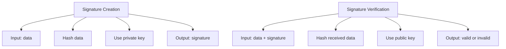

## 5. Real World Example

Human analogy:

A handwritten signature on a contract says, "I approve this document." If someone changes the contract after signing, the signature no longer honestly applies to the modified document.

A digital signature is stricter than a handwritten signature because even a tiny data change should break verification.

Computer/network analogy:

A software vendor releases an update package and a digital signature. Your system verifies the signature before installing the update. If an attacker modifies the update package, verification fails.

Another future-looking example:

Certificates contain data, including identity information and a public key. A certificate is signed so clients can detect whether the certificate content was approved and whether it was modified. The full certificate trust model belongs in later sections, but signatures are the cryptographic building block.

## 6. Advantages

Digital signatures provide integrity and authenticity together.

Main advantages:

| Advantage | Why It Matters |
|---|---|
| Detects tampering | Modified data fails verification |
| Proves private key approval | Only the private key holder should create valid signatures |
| Public verification | Many systems can verify using the public key |
| Does not expose private key | Verification does not require the signing secret |
| Foundation for certificates | Later PKI systems rely heavily on signatures |

For SDET work, digital signatures matter because many failures in security workflows are signature validation failures:

1. Wrong key.
2. Modified payload.
3. Unsupported algorithm.
4. Expired or rotated signing material.
5. Incorrect canonicalization before signing.

Canonicalization means converting data into a standard format before hashing or signing. If two systems format the same logical data differently, signatures may fail.

## 7. Limitations

Digital signatures do not automatically make everything trusted.

Main limitations:

| Limitation | Explanation |
|---|---|
| Public key trust still matters | You must know whose public key you are using |
| Private key compromise breaks trust | Attackers with private key can create valid signatures |
| Does not hide data | Signed data may still be readable |
| Depends on correct verification | Skipping verification makes signatures useless |
| Algorithm support matters | Systems must agree on allowed algorithms and formats |

Common mistake:

> "The data is signed, so it is encrypted."

Wrong.

Signed data can still be readable. Signing proves integrity and approval. Encryption provides confidentiality.

Comparison diagram:

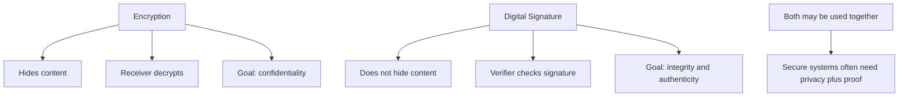

## 8. Why Later Technologies Were Needed

Digital signatures prove that a matching private key signed data. But one question remains:

> How do I know the public key I used for verification belongs to the expected identity?

That question leads to PKI and certificates later.

Before that, we still need key exchange.

Why?

Because real network sessions need efficient shared symmetric keys. Digital signatures can help authenticate data, but they do not by themselves create a fast shared encryption key for a session.

Digital signatures answer:

> Did the private key holder approve this data?

Key exchange answers:

> How do two sides create a shared secret for secure communication?

## 9. Interview Questions

### Basic Questions

1. What is a digital signature?
2. Which key is used to create a digital signature?
3. Which key is used to verify a digital signature?
4. Does a digital signature encrypt data?
5. What two properties does a digital signature usually provide?

### Intermediate Questions

1. Why do systems usually sign a hash instead of signing the entire raw data directly?
2. What happens if signed data is modified?
3. Why does public key trust matter during signature verification?
4. What is the difference between encryption and signing?
5. What does non-repudiation mean, and what are its practical limits?

### Advanced Questions

1. How would you test that a service rejects modified signed payloads?
2. What could cause signature verification to fail even if the correct key is used?
3. Why is private key protection critical for signing systems?
4. How can canonicalization bugs break signatures?
5. How do digital signatures become important in certificate validation?

### Follow-up Questions

1. If anyone can verify a signature using a public key, why can't anyone create the signature?
2. What is the difference between "signed" and "trusted"?
3. Can signed data still be sensitive?
4. What should a system do when signature verification fails?
5. How would you explain digital signatures to someone using a contract analogy?

---

# Topic 5 - Key Exchange

## 1. The Problem

Symmetric encryption is fast and good for protecting data, but both sides need the same secret key.

Asymmetric encryption helps with first contact, but it is slower and not ideal for encrypting all application traffic.

So real systems need a practical solution:

> Two systems that do not already share a secret must create the same shared secret over an unsafe network.

This is the key exchange problem.

Important:

The goal is not simply "send the key." Sending the key directly can expose it.

The goal is:

> Both sides end up with the same secret, while observers on the network do not learn that secret.

## 2. Why It Was Invented

Key exchange was invented because secure communication needs both:

1. A way to start securely with a stranger.
2. A fast shared key for ongoing encrypted communication.

Engineers needed a method where:

1. Client and server exchange some public information.
2. Each side uses its own secret information.
3. Both sides calculate the same shared secret.
4. Network observers cannot calculate that shared secret from the public messages alone.

This solved the pain point between asymmetric and symmetric crypto:

| Need | Best Tool |
|---|---|
| Start communication without pre-shared secret | Asymmetric cryptography / key exchange |
| Protect lots of traffic efficiently | Symmetric encryption |

## 3. What It Actually Is

Simple definition:

> Key exchange is a method for two parties to create the same shared secret across an unsafe network.

Technical definition:

> Key exchange is a cryptographic protocol that allows two parties to derive shared secret keying material by exchanging public values and combining them with private values, without directly transmitting the final shared secret.

Important terms:

| Term | Meaning |
|---|---|
| Shared secret | Secret value both sides calculate |
| Key material | Raw secret material used to derive usable encryption keys |
| Session key | A temporary key used for one communication session |
| Public value | Information sent over the network during exchange |
| Private value | Secret information kept locally |
| Passive attacker | Attacker who observes traffic |
| Active attacker | Attacker who modifies or injects traffic |

Concept diagram:

```mermaid
flowchart LR
    C1["Client private value"] --> C2["Client calculation"]
    S1["Server public value"] --> C2
    C2 --> C3["Shared secret"]

    S2["Server private value"] --> S3["Server calculation"]
    C4["Client public value"] --> S3
    S3 --> S4["Same shared secret"]

    C4 -.sent over network.-> S3
    S1 -.sent over network.-> C2
```

The beautiful idea:

> The network sees exchanged public values, but not the private values needed to compute the final shared secret.

## 4. How It Works Internally

At a high level, many key exchange methods follow this pattern:

1. Client creates a private value.
2. Client derives a public value from it.
3. Server creates a private value.
4. Server derives a public value from it.
5. Client and server exchange public values.
6. Client combines:
   - Client private value
   - Server public value
7. Server combines:
   - Server private value
   - Client public value
8. Both sides arrive at the same shared secret.
9. Both sides derive symmetric encryption keys from that shared secret.
10. Application data is protected using symmetric encryption.

Flow diagram:

```mermaid
sequenceDiagram
    participant C as Client
    participant N as Network
    participant S as Server

    C->>C: Generate private value
    C->>C: Create public value
    S->>S: Generate private value
    S->>S: Create public value

    C->>N: Send client public value
    N->>S: Deliver client public value
    S->>N: Send server public value
    N->>C: Deliver server public value

    C->>C: Combine client private value + server public value
    S->>S: Combine server private value + client public value

    C->>C: Derive shared secret
    S->>S: Derive same shared secret

    C->>C: Derive symmetric session keys
    S->>S: Derive same symmetric session keys
```

Packet-flow style thinking:

```text
Network sees:
    Client public value
    Server public value

Network does not see:
    Client private value
    Server private value
    Final shared secret
    Final session keys
```

This is why key exchange is powerful. It allows secure setup even when the network itself is observable.

However, key exchange has one more important problem:

> A passive attacker may only observe, but an active attacker may intercept and replace public values.

That leads to the need for authentication.

Unauthenticated key exchange can be vulnerable to a man-in-the-middle attack.

```mermaid
sequenceDiagram
    participant C as Client
    participant A as Attacker
    participant S as Server

    C->>A: Client public value
    A->>S: Attacker public value
    S->>A: Server public value
    A->>C: Attacker public value

    Note over C,A: Client shares a secret with attacker
    Note over A,S: Server shares a different secret with attacker
```

The client thinks it is talking securely to the server. The server thinks it is talking securely to the client. The attacker sits in the middle.

This is why later systems combine key exchange with authentication, signatures, and certificates.

## 5. Real World Example

Human analogy:

Two people are in a public room where everyone can hear them. They use a special agreed method that lets each person say some public information out loud. After the exchange, both people calculate the same secret number privately. Listeners heard the public parts but still cannot calculate the secret.

Computer/network analogy:

A client and server begin a secure session. They exchange public key exchange values. Each side combines the received public value with its own private value. Both derive the same session key. Then they use symmetric encryption to protect the rest of the traffic.

```text
Setup phase:
    Public exchange + private calculations -> shared secret

Data phase:
    Shared secret -> symmetric session keys -> encrypted application traffic
```

This is a core idea behind modern secure protocols. The exact TLS packet details come later.

## 6. Advantages

Key exchange gives systems a practical way to create shared secrets dynamically.

Main advantages:

| Advantage | Why It Matters |
|---|---|
| No pre-shared secret required | Useful for first-time communication |
| Shared secret is not directly sent | Reduces exposure on the network |
| Enables session keys | Each connection can use temporary keys |
| Works well with symmetric encryption | Setup can be asymmetric, data transfer can be symmetric |
| Supports forward secrecy in modern designs | Past traffic can remain protected even if long-term keys leak later, depending on the design |

Forward secrecy simple definition:

> Past encrypted sessions should remain safe even if a long-term private key is compromised later.

Do not go deep into this yet. Just remember it matters later in TLS.

## 7. Limitations

Key exchange by itself does not prove identity.

Main limitations:

| Limitation | Explanation |
|---|---|
| Needs authentication | Otherwise active attackers may intercept |
| Protocol details matter | Small implementation mistakes can break security |
| Randomness matters | Weak random values can weaken the exchange |
| Key derivation must be correct | Shared secret must be converted into safe usable keys |
| Algorithm compatibility matters | Client and server must support compatible methods |

The most important limitation:

> Key exchange can create a shared secret, but authentication is needed to know who you share it with.

This distinction is interview gold.

Bad answer:

> Key exchange makes the connection secure.

Better answer:

> Key exchange helps both sides derive shared keys. The protocol also needs authentication to prevent man-in-the-middle attacks.

## 8. Why Later Technologies Were Needed

Key exchange gives us a shared secret. But real internet systems still need:

1. A way to authenticate the server.
2. A way to bind public keys to identities.
3. A way to verify signed data.
4. A way to manage trust at scale.
5. A way to rotate, revoke, and renew credentials.

That is why later sections cover:

1. PKI.
2. X.509 certificates.
3. TLS.
4. Certificate lifecycle.
5. Revocation.
6. OpenSSL testing.

Comparison diagram:

```mermaid
flowchart TD
    A["Symmetric Encryption"] --> A1["Protects data after shared key exists"]
    B["Asymmetric Encryption"] --> B1["Helps with first contact and public/private key operations"]
    C["Hashing"] --> C1["Detects data changes"]
    D["Digital Signatures"] --> D1["Proves private key approved data"]
    E["Key Exchange"] --> E1["Creates shared secret across unsafe network"]

    A1 --> F["Secure session foundations"]
    B1 --> F
    C1 --> F
    D1 --> F
    E1 --> F
    F --> G["Later: PKI and TLS"]
```

## 9. Interview Questions

### Basic Questions

1. What is key exchange?
2. Why not just send the symmetric key over the network?
3. What is a shared secret?
4. What is a session key?
5. What is the difference between a public value and a private value?

### Intermediate Questions

1. How does key exchange solve the symmetric key distribution problem?
2. Why is key exchange usually followed by symmetric encryption?
3. What can a passive attacker see during key exchange?
4. Why does unauthenticated key exchange have risk?
5. What is a man-in-the-middle attack at a high level?

### Advanced Questions

1. Why does key exchange need authentication in real protocols?
2. What types of SDET tests would you design for key negotiation failure?
3. What can go wrong if random number generation is weak?
4. Why are temporary session keys useful?
5. What is forward secrecy at a beginner-friendly level?

### Follow-up Questions

1. Does key exchange encrypt application data by itself?
2. How is key exchange related to symmetric encryption?
3. How is key exchange related to asymmetric cryptography?
4. Why do secure protocols combine multiple cryptographic primitives?
5. What later topics depend heavily on understanding key exchange?

---

# Section 1 Summary

The five concepts in this section solve different problems.

| Concept | Solves | Does Not Solve Alone |
|---|---|---|
| Symmetric encryption | Keeps data private using a shared key | How to safely share the key |
| Asymmetric encryption | Allows public/private key operations | How to trust the public key |
| Hashing | Detects data changes | Who created or approved the data |
| Digital signatures | Proves private-key approval and detects tampering | Whether the public key itself is trusted |
| Key exchange | Creates shared secrets over unsafe networks | Identity without authentication |

The most important learning point:

> Secure systems combine primitives. No single primitive does everything.

For an Akamai SDET-II interview, you should be able to explain these combinations clearly:

1. Symmetric encryption is fast and protects bulk traffic.
2. Asymmetric cryptography helps systems communicate without pre-shared secrets.
3. Hashing creates fingerprints for integrity.
4. Digital signatures combine hashing and private keys to prove approval.
5. Key exchange creates session secrets for encrypted communication.
6. Authentication and trust systems are needed later to prevent impersonation.

## Common Interview Traps

| Trap Question | Strong Answer |
|---|---|
| Is hashing encryption? | No. Hashing is one-way and used for integrity. Encryption is reversible with a key and used for confidentiality. |
| Does signing hide data? | No. Signing proves integrity and authenticity. Encryption hides data. |
| Does asymmetric encryption replace symmetric encryption? | No. Asymmetric operations are usually slower and often help establish keys. Symmetric encryption protects bulk data. |
| Does key exchange prove identity? | Not by itself. It needs authentication to prevent man-in-the-middle attacks. |
| If a public key is public, is it automatically trusted? | No. You need a trust model to know who the key belongs to. |

## Beginner-Friendly Mental Model

```mermaid
flowchart TD
    A["I need privacy"] --> B["Use encryption"]
    B --> C{"Do both sides already share a secret?"}
    C -->|"Yes"| D["Symmetric encryption"]
    C -->|"No"| E["Use asymmetric/key exchange setup"]

    F["I need to know data did not change"] --> G["Hashing"]
    H["I need to know who approved the data"] --> I["Digital signature"]
    J["I need a fast key for this session"] --> K["Key exchange creates shared secret"]

    D --> L["Secure communication foundations"]
    E --> L
    G --> L
    I --> L
    K --> L
```

## How This Prepares You for Later Sections

Section 2, PKI, depends on digital signatures and public key trust.

Section 3, X.509 certificates, depends on understanding public keys, signatures, hashes, identity, and trust.

Section 4, TLS, depends on symmetric encryption, key exchange, signatures, and certificates.

Section 5, certificate lifecycle, depends on knowing why keys and certificates must be issued, renewed, rotated, and revoked.

Section 6, RSA vs ECDSA, depends on understanding public/private key pairs and signatures before comparing algorithms.

Section 7, revocation, depends on understanding that trust can change after something was issued.

Section 8, OpenSSL, becomes much easier once these concepts are clear because the commands are just practical ways to create, inspect, sign, verify, and test cryptographic objects.

## Final Self-Check

You are ready to move to PKI when you can answer these without memorizing:

1. Why is symmetric encryption fast but not enough by itself?
2. Why does asymmetric encryption help with first contact?
3. Why is hashing not encryption?
4. Why do digital signatures use private keys for signing and public keys for verification?
5. Why does key exchange need authentication?
6. Why do real systems combine multiple cryptographic primitives?

If these answers feel intuitive, the next topics will become much easier.
