# SECTION 2 - PKI

## Purpose of This Section

Section 1 taught the cryptographic building blocks:

1. Symmetric encryption protects data with a shared secret.
2. Asymmetric cryptography uses public/private key pairs.
3. Hashing detects changes.
4. Digital signatures prove that a private key approved specific data.
5. Key exchange creates shared secrets for sessions.

Section 2 answers the next big question:

> If anyone can create a public/private key pair, how do we know which public key belongs to the real server, company, service, or identity?

That question is the reason PKI exists.

Without PKI, a client may receive a public key, but it cannot safely know whether that key belongs to the real service or an attacker.

Section 2 covers:

1. Public Key Infrastructure
2. Certificate Authorities
3. Root CA
4. Intermediate CA
5. Trust Store

Important boundary for this file:

This file explains PKI and certificate trust at a conceptual and workflow level. It does not teach full X.509 certificate field-by-field structure, TLS handshake packet details, certificate lifecycle automation, revocation protocols, or RSA/ECDSA algorithm internals. Those come later.

## Why Section 2 Exists in the Roadmap

The learning path is intentionally ordered:

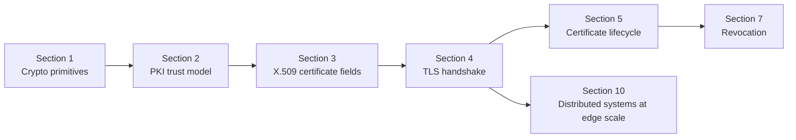

Section 1 tells you what signatures and public keys are.

Section 2 tells you how public keys become trusted at scale.

That matters deeply for an Akamai SDET-II role because edge platforms handle customer traffic securely. A tester must understand not only whether encryption happens, but also whether the identity behind that encryption is trustworthy.

## One-Screen Mental Model

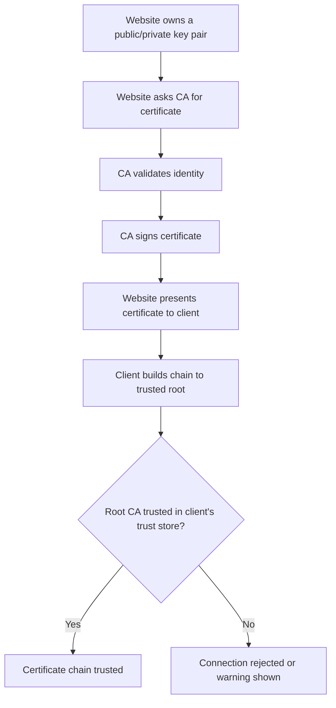

PKI is not just encryption.

PKI is about trust.

---

# Topic 1 - Public Key Infrastructure

## 1. The Problem

Asymmetric cryptography gives us public/private key pairs.

But there is a serious problem:

> Anyone can generate a public/private key pair and claim to be anyone.

For example, an attacker can create a key pair and say:

```text
This public key belongs to api.example.com
```

The math may be valid. The key pair may work. But the claim may be false.

This is the public key trust problem.

The client needs to answer:

1. Who owns this public key?
2. Who verified that ownership?
3. Is the verifier trusted?
4. Has the certificate been modified?
5. Is the certificate still valid for use?

Without a trust system, public keys are just random cryptographic objects.

They do not automatically prove identity.

## 2. Why It Was Invented

PKI was invented because internet-scale systems needed a way to trust public keys without manually configuring every key everywhere.

Imagine if every browser had to manually store the public key of every website:

```text
google.com -> public key A
akamai.com -> public key B
bank.com -> public key C
api.partner.com -> public key D
```

This would not scale.

It would also fail whenever:

1. A site rotates its key.
2. A company adds new domains.
3. A certificate expires.
4. A key is compromised.
5. Millions of clients need trust updates.

Engineers needed a scalable model where:

1. Trusted organizations verify identities.
2. Those organizations sign certificates.
3. Clients trust certificates by verifying signatures.
4. Trust can be distributed through a hierarchy.

PKI solves the pain point of identity at scale.

## 3. What It Actually Is

Simple definition:

> PKI is the system that lets clients trust public keys by using certificates, certificate authorities, and trust stores.

Technical definition:

> Public Key Infrastructure is a collection of policies, roles, hardware, software, cryptographic keys, certificates, certificate authorities, repositories, and procedures used to create, manage, distribute, validate, and revoke public key certificates.

Do not let the formal definition intimidate you.

For interview understanding, PKI is mainly this:

```text
Identity + Public Key + CA Signature + Client Trust Store = Trust Decision
```

Important terms:

| Term | Meaning |
|---|---|
| Public key | Key that others can use to verify signatures or encrypt to the owner |
| Private key | Secret key held by the owner |
| Certificate | A signed document that binds an identity to a public key |
| Certificate Authority | A trusted organization or system that signs certificates |
| Trust chain | A sequence of certificates leading back to a trusted root |
| Trust store | A local list of root CAs trusted by the client/system |
| Relying party | The client or system that verifies and relies on the certificate |

Concept diagram:

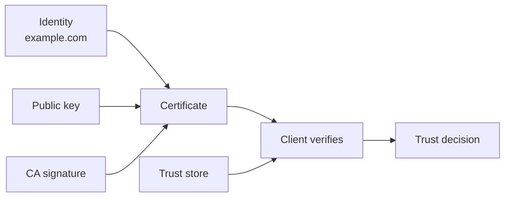

The central idea:

> PKI binds public keys to identities using certificates signed by trusted authorities.

## 4. How It Works Internally

At a high level, PKI works through a chain of trust.

Basic flow:

1. A server or organization creates a key pair.
2. It keeps the private key secret.
3. It requests a certificate for its identity.
4. A CA verifies the identity according to its rules.
5. The CA signs a certificate containing the identity and public key.
6. The server presents that certificate to clients.
7. The client verifies the certificate signature chain.
8. The client checks whether the chain ends at a trusted root CA.
9. If validation succeeds, the client trusts the public key for that identity.

Flow diagram:

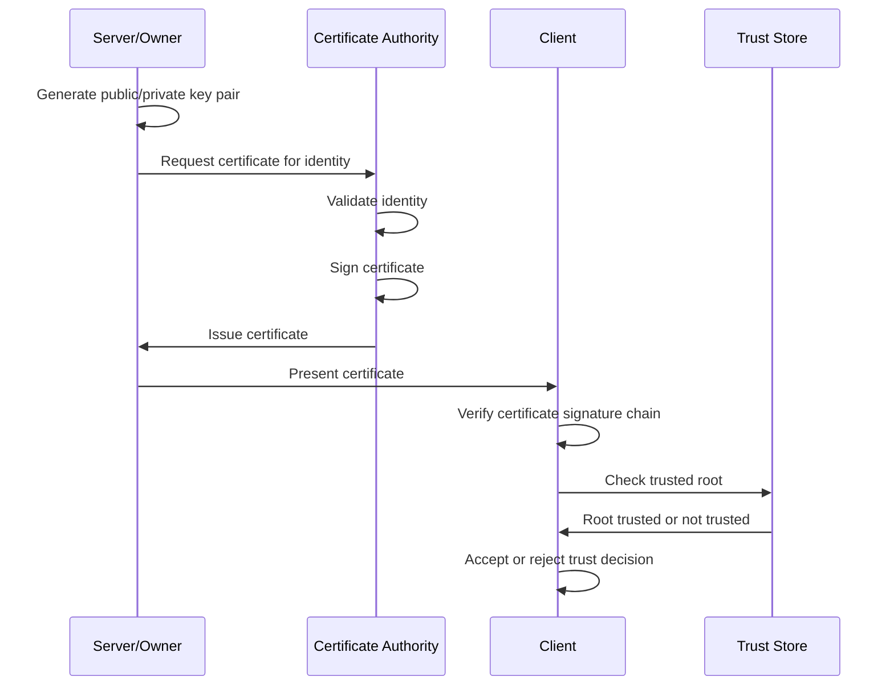

Packet-flow style thinking:

```text
Client connects to server
Server sends certificate chain
Client validates signatures in the chain
Client checks certificate identity
Client checks validity rules
Client checks whether chain ends in trusted root
Client accepts or rejects
```

PKI relies on digital signatures.

The CA signs the certificate. The client verifies that signature. If the signed content changes, verification fails.

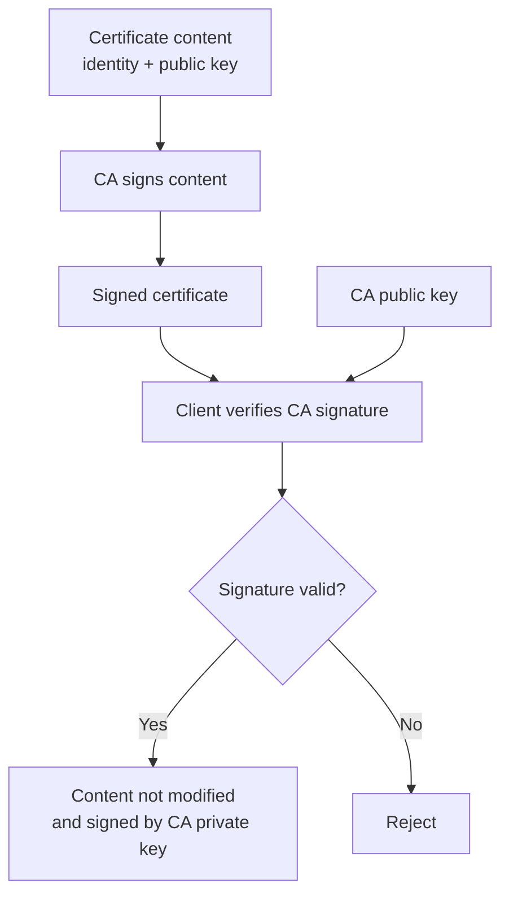

Important:

PKI does not make a server trustworthy in every human sense. It means the client can verify that a specific public key has been certified for a specific identity under a trusted CA system.

## 5. Real World Example

Human analogy:

Imagine you meet someone who says, "I am an employee of Company X."

You do not personally know them. But they show an ID card issued by Company X. You trust the ID card because:

1. The company is known.
2. The card has anti-tamper features.
3. The card names the person.
4. The card is not expired.

PKI is similar:

1. The server says, "I am api.example.com."
2. It presents a certificate.
3. The certificate was signed by a CA.
4. The client checks whether it trusts that CA.

Computer/network analogy:

A browser connects to `https://www.example.com`.

The server presents a certificate saying:

```text
Identity: www.example.com
Public key: server public key
Signed by: Intermediate CA
```

The browser validates the chain to a trusted root CA in its trust store. If validation succeeds, the browser can trust that public key for `www.example.com`.

## 6. Advantages

PKI provides scalable trust.

Main advantages:

| Advantage | Why It Matters |
|---|---|
| Scales trust | Clients do not need every server key pre-installed |
| Supports identity verification | Public keys are bound to identities |
| Uses digital signatures | Tampering can be detected |
| Supports hierarchy | Root and intermediate CAs distribute trust |
| Enables secure internet protocols | HTTPS and many internal service systems depend on it |
| Supports operations | Certificates can be issued, renewed, rotated, and revoked |

For Akamai-scale systems, PKI matters because edge servers may terminate secure connections for massive numbers of customer domains. Trust must be automated, verifiable, and reliable.

## 7. Limitations

PKI is powerful, but it is not magic.

Main limitations:

| Limitation | Explanation |
|---|---|
| Trust depends on trusted roots | If a root is trusted, certificates under it may be trusted |
| CA mistakes can be serious | Incorrect issuance can create security risk |
| Private key compromise is dangerous | Attackers may impersonate services if they get private keys |
| Validation must be correct | Broken client validation can accept bad certificates |
| Operational complexity is high | Expiry, renewal, rotation, and revocation must be managed |
| Trust stores differ | Different clients may trust different roots |

Important SDET risk:

A system may appear to use certificates, but still be insecure if it:

1. Skips hostname validation.
2. Accepts expired certificates.
3. Accepts self-signed certificates unexpectedly.
4. Ignores chain validation errors.
5. Trusts the wrong CA bundle.

## 8. Why Later Technologies Were Needed

PKI gives the trust model, but we still need to understand the pieces more deeply.

This section introduces the system. Later sections explain:

1. X.509 certificate fields: what exactly is inside a certificate.
2. TLS: how certificates are used during secure connection setup.
3. Certificate lifecycle: how certificates are issued, renewed, rotated, and revoked.
4. Revocation: how clients learn that a certificate should no longer be trusted.

PKI answers:

> How can public keys be trusted at scale?

X.509 answers:

> What exact data structure carries the identity, public key, issuer, and signature?

TLS answers:

> How does a client use that certificate during a secure connection?

Comparison diagram:

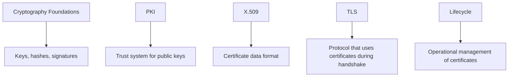

## 9. Interview Questions

### Basic Questions

1. What is PKI?
2. Why do we need PKI if we already have public/private keys?
3. What problem does PKI solve?
4. What is a certificate at a high level?
5. What is a trust chain?

### Intermediate Questions

1. How does PKI bind a public key to an identity?
2. Why does a client need a trust store?
3. What is the difference between encryption and trust validation?
4. Why is a self-generated public key not automatically trusted?
5. What checks should a client perform before trusting a certificate?

### Advanced Questions

1. What can go wrong if certificate chain validation is disabled?
2. How would you test whether an API client rejects an untrusted certificate?
3. Why do large distributed systems need automated PKI workflows?
4. How can different trust stores cause different validation results?
5. What risks exist if a CA incorrectly issues a certificate?

### Follow-up Questions

1. Does PKI encrypt traffic by itself?
2. Does a valid certificate prove the server is bug-free or safe?
3. What is the difference between a trusted key and a mathematically valid key?
4. Why does PKI depend on digital signatures?
5. What later topics depend on PKI?

---

# Topic 2 - Certificate Authorities

## 1. The Problem

PKI needs trusted entities that can verify identities and sign certificates.

Without Certificate Authorities, every client would need to decide trust manually.

That would create chaos:

```text
Client A trusts key 1 for example.com
Client B trusts key 2 for example.com
Client C has no idea which key to trust
```

The problem is delegated trust.

Clients cannot personally verify every server, domain, organization, device, user, or internal service. They need trusted authorities to perform verification and issue signed certificates.

## 2. Why It Was Invented

Certificate Authorities were invented to act as trusted issuers of certificates.

Engineers needed a role that could:

1. Verify that a requester controls an identity.
2. Sign a certificate binding that identity to a public key.
3. Follow policies for issuance.
4. Be audited or controlled.
5. Allow clients to verify issued certificates.

The CA reduces the trust burden on clients.

Instead of every client verifying every identity directly, clients trust selected CAs. Those CAs verify identities and sign certificates.

## 3. What It Actually Is

Simple definition:

> A Certificate Authority is a trusted system or organization that signs certificates after validating identity.

Technical definition:

> A Certificate Authority is an entity in a PKI that issues digitally signed certificates by validating certificate requests and binding subject identities to public keys according to defined policies.

Important terms:

| Term | Meaning |
|---|---|
| CA | Certificate Authority |
| Issuer | The CA that signs a certificate |
| Subject | The identity the certificate is about |
| Certificate request | A request asking a CA to issue a certificate |
| Validation | The CA's process for confirming identity or control |
| Signing | The CA uses its private key to approve certificate content |
| CA policy | Rules the CA follows before issuing certificates |

Concept diagram:

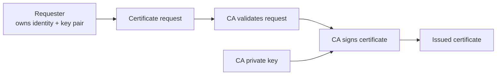

The CA is trusted because clients trust the CA's signing authority, not because the certificate holder's public key is special by itself.

## 4. How It Works Internally

The CA issuance process usually follows this high-level flow:

1. The requester generates a key pair.
2. The requester keeps the private key secret.
3. The requester submits a certificate request.
4. The CA verifies identity or control.
5. The CA creates certificate content.
6. The CA signs the certificate content using the CA private key.
7. The issued certificate is returned to the requester.
8. The requester installs the certificate on the service.
9. Clients later verify the certificate using the CA chain.

Flow diagram:

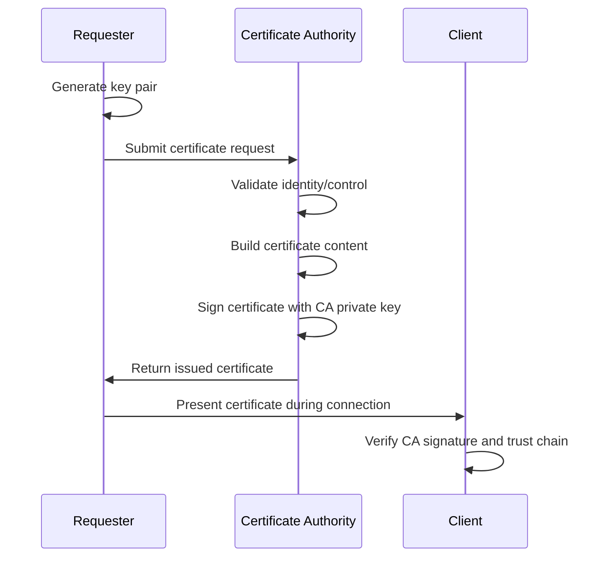

Packet-flow style thinking during client validation:

```text
Server sends:
    Leaf certificate
    Intermediate certificate if needed

Client checks:
    Who issued the leaf certificate?
    Can I verify the issuer signature?
    Does the chain lead to a trusted root?
    Does the identity match what I connected to?
    Is the certificate currently valid?
```

The CA's private key is extremely sensitive.

If a CA private key is compromised, attackers may be able to issue certificates that clients trust. This is why CA private keys are protected using strong operational controls, often including hardware security modules.

You do not need deep hardware details now. Just remember:

> CA private keys are high-value signing keys.

## 5. Real World Example

Human analogy:

A government passport office checks documents and issues a passport. A border officer trusts the passport because it was issued by a trusted authority, not because the traveler personally convinced every border officer in the world.

Computer/network analogy:

A company requests a certificate for `www.company.com`. A CA verifies the company controls that domain. The CA signs a certificate. Browsers trust the certificate if they can build a chain from that certificate to a root CA in their trust store.

SDET analogy:

You are testing a certificate provisioning platform. You may need to verify:

1. Valid requests produce valid certificates.
2. Invalid domain control requests are rejected.
3. Certificates are signed by the expected CA.
4. Issued certificates chain correctly.
5. Errors are clear when validation fails.

## 6. Advantages

Certificate Authorities make public key trust scalable.

Main advantages:

| Advantage | Why It Matters |
|---|---|
| Centralized issuance policy | Certificates follow defined rules |
| Scalable trust delegation | Clients trust CAs instead of every individual key |
| Signature-based verification | Clients can detect tampered certificates |
| Supports hierarchy | Root CAs can delegate to intermediate CAs |
| Supports automation | Certificate platforms can issue at high volume |

For an edge platform, CA integration enables automated secure onboarding of domains and services.

## 7. Limitations

CAs are powerful, so CA failures have large impact.

Main limitations:

| Limitation | Explanation |
|---|---|
| CA compromise is severe | Attackers could issue trusted-looking certificates |
| Mis-issuance risk | A CA may accidentally issue for an identity requester does not control |
| Policy complexity | Rules for issuance can be strict and operationally complex |
| Trust is not universal | Some clients may not trust a CA |
| Revocation is still needed | Issued certificates may later need to be distrusted |

Important distinction:

> A CA validates identity according to policy. It does not guarantee that the server application is secure, bug-free, or non-malicious forever.

Certificate trust is scoped.

It means the certificate was issued under a trust model. It does not mean the entire service is safe in every way.

## 8. Why Later Technologies Were Needed

CAs are necessary, but a flat CA model would still be risky.

If root CAs signed every server certificate directly, root private keys would need to be used frequently. Frequent use increases exposure and operational risk.

That leads to CA hierarchy:

1. Root CA at the top.
2. Intermediate CAs below it.
3. Leaf/server certificates issued below intermediates.

Certificate Authorities answer:

> Who signs certificates after validating identities?

Root and intermediate CAs answer:

> How do we structure trust safely and operationally?

Comparison diagram:

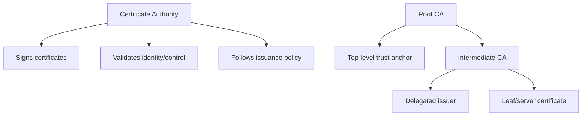

## 9. Interview Questions

### Basic Questions

1. What is a Certificate Authority?
2. What does a CA do before issuing a certificate?
3. Which key does a CA use to sign certificates?
4. What does it mean for a CA to be trusted?
5. What is certificate issuance?

### Intermediate Questions

1. Why do clients trust certificates signed by certain CAs?
2. What is the difference between a CA and a certificate holder?
3. Why is CA private key protection critical?
4. What is certificate mis-issuance?
5. Why might an internal platform use a private CA?

### Advanced Questions

1. How would you test a CA-backed certificate provisioning workflow?
2. What negative tests would you perform for certificate issuance?
3. What risks exist if a CA validates domain ownership incorrectly?
4. How can CA trust differ across operating systems or browsers?
5. What operational controls matter around CA signing keys?

### Follow-up Questions

1. Does a CA encrypt user traffic?
2. Does a CA need to be online for every client connection?
3. What happens if a certificate is signed by an unknown CA?
4. Why do CAs not usually sign every certificate directly from a root?
5. How does a client verify a CA signature?

---

# Topic 3 - Root CA

## 1. The Problem

Every trust chain needs a starting point.

If a server certificate is signed by an intermediate CA, and that intermediate is signed by another CA, the client eventually reaches a top-level certificate.

The client must ask:

> Where does trust begin?

This is a hard problem because signatures can verify mathematical relationships, but they cannot create trust from nothing.

At some point, the client must already trust something.

That trusted starting point is the root CA.

## 2. Why It Was Invented

Root CAs were invented to act as trust anchors.

Engineers needed a top-level authority that:

1. Is trusted directly by client systems.
2. Can sign intermediate CAs.
3. Is protected with very strong security.
4. Is used rarely to reduce risk.
5. Provides a stable root of trust for many certificate chains.

The root CA solves the "trust starting point" problem.

Without a trusted root, a client could verify signatures forever and still not know whether any issuer should be trusted.

## 3. What It Actually Is

Simple definition:

> A Root CA is the top-level trusted CA that acts as the starting point of certificate trust.

Technical definition:

> A Root Certificate Authority is a self-signed certificate authority whose certificate is installed as a trust anchor in client trust stores and whose private key is used to sign subordinate CA certificates, usually intermediate CAs.

Important terms:

| Term | Meaning |
|---|---|
| Trust anchor | A certificate trusted directly by the client |
| Self-signed certificate | A certificate signed by its own private key |
| Root certificate | The public certificate representing the root CA |
| Root private key | Highly protected private key used by the root CA |
| Subordinate CA | A CA below the root, often an intermediate CA |

Concept diagram:

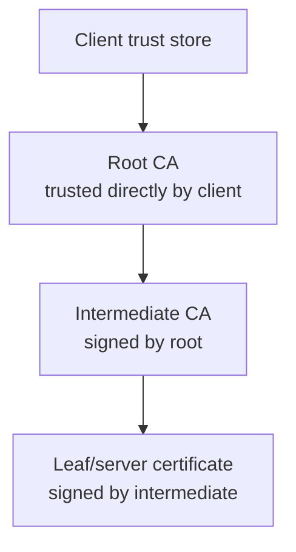

The root CA is trusted because it is pre-installed or explicitly configured in the client's trust store.

## 4. How It Works Internally

A root CA is usually not used for everyday server certificate issuance.

Instead, the root signs intermediate CA certificates. The intermediate CAs then issue leaf/server certificates.

High-level flow:

1. Root CA key pair is created under strict controls.
2. Root CA certificate is created.
3. Root certificate is added to trust stores.
4. Root CA signs one or more intermediate CA certificates.
5. Root private key is kept highly protected and used rarely.
6. Clients trust chains that lead back to this root.

Flow diagram:

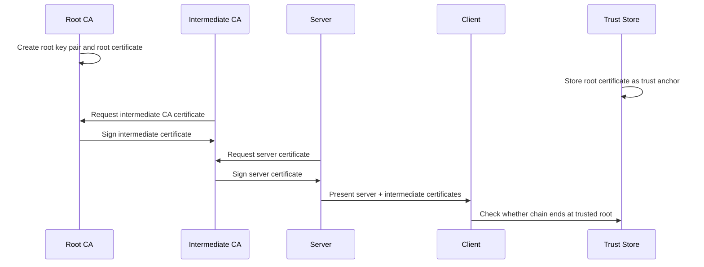

Trust-chain validation thinking:

```text
Leaf certificate:
    Signed by Intermediate CA

Intermediate certificate:
    Signed by Root CA

Root certificate:
    Trusted directly in client trust store

Decision:
    If signatures and rules validate, chain is trusted
```

Why is a root often self-signed?

Because there is no higher CA above it. A self-signature can prove the root certificate has not been modified, but trust comes from the fact that the root is installed in the trust store.

Important:

> A root certificate is trusted by configuration, not because another CA signed it.

## 5. Real World Example

Human analogy:

A country's highest passport authority is trusted by law and policy. Local offices may issue documents under authority delegated from the top-level government authority.

You do not need every local office to be trusted independently by every border officer. The trust traces back to a top-level authority.

Computer/network analogy:

A browser has a set of trusted root CA certificates. When it receives a website certificate chain, it tries to build a path to one of those trusted roots.

If the root is in the browser or operating system trust store, the chain may be trusted if all other checks pass.

If the root is not trusted, the browser rejects the certificate chain or shows a warning.

## 6. Advantages

Root CAs provide stable trust anchors.

Main advantages:

| Advantage | Why It Matters |
|---|---|
| Clear trust starting point | Clients know where trust begins |
| Scalable delegation | Root can sign intermediates |
| Strong protection model | Root private keys can be used rarely |
| Trust store compatibility | Clients can maintain known trusted roots |
| Supports large ecosystems | Many certificates can chain back to known roots |

For large platforms, root CAs allow a manageable trust model instead of manually trusting every certificate issuer.

## 7. Limitations

Root CAs are extremely sensitive.

Main limitations:

| Limitation | Explanation |
|---|---|
| Root compromise is catastrophic | Many chains under that root may become untrustworthy |
| Trust store inclusion is hard | A root must be accepted by client ecosystems |
| Removal has broad impact | Removing a root can break many certificate chains |
| Root trust is broad | Clients may trust many certificates under a trusted root |
| Operational mistakes are costly | Root key handling must be very strict |

Important SDET perspective:

If you test internal systems, you may see private root CAs. A test environment may trust a company root CA that public browsers do not trust.

So always ask:

1. Which trust store is being used?
2. Is this public PKI or private PKI?
3. Is the root expected to be trusted in this environment?

## 8. Why Later Technologies Were Needed

Root CAs should not do all signing work directly.

If the root private key is used frequently, exposure risk increases.

Intermediate CAs were needed to safely delegate certificate issuance.

Root CA answers:

> Where does trust begin?

Intermediate CA answers:

> How can the root delegate issuance without exposing the root key frequently?

Comparison diagram:

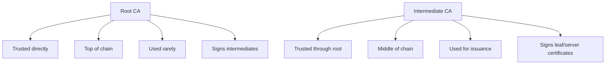

## 9. Interview Questions

### Basic Questions

1. What is a Root CA?
2. What is a trust anchor?
3. Why is a root certificate often self-signed?
4. Where are trusted root certificates stored?
5. What does it mean for a chain to end at a trusted root?

### Intermediate Questions

1. Why should root private keys be used rarely?
2. How does a root CA delegate trust?
3. What is the difference between a root CA and a leaf certificate?
4. Why does trust come from the trust store rather than the root's self-signature alone?
5. What happens if a client does not trust the root CA?

### Advanced Questions

1. What is the impact of root CA compromise?
2. How would you test certificate validation against different root stores?
3. Why might a certificate work in one environment but fail in another?
4. What risks exist when test environments install custom root CAs?
5. How should an SDET reason about public PKI versus private PKI?

### Follow-up Questions

1. Does a root CA directly encrypt traffic?
2. Can a system have multiple trusted roots?
3. Is every self-signed certificate a trusted root?
4. Why might a root be removed from a trust store?
5. How does a client know a root is trusted?

---

# Topic 4 - Intermediate CA

## 1. The Problem

Root CAs are too sensitive to use for everyday certificate issuance.

If a root CA directly signed every server certificate, the root private key would need to be available more often. That increases risk.

There is also an operational problem:

Different teams, products, regions, environments, or certificate types may need different issuance policies.

For example:

1. Public website certificates.
2. Internal service certificates.
3. Device certificates.
4. Short-lived testing certificates.
5. Customer-managed certificates.

Using one root key for all of this would be dangerous and hard to manage.

## 2. Why It Was Invented

Intermediate CAs were invented to delegate certificate issuance while protecting the root.

Engineers needed a structure where:

1. Root CA remains highly protected.
2. Intermediate CAs handle day-to-day issuance.
3. Different intermediates can have different policies.
4. If an intermediate is compromised, damage can be limited compared to root compromise.
5. Clients can still build trust back to the root.

Intermediate CAs solve the operational scaling problem of PKI.

## 3. What It Actually Is

Simple definition:

> An Intermediate CA is a CA that is trusted because it was signed by a Root CA or another higher-level CA.

Technical definition:

> An Intermediate Certificate Authority is a subordinate CA whose certificate is signed by a parent CA and whose private key is authorized to sign leaf certificates or additional subordinate CA certificates according to policy constraints.

Important terms:

| Term | Meaning |
|---|---|
| Intermediate CA | A CA between the root and leaf certificates |
| Parent CA | The CA that signs the intermediate |
| Subordinate CA | A CA below another CA |
| Leaf certificate | End-entity certificate used by a server, user, device, or service |
| Chain | Ordered certificates from leaf toward root |
| Delegation | Passing limited signing authority from root to intermediate |

Concept diagram:

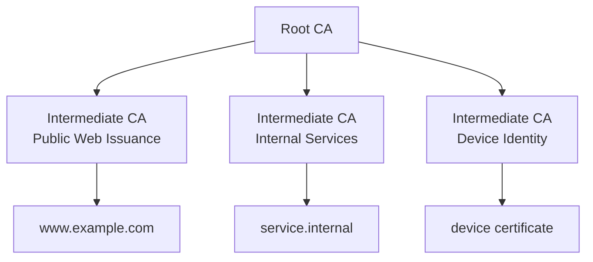

The intermediate is trusted because the chain can be verified back to a trusted root.

## 4. How It Works Internally

Intermediate CA creation and use:

1. Intermediate CA generates a key pair.
2. Intermediate CA requests a CA certificate from a parent CA.
3. Parent CA validates and signs the intermediate CA certificate.
4. Intermediate CA becomes authorized to issue certificates according to policy.
5. Server or service requests a leaf certificate from the intermediate.
6. Intermediate validates the request.
7. Intermediate signs the leaf certificate.
8. Server presents the leaf certificate and intermediate certificate to clients.
9. Client validates from leaf to intermediate to root.

Flow diagram:

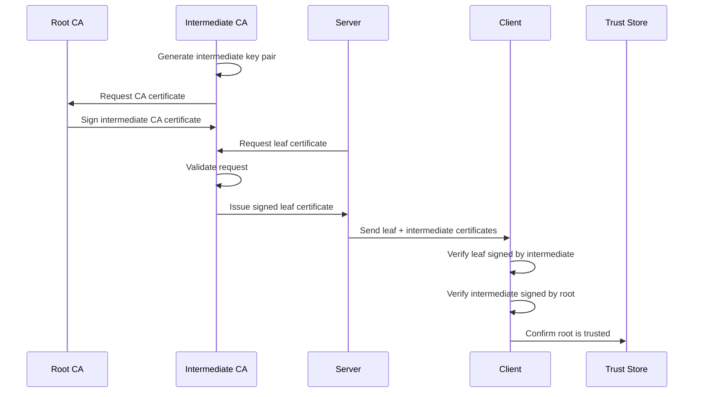

Certificate chain example:

```text
Leaf certificate:
    Subject: www.example.com
    Issuer: Example Intermediate CA

Intermediate certificate:
    Subject: Example Intermediate CA
    Issuer: Example Root CA

Root certificate:
    Subject: Example Root CA
    Trusted directly by client trust store
```

Important operational detail:

Servers usually send the leaf certificate and intermediate certificates. They usually do not need to send the root certificate because the client should already have the trusted root in its trust store.

If the server forgets to send the needed intermediate certificate, some clients may fail to build the chain.

This is a common real-world certificate deployment issue.

## 5. Real World Example

Human analogy:

A national authority authorizes regional offices to issue documents. The regional office can issue documents because it was authorized by the national authority.

If a regional office has a problem, the national authority may revoke or stop trusting that regional office without replacing the entire national authority.

Computer/network analogy:

A website certificate is signed by an intermediate CA. The browser does not directly trust the intermediate by default, but it verifies that the intermediate was signed by a trusted root CA.

SDET analogy:

You are testing a service deployment. The service certificate is valid, but clients fail with:

```text
unable to get local issuer certificate
```

One possible cause:

The server did not send the intermediate certificate, so the client cannot build a complete chain to a trusted root.

## 6. Advantages

Intermediate CAs make PKI safer and more scalable.

Main advantages:

| Advantage | Why It Matters |
|---|---|
| Protects root CA | Root key can stay offline or rarely used |
| Supports delegation | Different intermediates can issue for different purposes |
| Limits blast radius | Intermediate problems are less severe than root compromise |
| Improves operations | Issuance can be automated through intermediates |
| Enables policy separation | Different rules can apply to different certificate types |

For edge systems, intermediates are useful because certificate operations happen at huge scale. You need delegation, automation, and clear trust boundaries.

## 7. Limitations

Intermediate CAs also add complexity.

Main limitations:

| Limitation | Explanation |
|---|---|
| Chain must be complete | Missing intermediates can break validation |
| Intermediate compromise is serious | Attackers may issue certificates under that intermediate |
| Policy must be enforced | Incorrect constraints can create overbroad authority |
| More moving parts | More certificates, expirations, and deployments to manage |
| Client behavior may differ | Some clients fetch missing intermediates; others do not |

Important SDET risk:

Do not test only the leaf certificate. Test the complete chain.

Useful validation questions:

1. Is the leaf signed by the expected intermediate?
2. Is the intermediate signed by the expected root?
3. Is the full chain presented correctly?
4. Does the chain validate in a clean client environment?
5. Does validation fail when the intermediate is missing or wrong?

## 8. Why Later Technologies Were Needed

Intermediate CAs explain hierarchy, but clients still need a local source of trust.

A client can verify signatures in a chain, but it still needs to know which root CAs are trusted.

That leads to trust stores.

Intermediate CA answers:

> How does trust get delegated safely below a root?

Trust store answers:

> Which root CAs does this client trust in the first place?

Comparison diagram:

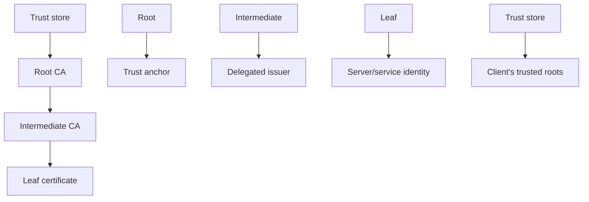

## 9. Interview Questions

### Basic Questions

1. What is an Intermediate CA?
2. Why do we use intermediate CAs?
3. What is a leaf certificate?
4. Who signs an intermediate CA certificate?
5. Who usually signs a server certificate?

### Intermediate Questions

1. Why is it risky for a root CA to sign every server certificate directly?
2. What happens if a server does not send the intermediate certificate?
3. How does a client validate a chain involving an intermediate?
4. How do intermediate CAs reduce root CA exposure?
5. Why might an organization use different intermediates for different purposes?

### Advanced Questions

1. How would you test a service for complete certificate chain delivery?
2. What are the risks of intermediate CA compromise?
3. How can client differences affect intermediate chain validation?
4. What negative tests would you create for wrong or missing intermediates?
5. How can intermediate CA policy mistakes affect security?

### Follow-up Questions

1. Does the client need to trust the intermediate directly?
2. Why does the chain need to reach a trusted root?
3. Should servers send the root certificate?
4. Can there be more than one intermediate in a chain?
5. What error messages suggest an intermediate chain problem?

---

# Topic 5 - Trust Store

## 1. The Problem

A certificate chain eventually reaches a root CA.

But the client still has to decide:

> Do I trust this root CA?

That decision cannot come from the certificate chain alone.

If every root CA in the world were automatically trusted, attackers could create their own root CA, issue certificates, and everything would validate.

So clients need a controlled list of trusted roots.

That list is the trust store.

## 2. Why It Was Invented

Trust stores were invented to give clients a local source of trusted root CA certificates.

Engineers needed a mechanism where:

1. Operating systems, browsers, runtimes, or applications can define trusted roots.
2. Certificate validation can end at a known trust anchor.
3. Trust can be added, updated, or removed.
4. Different environments can use different trust policies.

The pain point solved:

> Clients need a practical way to know which root CAs are trusted.

Without trust stores, PKI has no reliable trust starting point.

## 3. What It Actually Is

Simple definition:

> A trust store is a collection of root CA certificates that a client trusts.

Technical definition:

> A trust store is a system, browser, runtime, or application-managed repository of trusted certificates, usually root CA certificates, used as trust anchors during certificate path validation.

Important terms:

| Term | Meaning |
|---|---|
| Trust store | Local repository of trusted CA certificates |
| CA bundle | File or collection containing trusted CA certificates |
| Trust anchor | A trusted root certificate used to end validation |
| System trust store | Trust store managed by the operating system |
| Application trust store | Trust store managed by a specific application |
| Private trust store | Custom trust list for internal systems |

Concept diagram:

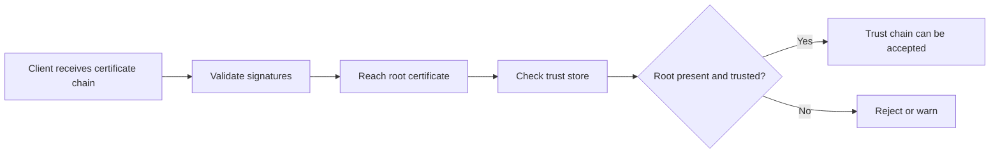

The trust store is the client's memory of who it is willing to trust.

## 4. How It Works Internally

Certificate validation with a trust store usually works like this:

1. Client receives a leaf certificate and intermediate certificates.
2. Client checks the leaf certificate signature.
3. Client checks the intermediate certificate signature.
4. Client builds a path toward a root certificate.
5. Client checks whether the root certificate is in the trust store.
6. Client applies other validation rules.
7. Client accepts or rejects the certificate.

Flow diagram:

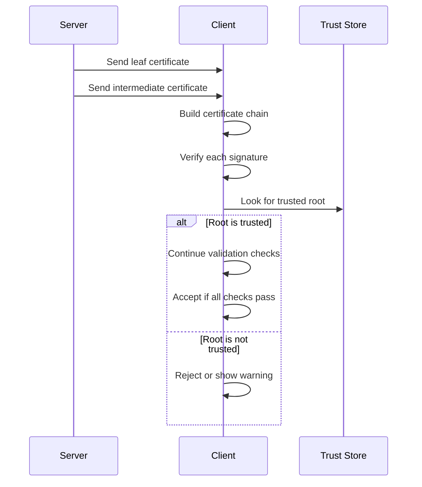

Important validation checks include:

1. Does the certificate chain cryptographically verify?
2. Does the chain end at a trusted root?
3. Is the certificate currently within its validity period?
4. Does the certificate identity match the service being contacted?
5. Is the certificate allowed for this purpose?
6. Has the certificate been revoked? Revocation is covered later.

Keep the scope clear:

This section explains why the trust store matters. Later sections explain exact certificate fields and revocation mechanisms.

Comparison diagram:

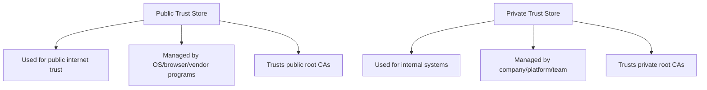

## 5. Real World Example

Human analogy:

Imagine a security guard has an approved issuer list. If an ID card comes from an issuer on the approved list, the guard continues checking it. If the issuer is not on the approved list, the guard rejects it even if the card looks professional.

Computer/network analogy:

Your browser trusts certificates only if the chain leads to a root CA trusted by the browser or operating system. A certificate signed by your own test CA may fail in a normal browser unless that test CA root is installed into the trust store.

SDET analogy:

A test passes on your laptop but fails in CI.

Possible reason:

Your laptop has a custom root CA installed. The CI runner does not.

This is not an application bug by itself. It is a trust store difference.

## 6. Advantages

Trust stores make trust decisions manageable.

Main advantages:

| Advantage | Why It Matters |
|---|---|
| Provides trust anchors | Validation has a defined endpoint |
| Centralizes trust policy | Trusted roots can be managed |
| Supports public and private PKI | Different environments can trust different roots |
| Allows trust removal | Bad or obsolete roots can be removed |
| Enables client-side validation | Clients can independently verify chains |

For distributed systems, trust stores allow services, containers, runtimes, and clients to enforce expected trust boundaries.

## 7. Limitations

Trust stores can cause confusing failures.

Main limitations:

| Limitation | Explanation |
|---|---|
| Trust stores differ | Browser, OS, Java, Python, and containers may use different stores |
| Custom roots can hide issues | Tests may pass only because a local machine trusts extra roots |
| Missing roots break validation | Clients reject chains ending at unknown roots |
| Updates matter | Old trust stores may not trust newer roots |
| Too much trust is risky | Adding broad roots increases what the client accepts |

Common SDET issue:

```text
curl works, browser fails
browser works, Java client fails
local works, container fails
staging works, production fails
```

One possible cause:

Different trust stores or CA bundles are being used.

Important testing habit:

Always identify which trust store the client actually uses.

## 8. Why Later Technologies Were Needed

Trust stores complete the basic PKI trust model, but real systems need more details.

After you understand trust stores, you are ready to learn:

1. What fields are inside a certificate.
2. How a TLS client receives and validates a certificate during a handshake.
3. How certificates are renewed, rotated, and revoked.
4. How tools like OpenSSL inspect and debug trust chains.

Trust store answers:

> Which root CAs does this client trust?

X.509 answers:

> What certificate fields does the client inspect?

TLS answers:

> When and how does this validation happen during connection setup?

Comparison diagram:

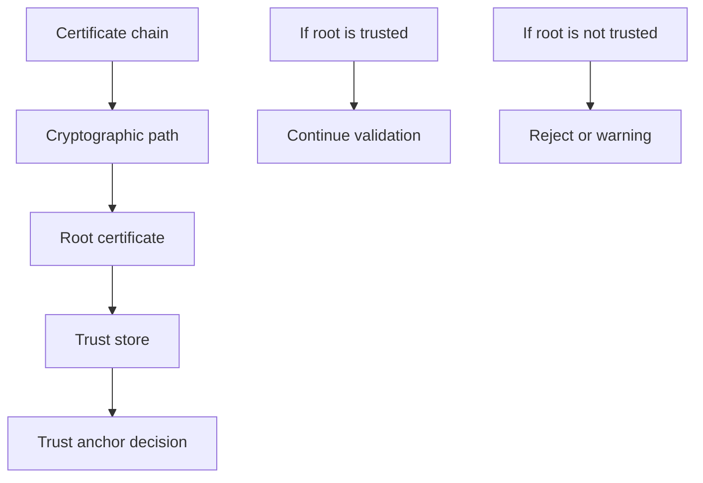

## 9. Interview Questions

### Basic Questions

1. What is a trust store?
2. What is a CA bundle?
3. What is a trust anchor?
4. Why does a client need a trust store?
5. What happens if a root CA is not in the trust store?

### Intermediate Questions

1. Why can the same certificate work in one client but fail in another?
2. What is the difference between a system trust store and application trust store?
3. Why is adding a custom root CA risky?
4. How do private PKI environments use trust stores?
5. What checks happen after a chain reaches a trusted root?

### Advanced Questions

1. How would you debug a certificate failure caused by a trust store mismatch?
2. How would you design tests for public CA versus private CA trust?
3. Why might a containerized service fail certificate validation while the host succeeds?
4. What are the risks of disabling certificate verification in tests?
5. How can outdated trust stores affect production traffic?

### Follow-up Questions

1. Does a trust store contain private keys?
2. Should test automation disable certificate verification to avoid failures?
3. Why might Java and curl produce different certificate validation results?
4. What is the safest way to test services using a private CA?
5. How does trust store knowledge help with TLS troubleshooting?

---

# End-to-End PKI Workflow

This workflow connects all Section 2 topics.

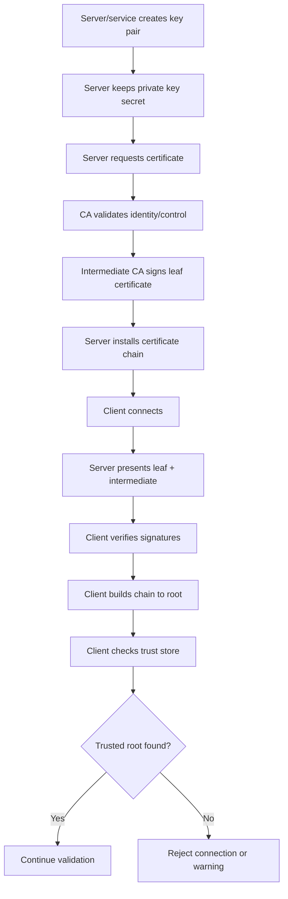

Step-by-step:

1. The server creates a public/private key pair.
2. The server protects the private key.
3. The server requests a certificate for its identity.
4. A CA validates that identity or control.
5. An intermediate CA signs the server certificate.
6. The server installs the leaf certificate and intermediate chain.
7. A client connects to the server.
8. The server sends its certificate chain.
9. The client verifies each signature in the chain.
10. The client checks whether the chain reaches a trusted root in its trust store.
11. The client applies other validation rules.
12. If all checks pass, the public key is trusted for that identity.

## Certificate Trust Decision Checklist

For SDET interview answers, organize certificate trust validation like this:

```text
1. Chain validation:
   Can the client build a valid chain from leaf to trusted root?

2. Signature validation:
   Is each certificate signed by the next issuer in the chain?

3. Identity validation:
   Does the certificate identity match the requested service?

4. Time validation:
   Is the certificate currently valid?

5. Purpose validation:
   Is the certificate allowed for this usage?

6. Revocation validation:
   Has the certificate been revoked? Covered later.

7. Trust store validation:
   Is the root trusted by this specific client environment?
```

## Common PKI Failure Scenarios for SDETs

| Failure | Likely Cause |
|---|---|
| Unknown issuer | Root or intermediate not trusted |
| Unable to get local issuer certificate | Missing intermediate or unknown CA |
| Certificate expired | Validity period ended |
| Hostname mismatch | Certificate identity does not match service name |
| Self-signed certificate error | Certificate not chained to trusted root |
| Works locally but fails in CI | Different trust stores |
| Works in browser but fails in Java | Different CA bundles or trust configuration |
| Chain too long or invalid | Incorrect certificate path or CA constraints |

## Troubleshooting Flow

```mermaid
flowchart TD
    A["Certificate validation failed"] --> B{"Is certificate expired?"}
    B -->|"Yes"| C["Renew or replace certificate"]
    B -->|"No"| D{"Does identity match hostname/service?"}
    D -->|"No"| E["Fix requested name or certificate identity"]
    D -->|"Yes"| F{"Is intermediate missing?"}
    F -->|"Yes"| G["Install/send full chain"]
    F -->|"No"| H{"Is root trusted by client?"}
    H -->|"No"| I["Install correct root or use publicly trusted CA"]
    H -->|"Yes"| J{"Is validation code/config correct?"}
    J -->|"No"| K["Fix client validation settings"]
    J -->|"Yes"| L["Investigate revocation, policy, or client-specific behavior"]
```

## Section 2 Summary

PKI exists because public keys do not prove identity by themselves.

The five concepts in this section fit together like this:

| Concept | Main Role |
|---|---|
| Public Key Infrastructure | Overall system for trusting public keys |
| Certificate Authority | Entity that validates identity and signs certificates |
| Root CA | Top-level trust anchor trusted directly by clients |
| Intermediate CA | Delegated CA that issues certificates under a root |
| Trust Store | Client-side list of trusted root CAs |

The most important idea:

> PKI is a trust system built on top of public keys and digital signatures.

## Common Interview Traps

| Trap Question | Strong Answer |
|---|---|
| Does a certificate encrypt traffic? | No. A certificate binds an identity to a public key. Protocols like TLS use that certificate during secure setup. |
| Is a public key automatically trusted? | No. It must be bound to identity and validated through a trust model. |
| Is every self-signed certificate a root CA? | No. A self-signed certificate is trusted only if the client explicitly trusts it as a trust anchor. |
| Does a valid signature mean the certificate is trusted? | Not by itself. The chain must lead to a trusted root and pass validation rules. |
| Should tests disable certificate verification? | No, except in very controlled cases. Better tests should configure the correct trust store and validate expected failures. |

## Beginner-Friendly Mental Model

```mermaid
flowchart TD
    A["Public key"] --> B["Needs identity proof"]
    B --> C["Certificate"]
    C --> D["Needs trusted signer"]
    D --> E["Certificate Authority"]
    E --> F["Needs trust starting point"]
    F --> G["Root CA"]
    G --> H["Needs to be known by client"]
    H --> I["Trust Store"]
    I --> J["Client can make trust decision"]
```

## How This Prepares You for Later Sections

Section 3, X.509 certificates, will make the certificate object concrete. You will learn fields such as Subject, Issuer, SAN, Public Key, and Signature.

Section 4, TLS, will show where certificate presentation and validation happen during connection setup.

Section 5, certificate lifecycle, will explain how certificates are issued, renewed, rotated, and replaced in automation workflows.

Section 7, revocation, will explain how trust can be removed before a certificate naturally expires.

Section 8, OpenSSL, will give practical commands to inspect chains, verify certificates, and debug failures.

## Final Self-Check

You are ready to move to X.509 certificates when you can answer these without memorizing:

1. Why does PKI exist?
2. Why is a public key not automatically trusted?
3. What does a CA do?
4. Why are root CAs trusted directly?
5. Why are intermediate CAs used?
6. What does a trust store contain?
7. Why can the same certificate pass in one environment and fail in another?
8. What does it mean to build a chain of trust?

If these answers feel intuitive, X.509 certificate fields will be much easier to understand.
