# SECTION 3 - X.509 CERTIFICATES

## Purpose of This Section

Section 1 explained cryptographic building blocks such as public keys, hashes, and digital signatures.

Section 2 explained PKI: how clients trust public keys through certificate authorities, root CAs, intermediate CAs, and trust stores.

Section 3 makes the certificate itself concrete.

The main question for this section is:

> What is actually inside a certificate, and how does each field help a client make a trust decision?

This section covers only:

1. Certificate structure
2. Subject
3. Issuer
4. SAN
5. Public Key
6. Signature

Important boundary for this file:

This file explains X.509 certificate fields at an interview-ready conceptual level. It does not teach the full TLS handshake, certificate lifecycle automation, revocation protocols, OpenSSL command syntax, or RSA/ECDSA algorithm internals. Those topics come later.

## Why Section 3 Exists in the Roadmap

The learning path is intentionally layered:

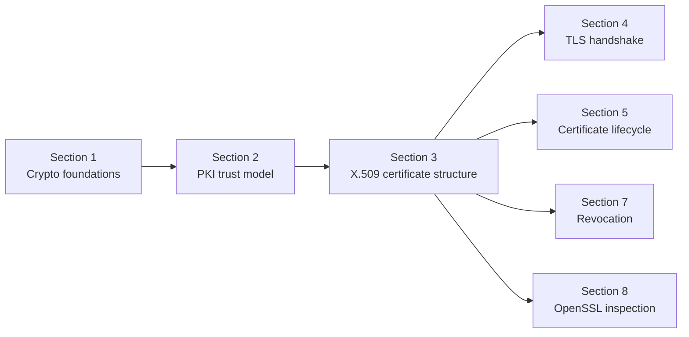

Section 2 says:

> A certificate binds an identity to a public key and is signed by a CA.

Section 3 asks:

> Where exactly are identity, public key, issuer, and signature stored inside the certificate?

For an Akamai SDET-II interview, this matters because many certificate bugs are field-level bugs:

1. Wrong SAN.
2. Wrong issuer chain.
3. Expired validity period.
4. Incorrect public key.
5. Unsupported signature algorithm.
6. Missing or incorrect extensions.
7. Certificate presented for the wrong hostname.

## One-Screen Mental Model

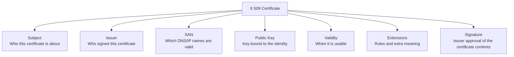

Simple definition:

> An X.509 certificate is a signed identity document for a public key.

Even simpler:

> It says: "This identity owns this public key, and this trusted issuer signed that statement."

---

# Topic 1 - Certificate Structure

## 1. The Problem

PKI needs a standard way to carry trust information.

A client cannot make a trust decision from a random text document that says:

```text
This key belongs to www.example.com.
Trust me.
```

That is not enough.

The client needs a structured object containing:

1. The identity the certificate is about.
2. The public key being certified.
3. The issuer that signed it.
4. The time period when it is valid.
5. The rules for how it may be used.
6. The digital signature proving the issuer approved the content.

Before a standard certificate structure, different systems could represent identity and keys differently. That would make validation inconsistent, fragile, and hard to automate.

The problem is standardized trust data.

## 2. Why It Was Invented

X.509 certificates were created so systems could exchange public key identity information in a standard format.

Engineers needed a certificate format that:

1. Machines could parse reliably.
2. Humans and tools could inspect.
3. Certificate authorities could sign.
4. Clients could validate.
5. Different vendors and platforms could understand.

Without a standard structure, browsers, servers, operating systems, load balancers, API clients, and security tools would all need custom logic.

For large distributed systems, that would be unmanageable.

## 3. What It Actually Is

Simple definition:

> An X.509 certificate is a structured, signed document that binds an identity to a public key.

Technical definition:

> An X.509 certificate is a standardized digital certificate format containing a subject identity, subject public key information, issuer identity, validity period, extensions, and an issuer digital signature over the certificate data.

Important terms:

| Term | Meaning |
|---|---|
| Certificate | Signed document binding identity to public key |
| X.509 | Standard format used for public key certificates |
| Leaf certificate | End-entity certificate used by a server, service, user, or device |
| CA certificate | Certificate belonging to a certificate authority |
| Certificate chain | Ordered certificates from leaf to root |
| DER | Binary encoding of a certificate |
| PEM | Text form that contains Base64-encoded certificate data |
| Extension | Extra field that adds rules or meaning |

Concept diagram:

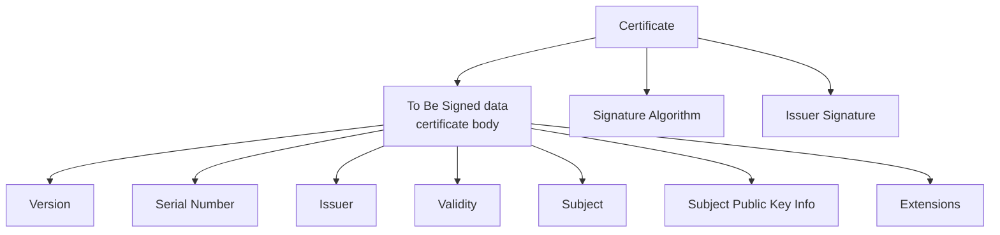

Do not be scared by the internal names.

For interview understanding, think of the certificate as:

```text
Certificate body:
    Who is this certificate about?
    Who issued it?
    What public key is being certified?
    When is it valid?
    What names and usages are allowed?

Signature:
    Issuer's approval of the certificate body
```

## 4. How It Works Internally

At a practical level, a certificate has two major parts:

1. The data being certified.
2. The issuer's digital signature over that data.

The data being certified includes fields such as:

1. Version.
2. Serial number.
3. Issuer.
4. Validity period.
5. Subject.
6. Subject public key information.
7. Extensions such as SAN and key usage.

The signature proves that the issuer approved the certificate data.

Flow diagram:

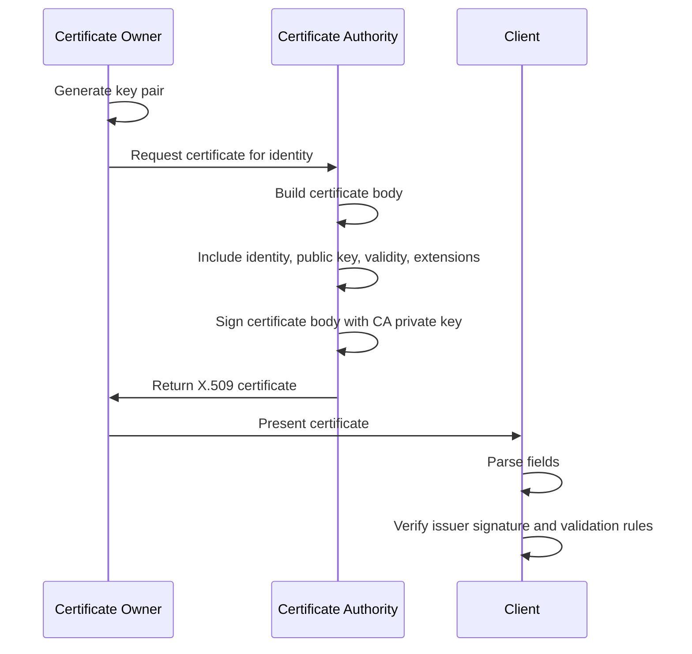

Certificate validation thinking:

```text
Client receives certificate
Client parses certificate fields
Client checks identity fields
Client checks validity period
Client checks public key information
Client checks issuer
Client verifies signature
Client builds chain to trusted root
Client accepts or rejects
```

Structure comparison:

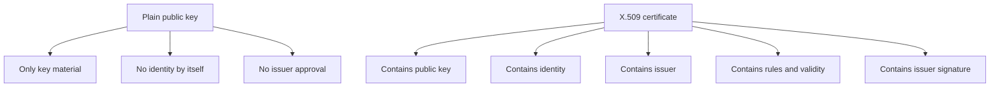

Common certificate body fields:

| Field | Why It Exists |
|---|---|
| Version | Identifies certificate format version |
| Serial Number | Unique number assigned by issuer |
| Signature Algorithm | Algorithm used by issuer to sign |
| Issuer | CA that issued the certificate |
| Validity | Start and end time for certificate use |
| Subject | Entity the certificate is about |
| Subject Public Key Info | Public key and key algorithm |
| Extensions | Extra rules such as SAN, key usage, CA status |
| Signature | Issuer's digital signature over certificate body |

This section focuses on the fields requested in the roadmap:

1. Subject.
2. Issuer.
3. SAN.
4. Public Key.
5. Signature.

## 5. Real World Example

Human analogy:

A passport has structured fields:

1. Name.
2. Passport number.
3. Issuing country.
4. Valid from date.
5. Expiry date.
6. Photo.
7. Official stamp or security features.

The border officer does not just read a random sentence. They inspect structured fields and decide whether the document is valid.

Computer/network analogy:

A server certificate has structured fields:

```text
Subject: CN=www.example.com
Issuer: Example Intermediate CA
SAN: DNS:www.example.com, DNS:example.com
Public Key: server public key
Validity: not before and not after dates
Signature: issuer signature
```

A client parses these fields and applies validation rules.

## 6. Advantages

X.509 structure makes certificate validation consistent and automatable.

Main advantages:

| Advantage | Why It Matters |
|---|---|
| Standard format | Different systems can parse certificates |
| Machine-readable | Clients can automate validation |
| Signed content | Tampering can be detected |
| Carries identity and public key | Supports PKI trust decisions |
| Supports extensions | Allows rules for usage, names, and CA behavior |
| Works across ecosystems | Used by browsers, servers, APIs, devices, and tools |

For SDET work, structured certificates make it possible to write automated tests that assert exact certificate behavior.

## 7. Limitations

X.509 certificates are powerful but complex.

Main limitations:

| Limitation | Explanation |
|---|---|
| Many fields | Beginners can confuse which field does what |
| Extensions matter | Ignoring extensions can lead to bad validation |
| Client behavior can differ | Different libraries may parse or enforce rules differently |
| Trust is external | A certificate still needs a trust chain and trust store |
| Valid fields do not guarantee safe application | Certificate validation is only one part of security |

Important SDET warning:

Do not assume "certificate exists" means "certificate is valid."

You need to check:

1. Is the certificate parseable?
2. Is the certificate currently valid?
3. Does the name match?
4. Is the issuer chain trusted?
5. Is the signature valid?
6. Is the certificate allowed for this usage?

## 8. Why Later Technologies Were Needed

X.509 defines the certificate object, but real systems still need protocols and operations around it.

X.509 answers:

> What fields are inside the certificate?

TLS answers:

> How is the certificate presented and validated during secure connection setup?

Certificate lifecycle answers:

> How are certificates issued, renewed, rotated, and replaced safely?

Revocation answers:

> How do clients learn that a certificate should no longer be trusted before expiry?

Comparison diagram:

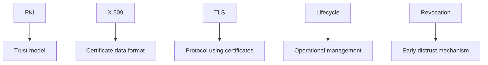

## 9. Interview Questions

### Basic Questions

1. What is an X.509 certificate?
2. What problem does a certificate solve?
3. What is the difference between a public key and a certificate?
4. What are the main parts of a certificate?
5. Why does a certificate need a signature?

### Intermediate Questions

1. What fields does a client usually inspect during certificate validation?
2. Why is a standard certificate format important?
3. What is the difference between DER and PEM at a high level?
4. Why is a certificate not automatically trusted just because it is well-formed?
5. How does a certificate bind identity to a public key?

### Advanced Questions

1. How would you design tests for certificate parsing and validation?
2. What bugs can happen if a client ignores certificate extensions?
3. Why might two clients interpret the same certificate differently?
4. What is the difference between certificate structure validation and chain validation?
5. How would malformed certificate fields affect a distributed service?

### Follow-up Questions

1. Does an X.509 certificate contain a private key?
2. Does a certificate encrypt traffic by itself?
3. What makes a certificate trusted?
4. Why is the certificate body signed?
5. Which later topics depend on understanding certificate structure?

---

# Topic 2 - Subject

## 1. The Problem

A certificate needs to say who or what it is about.

If a certificate contains only a public key, the client still cannot know what identity that key represents.

The problem is identity labeling.

The certificate needs a field that describes the entity being certified.

Historically, this was the Subject field.

Without a subject-like identity field, a certificate would say:

```text
Here is a public key.
```

But the client needs:

```text
Here is a public key for this named entity.
```

## 2. Why It Was Invented

The Subject field was created to identify the certificate holder.

Engineers needed a place to describe the entity the certificate belongs to, such as:

1. A server.
2. An organization.
3. A user.
4. A device.
5. A service.

In older web certificate validation, the Subject Common Name was often used for hostname matching.

Modern web certificate validation uses SAN for DNS names, not the Subject Common Name. SAN is covered in the next topic.

The Subject field still matters because it helps describe the certificate holder and appears in many certificates and tools.

## 3. What It Actually Is

Simple definition:

> The Subject is the certificate field that identifies who the certificate is about.

Technical definition:

> The Subject field is a distinguished name in an X.509 certificate that identifies the entity associated with the certificate's public key.

Important terms:

| Term | Meaning |
|---|---|
| Subject | Identity the certificate is about |
| Distinguished Name | Structured name made of attributes |
| CN | Common Name |
| O | Organization |
| OU | Organizational Unit |
| C | Country |
| ST | State or province |
| L | Locality or city |

Concept diagram:

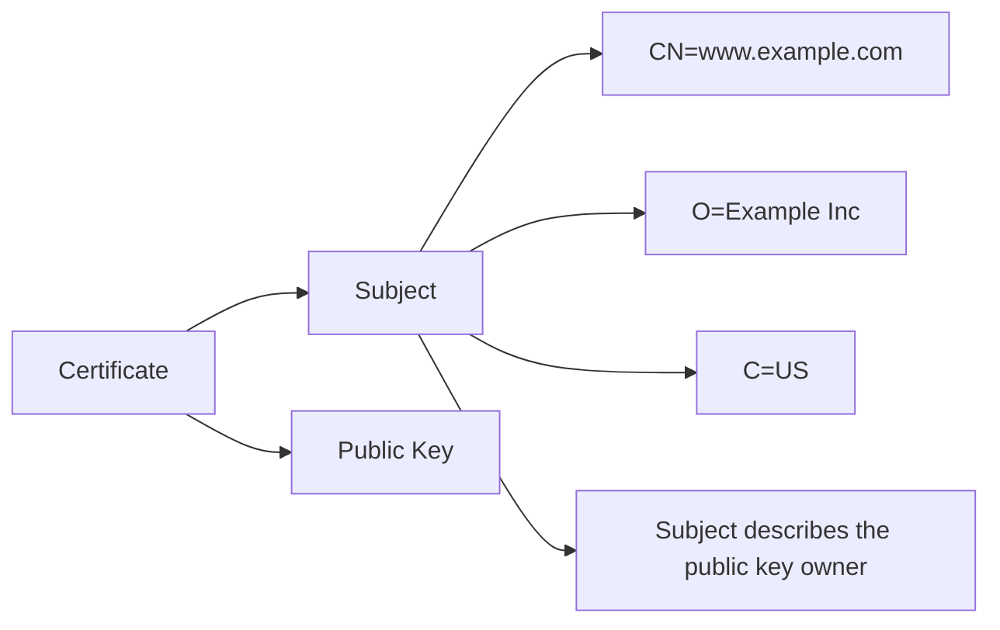

Simple example:

```text
Subject:
    CN=www.example.com
    O=Example Inc
    C=US
```

Do not over-trust the Subject field by itself.

For modern server certificates, hostname validation depends primarily on SAN.

## 4. How It Works Internally

The Subject is part of the certificate body.

When a CA issues a certificate:

1. The requester asks for a certificate.
2. The CA validates the request according to policy.
3. The CA places subject identity information into the certificate.
4. The CA includes the public key.
5. The CA signs the certificate body.

Flow diagram:

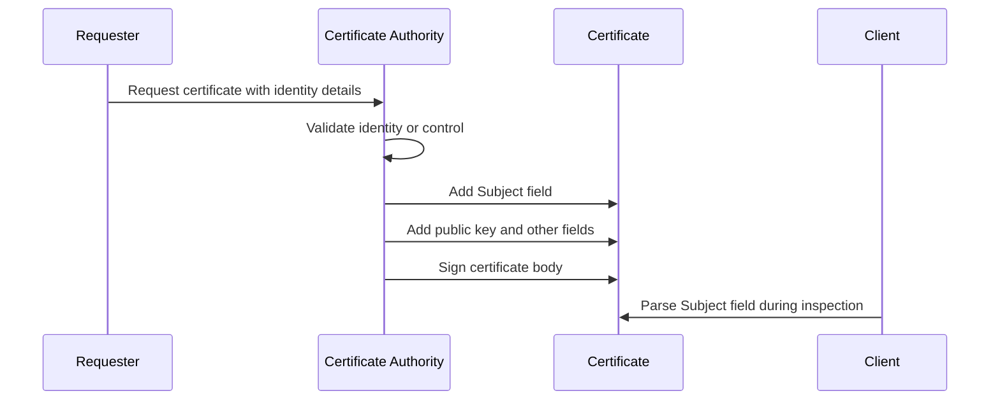

How a client uses Subject:

```text
Client parses certificate
Client reads Subject for identity information
Client may display Subject to users or logs
Client usually uses SAN for server hostname matching
Client verifies the signature over the whole certificate body
```

Subject versus SAN comparison:

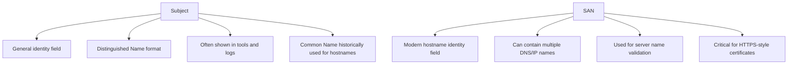

Important:

If the Subject says `CN=www.example.com` but the SAN does not include `www.example.com`, modern clients may reject the certificate for `www.example.com`.

## 5. Real World Example

Human analogy:

A passport has a "Name" field. That tells you who the document is about.

But a passport also has other fields such as passport number, issuing authority, and validity period. The name alone does not prove the passport is valid.

Computer/network analogy:

A certificate may contain:

```text
Subject:
    CN=api.customer.example
    O=Customer Example Ltd
```

This helps identify the certificate holder. But a client still needs to validate:

1. SAN matches the requested DNS name.
2. Issuer chain is trusted.
3. Signature is valid.
4. Certificate is currently valid.

## 6. Advantages

The Subject field gives certificates a structured identity label.

Main advantages:

| Advantage | Why It Matters |
|---|---|
| Identifies certificate holder | Shows who the certificate is about |
| Structured format | Tools can parse and display attributes |
| Useful for logs and debugging | Helps humans inspect certificates |
| Works across certificate types | Useful for users, devices, services, and CAs |
| Signed by issuer | Tampering with subject breaks signature validation |

For SDETs, Subject is useful when checking whether certificates are being issued for the expected entity.

## 7. Limitations

Subject is often misunderstood.

Main limitations:

| Limitation | Explanation |
|---|---|
| Not enough for trust | Subject does not prove the certificate is trusted |
| Not the modern hostname source | SAN is used for DNS/IP validation |
| Can be empty in some certificates | Some certificates rely on SAN instead |
| Human-readable does not mean valid | A nice-looking subject can still be untrusted |
| Policy-dependent | Meaning of subject attributes depends on certificate type and CA policy |

Common mistake:

> The CN matches, so the certificate is valid.

Better answer:

> The CN may be informative, but modern hostname validation depends on SAN and the full certificate validation rules.

## 8. Why Later Technologies Were Needed

Subject alone could not handle modern naming needs.

A server may need one certificate valid for:

1. `example.com`
2. `www.example.com`
3. `api.example.com`
4. An IP address
5. Multiple customer domains

The Subject Common Name is not a clean place for many names.

That leads to SAN.

Subject answers:

> Who is this certificate generally about?

SAN answers:

> Which exact DNS names or IP addresses is this certificate valid for?

Comparison diagram:

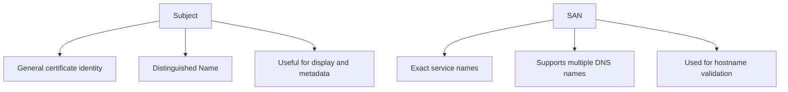

## 9. Interview Questions

### Basic Questions

1. What is the Subject field in a certificate?
2. What does CN mean?
3. What is a Distinguished Name?
4. Does Subject contain the private key?
5. Is Subject signed by the issuer?

### Intermediate Questions

1. Why is Subject not enough for modern hostname validation?
2. What is the difference between Subject and SAN?
3. Why can a certificate with a matching CN still fail validation?
4. How is Subject useful in logs and debugging?
5. What kinds of identities can appear in Subject?

### Advanced Questions

1. How would you test that a certificate provisioning API sets Subject correctly?
2. What bugs can happen if a client validates only CN and ignores SAN?
3. Why might modern certificates have minimal or empty Subject fields?
4. How can Subject field expectations differ between public and private PKI?
5. What security risk exists if identity validation logic uses the wrong field?

### Follow-up Questions

1. Which field should be checked for DNS names in modern server certificates?
2. Can the Subject be modified after issuance without breaking validation?
3. Does a meaningful Subject guarantee the issuer is trusted?
4. How would you explain Subject using a passport analogy?
5. What should an SDET check besides Subject?

---

# Topic 3 - Issuer

## 1. The Problem

A certificate needs to say who issued it.

If a client receives a certificate, it must determine:

1. Who signed this certificate?
2. Which public key should verify the signature?
3. What is the next certificate in the chain?
4. Does the chain lead to a trusted root?

Without an Issuer field, a client would not know which CA certificate to look for.

The problem is chain building.

## 2. Why It Was Invented

The Issuer field was created to identify the certificate authority that signed the certificate.

Engineers needed a field that helps clients connect certificates into a chain:

```text
Leaf certificate issuer -> Intermediate certificate subject
Intermediate certificate issuer -> Root certificate subject
Root certificate -> trusted in trust store
```

The Issuer field helps clients find the parent certificate needed to verify the signature.

## 3. What It Actually Is

Simple definition:

> The Issuer field tells you which CA issued and signed the certificate.

Technical definition:

> The Issuer field is a distinguished name in an X.509 certificate that identifies the certificate authority responsible for signing that certificate.

Important terms:

| Term | Meaning |
|---|---|
| Issuer | CA that signed the certificate |
| Subject | Entity the certificate is about |
| Parent certificate | Certificate belonging to the issuer |
| Chain building | Process of linking leaf to intermediate to root |
| Signature verification | Checking issuer signature using issuer public key |

Concept diagram:

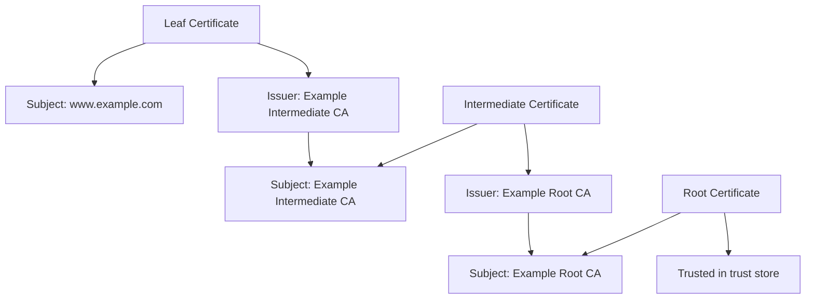

The issuer of one certificate should match the subject of the certificate above it in the chain.

## 4. How It Works Internally

When a CA signs a certificate, it places its own identity into the Issuer field.

Then it signs the certificate body with its private key.

Client validation flow:

1. Client reads the leaf certificate.
2. Client reads the leaf Issuer field.
3. Client looks for a certificate whose Subject matches that Issuer.
4. Client uses that issuer certificate's public key to verify the leaf signature.
5. Client repeats the process upward.
6. Client stops when it reaches a trusted root.

Flow diagram:

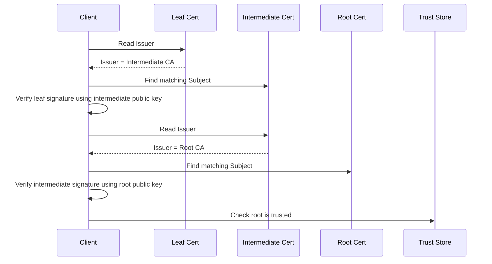

Packet-flow style thinking:

```text
Server sends chain:
    1. Leaf certificate
    2. Intermediate certificate

Client already has:
    Trusted root certificate in trust store

Client does:
    Leaf Issuer matches Intermediate Subject
    Intermediate Issuer matches Root Subject
    Root exists in trust store
```

Issuer and Subject comparison:

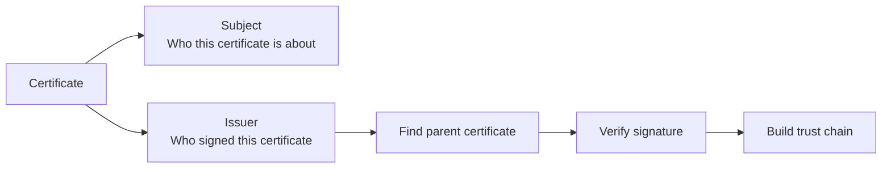

Important:

The Issuer field helps identify the signer, but the client still must verify the signature. Matching names alone are not enough.

## 5. Real World Example

Human analogy:

A passport has a person named on it and an issuing authority.

The person name answers:

```text
Who is this document about?
```

The issuing authority answers:

```text
Who issued this document?
```

Computer/network analogy:

A server certificate may show:

```text
Subject: CN=www.example.com
Issuer: CN=Example Intermediate CA
```

The client then looks for the `Example Intermediate CA` certificate. If found, it uses the intermediate's public key to verify the server certificate signature.

## 6. Advantages

Issuer enables certificate chain construction.

Main advantages:

| Advantage | Why It Matters |
|---|---|
| Identifies signer | Client knows who issued the certificate |
| Supports chain building | Links leaf to intermediate to root |
| Supports delegation | Shows which CA issued under a hierarchy |
| Useful for troubleshooting | Helps identify wrong or unexpected issuers |
| Signed into certificate body | Tampering with issuer breaks signature validation |

For SDETs, Issuer is essential when debugging chain failures and verifying that the expected CA issued a certificate.

## 7. Limitations

Issuer is not enough by itself.

Main limitations:

| Limitation | Explanation |
|---|---|
| Name match is not trust | Matching issuer name does not prove signature validity |
| Parent certificate still needed | Client needs issuer certificate public key |
| Ambiguity can exist | Names alone may not uniquely identify every CA |
| Chain rules still apply | Trust store, validity, usage, and constraints matter |
| Missing intermediate breaks validation | Client may not find the issuer certificate |

Common mistake:

> The Issuer says a trusted CA name, so it must be trusted.

Better answer:

> The client must verify the signature and build a valid chain to a trusted root.

## 8. Why Later Technologies Were Needed

Issuer tells us who signed the certificate, but it does not tell us which service names the certificate is valid for.

For server certificates, clients need exact name matching:

```text
I connected to api.example.com.
Is this certificate valid for api.example.com?
```

That leads to SAN.

Issuer answers:

> Who signed this certificate?

SAN answers:

> Which names is this certificate valid for?

Comparison diagram:

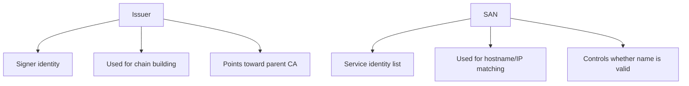

## 9. Interview Questions

### Basic Questions

1. What is the Issuer field?
2. How is Issuer different from Subject?
3. Why does a certificate need an Issuer field?
4. What certificate usually matches the Issuer of a leaf certificate?
5. Does Issuer identify who signed the certificate?

### Intermediate Questions

1. How does Issuer help with chain building?
2. Why is matching issuer name not enough for trust?
3. What happens if the intermediate certificate is missing?
4. How does a client verify a certificate signature using the issuer?
5. Why might a certificate issued by an unexpected CA be a problem?

### Advanced Questions

1. How would you test that a certificate is issued by the expected intermediate CA?
2. What chain validation bugs can happen around issuer lookup?
3. Why can different clients behave differently when an intermediate is missing?
4. How would you debug "unable to get local issuer certificate"?
5. What risks exist if validation code trusts issuer names without verifying signatures?

### Follow-up Questions

1. Does Issuer prove the root is trusted?
2. Can a malicious certificate write a famous CA name into Issuer?
3. What check prevents fake issuer naming from working?
4. How does Issuer relate to the certificate signature?
5. What field tells the client the server names instead of signer names?

---

# Topic 4 - SAN

## 1. The Problem

Clients need to know whether a certificate is valid for the exact service name they contacted.

Example:

```text
Client connects to: api.example.com
Certificate must be valid for: api.example.com
```

A certificate may have a public key and a valid issuer signature, but still be wrong for the requested hostname.

Example:

```text
Client connects to: payments.example.com
Certificate valid for: blog.example.com
```

The certificate may be valid for `blog.example.com`, but it should not be accepted for `payments.example.com`.

The problem is service name matching.

## 2. Why It Was Invented

SAN was invented to represent the exact names a certificate is valid for.

SAN stands for Subject Alternative Name.

Engineers needed a field that could support:

1. Multiple DNS names.
2. IP addresses.
3. Email names in some certificate types.
4. URI names in some certificate types.
5. Better hostname validation than old Common Name usage.

The old Subject Common Name field was too limited for modern systems.

Modern server certificate validation relies on SAN.

## 3. What It Actually Is

Simple definition:

> SAN is the certificate field that lists the DNS names or IP addresses the certificate is valid for.

Technical definition:

> The Subject Alternative Name extension is an X.509 extension that binds additional identities, such as DNS names and IP addresses, to the certificate subject and is used by modern clients for service identity validation.

Important terms:

| Term | Meaning |
|---|---|
| SAN | Subject Alternative Name |
| DNS name | Domain name such as `www.example.com` |
| IP address | Network address such as `192.0.2.10` |
| Hostname validation | Checking that requested name appears in SAN |
| Wildcard certificate | Certificate valid for a pattern such as `*.example.com` |
| Extension | Extra certificate field with structured meaning |

Concept diagram:

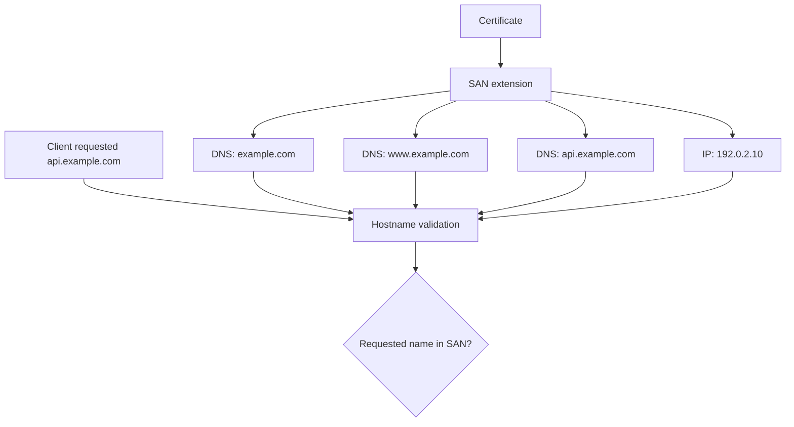

The most important practical rule:

> For modern server certificates, the requested DNS name must match the SAN.

## 4. How It Works Internally

SAN is an extension inside the certificate body.

Because it is part of the signed certificate body, the issuer signature protects it from tampering.

Hostname validation flow:

1. Client connects to a service name.
2. Server presents a certificate.
3. Client parses the SAN extension.
4. Client compares the requested name to the SAN entries.
5. If the requested name matches an allowed SAN entry, name validation can pass.
6. If not, name validation fails.
7. The client still performs other checks such as chain trust and validity period.

Flow diagram:

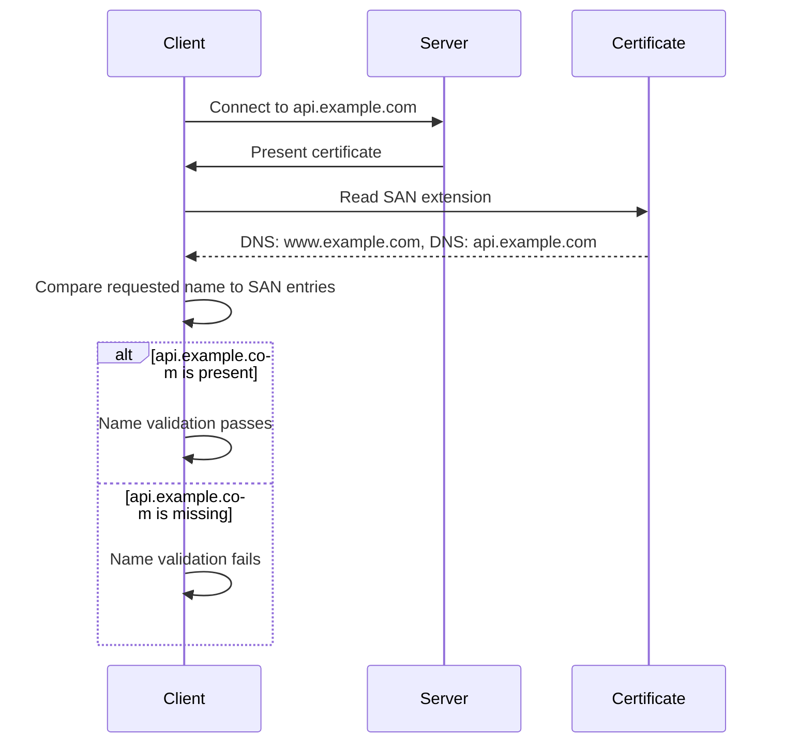

Packet-flow style thinking:

```text
Client request target:
    api.example.com

Certificate SAN:
    DNS: www.example.com
    DNS: api.example.com

Name check:
    api.example.com is listed
    Result: name match passes
```

Mismatch example:

```text
Client request target:
    api.example.com

Certificate SAN:
    DNS: www.example.com
    DNS: static.example.com

Name check:
    api.example.com is not listed
    Result: name match fails
```

SAN versus Subject comparison:

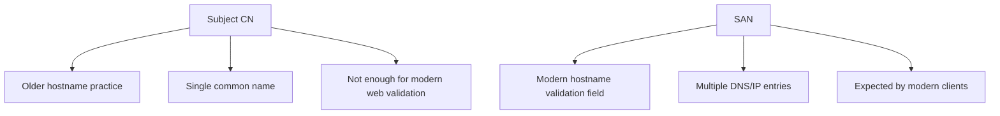

Wildcard note:

A wildcard SAN such as:

```text
DNS: *.example.com
```

can match:

```text
api.example.com
www.example.com
```

but it should not be treated as matching every possible depth, such as:

```text
v1.api.example.com
```

Exact wildcard rules depend on client validation rules and certificate policy. For interview purposes, remember:

> Wildcards are useful but must be validated carefully.

## 5. Real World Example

Human analogy:

Imagine a building access card that lists which rooms you can enter:

```text
Allowed rooms:
    Server Room A
    Network Lab
    Security Office
```

Even if the card is real, you should not use it to enter a room that is not listed.

Computer/network analogy:

A certificate may list:

```text
SAN:
    DNS: customer.example.com
    DNS: www.customer.example.com
```

If a client connects to:

```text
api.customer.example.com
```

the certificate should fail name validation unless that exact name or a valid wildcard covers it.

SDET example:

You test a certificate provisioning platform that accepts domain names through an API. A good test verifies that every requested domain appears correctly in SAN and that unexpected domains do not appear.

## 6. Advantages

SAN gives precise control over certificate names.

Main advantages:

| Advantage | Why It Matters |
|---|---|
| Supports multiple names | One certificate can cover multiple hostnames |
| Supports DNS and IP identities | Useful for different service types |
| Modern validation standard | Clients expect SAN for server certificates |
| Signed by issuer | Tampering with SAN breaks signature validation |
| Reduces ambiguity | Clear list of valid names |

For Akamai-like systems, SAN is critical because edge platforms may serve many customer hostnames and need precise certificate coverage.

## 7. Limitations

SAN mistakes are common and user-visible.

Main limitations:

| Limitation | Explanation |
|---|---|
| Missing name causes failure | Client rejects certificate for that hostname |
| Wrong name is a security bug | Certificate may be valid for unintended identity |
| Wildcards can be misunderstood | Incorrect wildcard assumptions cause failures |
| Too many names can be operationally messy | Large SAN lists are harder to manage |
| Client validation details matter | Different libraries may enforce edge cases differently |

Common SDET risk:

Testing only one hostname is not enough if the certificate is intended to cover many names.

You should test:

1. Each expected SAN entry.
2. At least one missing-name negative case.
3. Wildcard behavior if wildcards are used.
4. IP SAN behavior if connecting by IP address.

## 8. Why Later Technologies Were Needed

SAN tells the client which names the certificate is valid for.

But the certificate also needs to carry the actual public key that will be trusted for that identity.

SAN answers:

> Is this certificate valid for the service name I contacted?

Public Key answers:

> Which cryptographic public key is bound to that identity?

Comparison diagram:

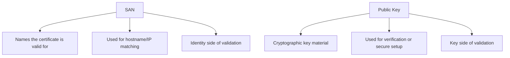

## 9. Interview Questions

### Basic Questions

1. What does SAN stand for?
2. What problem does SAN solve?
3. Why is SAN important for HTTPS certificates?
4. Can a certificate contain multiple SAN entries?
5. What happens if the requested hostname is not in SAN?

### Intermediate Questions

1. Why is SAN preferred over Subject CN for hostname validation?
2. How would you test SAN entries in an automation framework?
3. What is a wildcard certificate at a high level?
4. Why can a certificate be trusted by issuer but still fail name validation?
5. What is the difference between DNS SAN and IP SAN?

### Advanced Questions

1. What negative tests would you write for SAN validation?
2. How can incorrect wildcard handling create security issues?
3. Why might a certificate pass in one client but fail in another due to SAN behavior?
4. How would SAN mistakes affect a CDN or edge delivery platform?
5. How would you validate that a certificate provisioning API does not add unauthorized SANs?

### Follow-up Questions

1. If CN matches but SAN is missing, should modern clients accept the certificate?
2. Does SAN prove the issuer is trusted?
3. Is SAN protected by the certificate signature?
4. Can one certificate cover many domains?
5. What field tells us the key associated with those SAN names?

---

# Topic 5 - Public Key

## 1. The Problem

PKI exists to help clients trust public keys.

So a certificate must contain the public key being certified.

Without the public key field, a certificate could identify a service and issuer, but it would not tell the client which key belongs to that service.

The problem is key binding.

The certificate needs to bind:

```text
Identity -> Public Key
```

with issuer approval.

## 2. Why It Was Invented

The public key field exists because the certificate's main job is to associate a public key with an identity.

Engineers needed a standard place to store:

1. The public key value.
2. The public key algorithm.
3. Enough information for clients to use the key correctly.

This allows clients to say:

```text
This public key is certified for this identity by this issuer.
```

## 3. What It Actually Is

Simple definition:

> The Public Key field contains the public key that belongs to the certificate subject.

Technical definition:

> The Subject Public Key Info field in an X.509 certificate contains the subject's public key and algorithm information, binding that key to the certificate identity through the issuer's signature.

Important terms:

| Term | Meaning |
|---|---|
| Subject Public Key Info | Certificate field containing public key and algorithm info |
| Public key | Non-secret key associated with the subject |
| Private key | Secret matching key held by the subject |
| Key pair | Matching public and private keys |
| Algorithm | Cryptographic method the key belongs to |
| Key binding | Association between identity and public key |

Concept diagram:

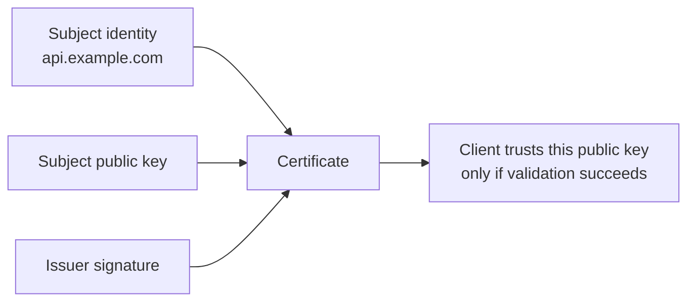

Important:

The certificate contains the public key, not the private key.

The private key must remain secret on the server, service, device, or secure key system.

## 4. How It Works Internally

During issuance:

1. The certificate owner creates a key pair.
2. The owner keeps the private key secret.
3. The owner sends the public key as part of the certificate request.
4. The CA validates identity or control.
5. The CA places the public key into the certificate.
6. The CA signs the certificate body.
7. The signature binds the public key to the identity and other fields.

Flow diagram:

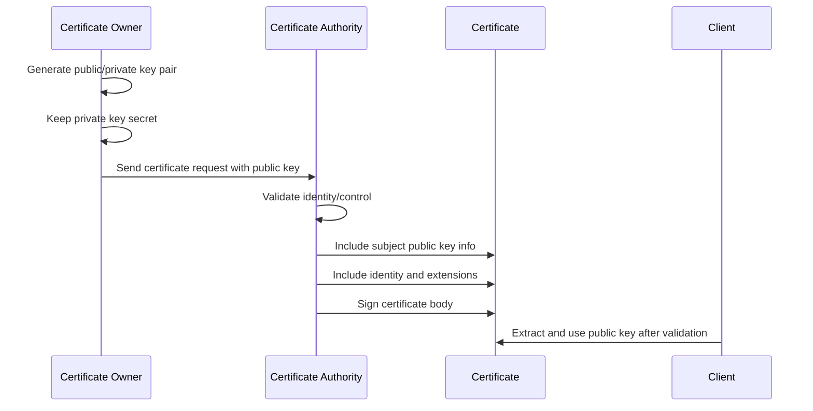

Client-side thinking:

```text
Client receives certificate
Client validates identity, issuer, signature, validity, and trust chain
If validation succeeds:
    Client accepts the certificate public key for that identity
If validation fails:
    Client must not trust that public key for the identity
```

Public key versus private key comparison:

```mermaid
flowchart TD
    A["Public Key"] --> A1["Stored in certificate"]
    A --> A2["Can be shared"]
    A --> A3["Used by clients during validation/protocols"]
    A --> A4["Not secret"]

    B["Private Key"] --> B1["Not stored in certificate"]
    B --> B2["Must be protected"]
    B --> B3["Used by owner for private-key operations"]
    B --> B4["Secret"]
```

A certificate is useful only if the service actually controls the matching private key.

If a server presents a certificate but does not have the matching private key, secure protocols that require proof of private-key possession will fail.

## 5. Real World Example

Human analogy:

Think of the public key like a verified public contact address printed on an official ID document.

The certificate says:

```text
This verified identity is associated with this public contact point.
```

But the private key is like the secret ability to prove you really control that identity. It must not be printed on the document.

Computer/network analogy:

A certificate for `api.example.com` contains the server public key.

The server keeps the matching private key in a protected location.

During secure connection setup, the server must prove it controls the private key corresponding to the certificate public key. The detailed TLS behavior comes later, but the certificate field foundation is here.

SDET example:

You deploy a certificate and private key to a test server. If the certificate and private key do not match, the service may fail to start or clients may fail secure connection setup.

## 6. Advantages

The public key field is the core of certificate usefulness.

Main advantages:

| Advantage | Why It Matters |
|---|---|
| Binds key to identity | Main purpose of certificate |
| Machine-readable | Clients can extract and use the key |
| Signed by issuer | Tampering with key breaks signature validation |
| Supports automated validation | Tools can compare key material and algorithms |
| Enables secure protocols | Protocols can use the certified key during setup |

For SDETs, public key checks help catch deployment mismatches and certificate provisioning bugs.

## 7. Limitations

The public key field alone does not prove trust.

Main limitations:

| Limitation | Explanation |
|---|---|
| Public key is not identity by itself | It needs certificate identity fields |
| Public key is not trusted by itself | It needs issuer signature and chain trust |
| Private key must match | Service must control the corresponding private key |
| Algorithm support matters | Clients must support the key algorithm |
| Key strength matters | Weak keys may be rejected by policy |

Important SDET risk:

A certificate may be structurally valid but deployed with the wrong private key.

This creates operational failures even if the certificate itself looks fine.

## 8. Why Later Technologies Were Needed

The public key field tells us which key is certified.

But how do we know the certificate content was approved by the issuer and not modified?

That leads to the certificate signature.

Public Key answers:

> Which public key is bound to this identity?

Signature answers:

> Did the issuer approve this exact certificate content?

Comparison diagram:

```mermaid
flowchart TD
    A["Public Key field"] --> A1["Key being certified"]
    A --> A2["Belongs to subject"]
    A --> A3["Used after validation succeeds"]

    B["Certificate Signature"] --> B1["Issuer approval"]
    B --> B2["Protects certificate body"]
    B --> B3["Detects tampering"]
```

## 9. Interview Questions

### Basic Questions

1. Does a certificate contain a public key?
2. Does a certificate contain the private key?
3. What is Subject Public Key Info?
4. Why does the certificate need a public key field?
5. What does it mean to bind a public key to an identity?

### Intermediate Questions

1. Why is a public key not trusted by itself?
2. What happens if a certificate and private key do not match?
3. Why must the private key be protected?
4. How does the CA signature protect the public key field?
5. Why do clients care about public key algorithm support?

### Advanced Questions

1. How would you test for certificate/private key mismatch?
2. What deployment bugs can happen around public keys and private keys?
3. How can weak or unsupported key algorithms cause validation failures?
4. How would you verify that a certificate provisioning API returned the expected public key?
5. What risks exist if private keys are logged, exported, or stored incorrectly?

### Follow-up Questions

1. If the public key is public, why does it need a certificate?
2. Who owns the private key corresponding to the certificate public key?
3. Can an attacker replace the public key inside a certificate?
4. What would happen to the signature if the public key field changed?
5. Which field proves issuer approval of the public key binding?

---

# Topic 6 - Signature

## 1. The Problem

A certificate contains important fields:

1. Subject.
2. Issuer.
3. SAN.
4. Public key.
5. Validity period.
6. Extensions.

But a client needs to know:

> Did the issuer actually approve this exact certificate content?

Without a signature, an attacker could modify certificate fields.

Example attack idea:

```text
Original SAN:
    DNS: blog.example.com

Attacker changes SAN:
    DNS: payments.example.com
```

If there were no issuer signature, the client might not detect the change.

The problem is tamper detection and issuer approval.

## 2. Why It Was Invented

Certificate signatures exist so clients can verify that a CA approved the certificate content.

Engineers needed a way to ensure:

1. Certificate fields were not modified after issuance.
2. The issuer's private key signed the certificate.
3. Clients can verify the signature using the issuer's public key.
4. Certificate chains can be built and validated.

The signature turns a certificate from "claims in a file" into "claims approved by an issuer."

## 3. What It Actually Is

Simple definition:

> The certificate signature is the issuer's digital signature over the certificate body.

Technical definition:

> The signature field in an X.509 certificate contains the digital signature value generated by the issuer's private key over the to-be-signed certificate data, allowing clients to verify integrity and issuer approval using the issuer's public key.

Important terms:

| Term | Meaning |
|---|---|
| Certificate body | The certificate data that gets signed |
| To-be-signed data | The part of the certificate covered by the signature |
| Signature algorithm | Algorithm used to create and verify signature |
| Signature value | Actual cryptographic signature bytes |
| Issuer private key | Key used to create signature |
| Issuer public key | Key used by clients to verify signature |

Concept diagram:

```mermaid
flowchart LR
    A["Certificate body<br/>subject, issuer, SAN, public key, validity"] --> B["Hash certificate body"]
    B --> C["Issuer signs hash<br/>using issuer private key"]
    C --> D["Certificate signature"]
    A --> E["Final certificate"]
    D --> E
```

Verification concept:

```mermaid
flowchart LR
    A["Received certificate"] --> B["Hash received body"]
    A --> C["Read signature"]
    D["Issuer public key"] --> E["Verify signature"]
    B --> E
    C --> E
    E --> F{"Valid signature?"}
    F -->|"Yes"| G["Body was approved by issuer and not modified"]
    F -->|"No"| H["Reject certificate"]
```

## 4. How It Works Internally

Certificate signing flow:

1. CA creates certificate body.
2. Certificate body includes identity, public key, issuer, validity, and extensions.
3. CA hashes the certificate body.
4. CA signs the hash using the CA private key.
5. Signature is attached to the certificate.
6. Certificate is issued.

Certificate verification flow:

1. Client receives certificate.
2. Client separates certificate body and signature.
3. Client finds issuer certificate.
4. Client extracts issuer public key.
5. Client verifies signature over the certificate body.
6. If verification succeeds, certificate body was not modified and was signed by issuer private key.
7. Client continues other checks such as name, time, usage, and chain trust.

Flow diagram:

```mermaid
sequenceDiagram
    participant CA as Issuer CA
    participant Cert as Certificate
    participant Client as Client
    participant IssuerCert as Issuer Certificate

    CA->>Cert: Build certificate body
    CA->>Cert: Sign body using issuer private key
    Cert-->>Client: Presented to client
    Client->>IssuerCert: Get issuer public key
    Client->>Client: Verify certificate signature
    alt Signature valid
        Client->>Client: Certificate body integrity confirmed
    else Signature invalid
        Client->>Client: Reject certificate
    end
```

Signature chain thinking:

```text
Leaf certificate:
    Signature verified using intermediate public key

Intermediate certificate:
    Signature verified using root public key

Root certificate:
    Trusted directly from trust store
```

Signature versus SAN versus Public Key:

```mermaid
flowchart TD
    A["SAN"] --> A1["Names certificate is valid for"]
    B["Public Key"] --> B1["Key certified for those names"]
    C["Signature"] --> C1["Issuer approval of SAN, public key, and other fields"]

    A1 --> D["Certificate trust decision"]
    B1 --> D
    C1 --> D
```

Important:

A valid signature does not automatically mean the certificate should be accepted.

The client still checks:

1. Is the issuer trusted through a valid chain?
2. Is the hostname in SAN?
3. Is the certificate currently valid?
4. Is the certificate allowed for this purpose?
5. Has the certificate been revoked? This is covered later.

## 5. Real World Example

Human analogy:

A government stamp or seal on a passport protects the document from casual modification and shows official approval.

If someone changes the name or photo after issuance, the tamper protection should fail inspection.

Computer/network analogy:

A CA issues a certificate for:

```text
SAN: DNS:api.example.com
Public Key: server public key
Issuer: Example Intermediate CA
```

The CA signature covers those fields.

If an attacker changes the SAN or public key, the signature verification fails.

SDET example:

You create a negative test that modifies one byte of a certificate. A correct client should reject it because the certificate signature no longer verifies.

## 6. Advantages

The certificate signature is what protects certificate integrity.

Main advantages:

| Advantage | Why It Matters |
|---|---|
| Detects tampering | Modified certificate body fails verification |
| Proves issuer approval | Signature requires issuer private key |
| Enables chain validation | Each certificate can be verified by its issuer |
| Protects identity-key binding | SAN, subject, and public key are signed together |
| Supports automated trust decisions | Clients can verify signatures programmatically |

For SDETs, signature validation is one of the most important negative-test areas.

## 7. Limitations

A valid signature is necessary but not sufficient.

Main limitations:

| Limitation | Explanation |
|---|---|
| Does not prove hostname match | SAN still must be checked |
| Does not prove current validity | Expiry dates still matter |
| Does not prove trusted root | Chain must end at trusted root |
| Does not hide certificate data | Certificates are usually readable |
| Depends on issuer key security | If issuer private key is compromised, trust is damaged |
| Depends on algorithm policy | Weak algorithms may be rejected |

Common mistake:

> The signature is valid, so the certificate is acceptable.

Better answer:

> Signature validity proves integrity and issuer approval, but the client still needs full certificate validation.

## 8. Why Later Technologies Were Needed

The signature field completes the basic certificate anatomy.

But real systems still need to use certificates inside protocols and operations.

Signature answers:

> Did the issuer approve this exact certificate content?

TLS answers:

> How does a client receive and validate this certificate during a secure connection?

Lifecycle answers:

> How do we issue, renew, rotate, and replace these certificates safely?

Revocation answers:

> How do we stop trusting a certificate before it expires?

Comparison diagram:

```mermaid
flowchart TD
    A["Certificate field validation"] --> A1["Subject, Issuer, SAN, Public Key, Signature"]
    B["Chain validation"] --> B1["Leaf to intermediate to root"]
    C["Protocol validation"] --> C1["TLS uses certificate during handshake"]
    D["Operational validation"] --> D1["Lifecycle, rotation, revocation"]
```

## 9. Interview Questions

### Basic Questions

1. What is the signature field in a certificate?
2. Who creates the certificate signature?
3. Which key is used to sign a certificate?
4. Which key is used to verify a certificate signature?
5. What happens if certificate content is modified after signing?

### Intermediate Questions

1. Why is a valid signature not enough to accept a certificate?
2. How does signature verification support chain validation?
3. What is the difference between certificate signature and certificate public key?
4. Why does the issuer sign the certificate body?
5. What checks should happen after signature verification succeeds?

### Advanced Questions

1. How would you test that a client rejects a tampered certificate?
2. What can go wrong if a client skips signature verification?
3. How can unsupported or weak signature algorithms cause failures?
4. Why is issuer private key protection critical?
5. How would signature failures appear in certificate troubleshooting?

### Follow-up Questions

1. Does a signature encrypt the certificate?
2. Is SAN protected by the signature?
3. Is the public key field protected by the signature?
4. Does a valid signature prove the root is trusted?
5. What later topic explains when certificate validation happens during connection setup?

---

# End-to-End X.509 Certificate Validation Workflow

This workflow connects all Section 3 topics.

```mermaid
flowchart TD
    A["Client receives certificate"] --> B["Parse certificate structure"]
    B --> C["Read Subject"]
    B --> D["Read Issuer"]
    B --> E["Read SAN"]
    B --> F["Read Public Key"]
    B --> G["Read Signature"]
    D --> H["Find issuer certificate"]
    G --> I["Verify signature using issuer public key"]
    E --> J["Check requested hostname/IP is in SAN"]
    F --> K["Accept certified public key only if validation succeeds"]
    I --> L["Build chain toward trusted root"]
    J --> M["Name validation result"]
    L --> N{"All validation checks pass?"}
    M --> N
    N -->|"Yes"| O["Certificate accepted"]
    N -->|"No"| P["Certificate rejected"]
```

Step-by-step:

1. Client receives a certificate.
2. Client parses the X.509 structure.
3. Client reads the Subject to understand who the certificate is about.
4. Client reads the Issuer to identify who signed it.
5. Client reads SAN to check the requested service name.
6. Client reads the Public Key that is bound to the identity.
7. Client verifies the Signature using the issuer's public key.
8. Client builds the certificate chain.
9. Client checks the chain against the trust store.
10. Client applies validity, usage, name, and policy checks.
11. Client accepts or rejects the certificate.

## Certificate Field Checklist for SDETs

Use this checklist when testing certificate provisioning or validation:

```text
Certificate structure:
    Is the certificate parseable?
    Is it encoded in the expected format?

Subject:
    Does it contain expected identity metadata?
    Are organization or service fields correct if required?

Issuer:
    Was it issued by the expected CA or intermediate?
    Can the chain be built correctly?

SAN:
    Are all expected DNS/IP names present?
    Are unauthorized names absent?
    Do negative hostname tests fail correctly?

Public Key:
    Does the public key match the expected request?
    Does the private key deployed with the service match?
    Is the algorithm supported by clients?

Signature:
    Does signature verification succeed for valid certificates?
    Does validation fail after tampering?
    Is the signature algorithm allowed by policy?
```

## Common X.509 Failure Scenarios

| Failure | Likely Cause |
|---|---|
| Hostname mismatch | Requested name is not in SAN |
| Unknown issuer | Issuer chain cannot reach trusted root |
| Unable to get local issuer certificate | Missing intermediate or unknown CA |
| Certificate signature failure | Certificate was modified or wrong issuer key used |
| Certificate/private key mismatch | Deployed private key does not match certificate public key |
| Unsupported certificate algorithm | Client does not support key or signature algorithm |
| Certificate parse error | Malformed or wrong encoding |
| Works in one client but not another | Different validation rules, trust stores, or algorithm support |

## Troubleshooting Flow

```mermaid
flowchart TD
    A["Certificate problem"] --> B{"Can client parse certificate?"}
    B -->|"No"| C["Check encoding, corruption, or malformed certificate"]
    B -->|"Yes"| D{"Does SAN match requested name?"}
    D -->|"No"| E["Fix certificate names or requested hostname"]
    D -->|"Yes"| F{"Does issuer chain build?"}
    F -->|"No"| G["Check issuer and intermediate certificates"]
    F -->|"Yes"| H{"Does signature verify?"}
    H -->|"No"| I["Check tampering, wrong issuer, or bad chain"]
    H -->|"Yes"| J{"Does public key match deployed private key?"}
    J -->|"No"| K["Fix deployment mismatch"]
    J -->|"Yes"| L["Check validity, usage, trust store, revocation, and client policy"]
```

## Section 3 Summary

An X.509 certificate is a structured, signed document that binds an identity to a public key.

The requested Section 3 fields fit together like this:

| Field | Main Role |
|---|---|
| Certificate structure | Standard container for signed trust data |
| Subject | Entity the certificate is about |
| Issuer | CA that signed the certificate |
| SAN | DNS/IP names the certificate is valid for |
| Public Key | Key certified for the subject identity |
| Signature | Issuer approval and tamper protection |

The most important idea:

> A certificate is not just a public key. It is a signed identity-to-key binding with validation rules.

## Common Interview Traps

| Trap Question | Strong Answer |
|---|---|
| Does a certificate contain the private key? | No. It contains the public key. The private key must be protected separately. |
| Is CN enough for hostname validation? | Modern server validation uses SAN. CN alone is not enough. |
| Does a valid signature mean the certificate is trusted? | Not by itself. The chain must lead to a trusted root and all validation rules must pass. |
| Is Subject the same as Issuer? | No. Subject is who the certificate is about. Issuer is who signed it. |
| Can an attacker edit SAN after issuance? | They can edit bytes, but signature verification should fail. |

## Beginner-Friendly Mental Model

```mermaid
flowchart TD
    A["Certificate"] --> B["Subject: who is this about?"]
    A --> C["SAN: what names are valid?"]
    A --> D["Public Key: what key belongs to it?"]
    A --> E["Issuer: who approved it?"]
    A --> F["Signature: proof issuer approved exact content"]
    E --> G["Chain to trusted root"]
    F --> H["Detect tampering"]
    C --> I["Prevent wrong-hostname acceptance"]
    D --> J["Bind identity to cryptographic key"]
```

## How This Prepares You for Later Sections

Section 4, TLS, will show how the server presents this certificate during a handshake and how the client validates it before trusting the connection.

Section 5, certificate lifecycle, will explain how certificates with these fields are issued, renewed, rotated, and replaced.

Section 6, RSA vs ECDSA, will explain key and signature algorithm choices that appear in certificate public key and signature fields.

Section 7, certificate revocation, will explain how a certificate that looks structurally valid can still become untrusted before expiry.

Section 8, OpenSSL, will give commands to inspect each field and verify certificate chains.

## Final Self-Check

You are ready to move to TLS when you can answer these without memorizing:

1. What is an X.509 certificate?
2. Why is a certificate more than just a public key?
3. What is the difference between Subject and Issuer?
4. Why is SAN critical for hostname validation?
5. Why does the certificate contain a public key but not a private key?
6. What does the certificate signature protect?
7. Why is a valid signature not enough by itself?
8. What field-level issues would you test as an SDET?

If these answers feel intuitive, the TLS certificate exchange will be much easier to understand.
