# SECTION 4 - TLS

## Purpose of This Section

Section 1 taught cryptographic foundations: encryption, hashing, signatures, and key exchange.

Section 2 taught PKI: how public keys become trusted through CAs, chains, and trust stores.

Section 3 taught X.509 certificates: what is inside a certificate and how fields like Subject, Issuer, SAN, Public Key, and Signature are used.

Section 4 explains how these pieces are used in a real network protocol.

The main question for this section is:

> How does a client and server create a secure connection over an unsafe network?

This section covers only:

1. SSL vs TLS
2. TLS 1.2
3. TLS 1.3
4. ClientHello
5. ServerHello
6. Certificate Exchange
7. Key Negotiation

Important boundary for this file:

This file explains TLS concepts, handshake flow, and packet-level thinking. It does not go deep into certificate lifecycle automation, revocation protocols, OpenSSL command syntax, RSA/ECDSA math, QUIC, HTTP/2, HTTP/3, or CDN architecture. Those come later.

## Why Section 4 Exists in the Roadmap

The previous sections gave you the parts. TLS shows the machine using those parts.

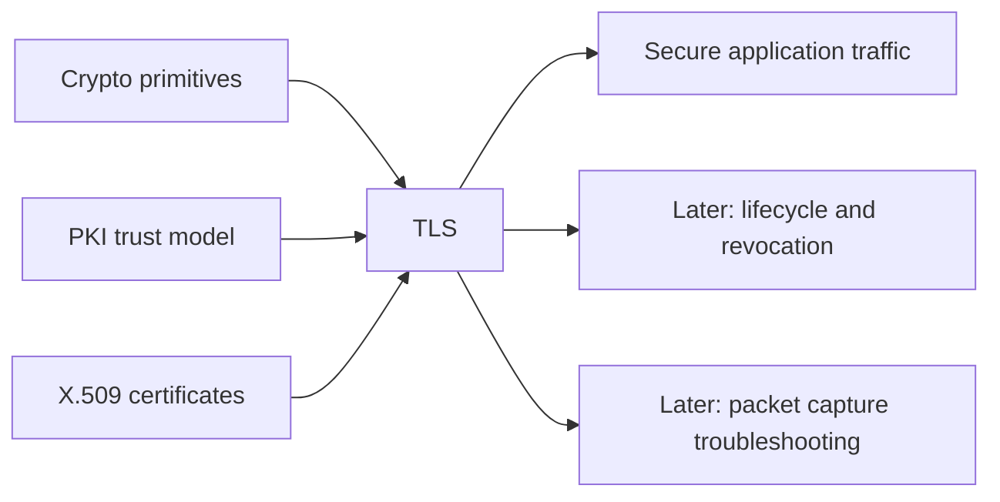

TLS is the protocol behind HTTPS and many secure service-to-service connections.

For an Akamai SDET-II interview, TLS matters because edge platforms terminate and proxy enormous amounts of secure traffic. You may need to test certificate selection, handshake behavior, protocol versions, cipher negotiation, key negotiation, and failure handling.

## One-Screen Mental Model

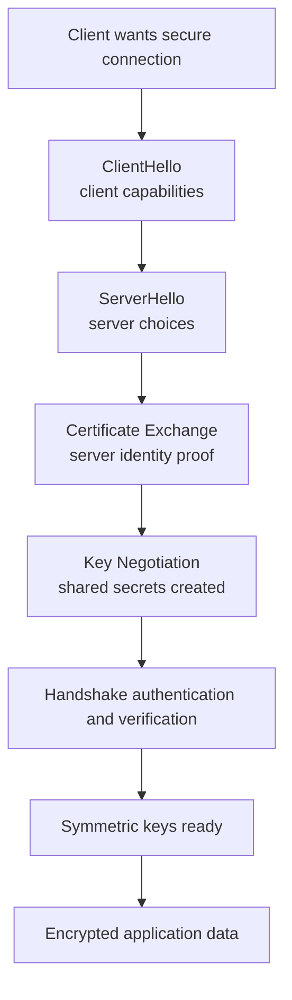

Simple definition:

> TLS is a protocol that lets two systems create an authenticated, encrypted connection over an untrusted network.

Even simpler:

> TLS is how a client and server agree on keys, verify identity, and then encrypt traffic.

---

# Topic 1 - SSL vs TLS

## 1. The Problem

The internet was not originally designed to keep application traffic private or authenticated.

Without a secure transport protocol, a network observer could:

1. Read sensitive data.
2. Modify requests or responses.
3. Impersonate a server.
4. Steal session cookies or tokens.
5. Redirect users to malicious services.

Plain HTTP is easy to inspect:

```text
GET /login HTTP/1.1
Host: example.com
Cookie: session=abc123
```

The problem is secure communication over an unsafe network.

We need:

1. Confidentiality: attackers cannot read traffic.
2. Integrity: attackers cannot silently modify traffic.
3. Authentication: clients can verify the server identity.
4. Key agreement: both sides derive shared encryption keys safely.

## 2. Why It Was Invented

SSL was created first to secure web traffic.

TLS replaced SSL because protocols must evolve when weaknesses are found.

Engineers needed a protocol that could:

1. Work above TCP and below application protocols such as HTTP.
2. Authenticate servers using certificates.
3. Negotiate cryptographic algorithms.
4. Establish shared keys.
5. Encrypt application data.
6. Detect tampering.

SSL stands for Secure Sockets Layer.

TLS stands for Transport Layer Security.

In modern systems, SSL is obsolete. TLS is the modern protocol family.

People still casually say "SSL certificate," but in modern technical language they usually mean:

```text
TLS certificate
```

or more precisely:

```text
X.509 certificate used by TLS
```

## 3. What It Actually Is

Simple definition:

> SSL is the older, deprecated family of secure transport protocols. TLS is the modern replacement used today.

Technical definition:

> TLS is a cryptographic transport protocol that provides authenticated key exchange, encrypted communication, and message integrity between two endpoints over a network.

Important terms:

| Term | Meaning |
|---|---|
| SSL | Older secure protocol family, now obsolete |
| TLS | Modern secure transport protocol |
| HTTPS | HTTP running over TLS |
| Handshake | Setup phase where client and server negotiate security |
| Record protocol | TLS layer that carries encrypted data after handshake |
| Cipher suite | Set of cryptographic algorithms used by a TLS connection |
| Session key | Symmetric key used to protect application data |

Concept diagram:

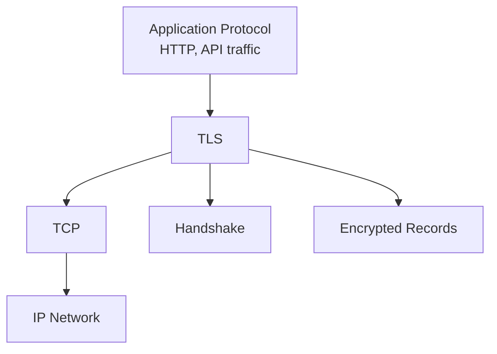

TLS is not the application protocol.

TLS protects the application protocol.

Example:

```text
HTTP request -> protected by TLS -> sent over TCP/IP
```

## 4. How It Works Internally

At a high level, TLS has two phases:

1. Handshake phase.
2. Encrypted data phase.

Handshake phase:

1. Client says what TLS versions and algorithms it supports.
2. Server chooses compatible options.
3. Server sends certificate for identity.
4. Client validates server certificate.
5. Client and server perform key negotiation.
6. Both sides derive shared symmetric keys.
7. Both sides verify the handshake was not tampered with.

Encrypted data phase:

1. Client encrypts application data using symmetric keys.
2. Server decrypts it.
3. Server encrypts responses.
4. Client decrypts responses.

Flow diagram:

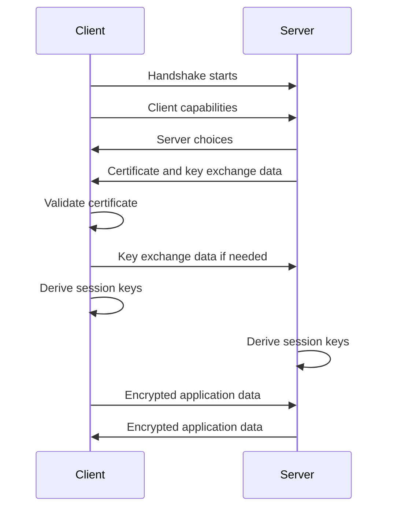

Packet-flow style thinking:

```text
TCP connection established
TLS handshake messages exchanged
Certificate validation happens
Shared secrets are derived
Symmetric keys are created
Application data becomes encrypted TLS records
```

SSL versus TLS comparison:

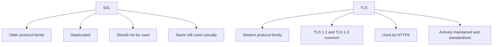

Important interview answer:

> SSL is obsolete. Modern secure web traffic uses TLS. The phrase "SSL certificate" is common slang, but the protocol should be TLS.

## 5. Real World Example

Human analogy:

Two people want a private conversation in a public room. Before speaking privately, they:

1. Agree on a language.
2. Verify who they are talking to.
3. Agree on a temporary secret.
4. Use that secret to protect the conversation.

Computer/network analogy:

A browser connects to `https://api.example.com`.

1. Browser opens TCP connection.
2. Browser starts TLS handshake.
3. Server sends certificate.
4. Browser validates certificate.
5. Browser and server derive encryption keys.
6. Browser sends encrypted HTTP request.
7. Server sends encrypted HTTP response.

## 6. Advantages

TLS provides practical secure communication.

Main advantages:

| Advantage | Why It Matters |
|---|---|
| Confidentiality | Protects data from passive observers |
| Integrity | Detects tampering with protected traffic |
| Authentication | Lets client verify server identity |
| Key negotiation | Creates shared keys dynamically |
| Widely supported | Used by browsers, APIs, services, and edge systems |
| Version evolution | Newer TLS versions improve security and performance |

For Akamai-scale systems, TLS enables secure delivery of customer traffic at the edge.

## 7. Limitations

TLS is powerful, but failures are common.

Main limitations:

| Limitation | Explanation |
|---|---|
| Configuration complexity | Versions, ciphers, certificates, and policies must align |
| Certificate dependency | Bad certificates break trust |
| Client compatibility | Old clients may not support modern TLS |
| Performance cost | Handshakes require CPU and round trips |
| Operational risk | Expired certificates or wrong chains cause outages |
| Misconfiguration risk | Disabling validation or allowing weak versions is dangerous |

TLS also does not fix application bugs.

If an API leaks data in the response, TLS protects the leak in transit but does not make the application logic safe.

## 8. Why Later Technologies Were Needed

TLS evolved because older versions had weaknesses and inefficiencies.

TLS 1.2 became widely deployed and remains important because many systems still support it.

TLS 1.3 simplified and improved the handshake:

1. Fewer round trips.
2. Fewer legacy algorithms.
3. More encrypted handshake data.
4. Stronger modern defaults.

SSL vs TLS answers:

> Which protocol family should be used?

TLS 1.2 and TLS 1.3 answer:

> How does the secure handshake actually happen in widely deployed versions?

Comparison diagram:

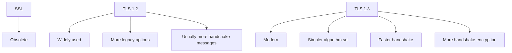

## 9. Interview Questions

### Basic Questions

1. What is TLS?
2. What is the difference between SSL and TLS?
3. What does HTTPS mean?
4. What are the main goals of TLS?
5. What happens after the TLS handshake completes?

### Intermediate Questions

1. Why is SSL considered obsolete?
2. Why do people still say "SSL certificate"?
3. What is the difference between TLS handshake and encrypted application data?
4. How does TLS use certificates?
5. Why does TLS use symmetric encryption after handshake?

### Advanced Questions

1. How would you test that a service rejects obsolete SSL/TLS versions?
2. What TLS misconfigurations can cause production outages?
3. Why is TLS configuration more complicated at edge scale?
4. How would you verify that HTTP traffic is actually protected by TLS?
5. What would you check if a client says "TLS handshake failed"?

### Follow-up Questions

1. Does TLS require TCP?
2. Does TLS encrypt DNS lookups by default?
3. Does TLS prove the application is bug-free?
4. Does a valid certificate guarantee a secure TLS configuration?
5. Which TLS versions are most important to understand for interviews?

---

# Topic 2 - TLS 1.2

## 1. The Problem

TLS needs a handshake that can securely establish keys and authenticate the server.

TLS 1.2 was designed to support secure connections across many systems while allowing negotiation of versions, cipher suites, certificates, and key exchange methods.

The problem TLS 1.2 solves:

> How can a client and server agree on security parameters, authenticate the server, and create shared keys before sending encrypted application data?

TLS 1.2 is still important because many systems, appliances, clients, and enterprise environments support it.

## 2. Why It Was Invented

TLS 1.2 was created as an improvement over older TLS versions.

Engineers needed:

1. Better cryptographic flexibility.
2. Stronger hash and signature algorithm support.
3. Secure handshake negotiation.
4. Compatibility across a broad internet ecosystem.

TLS 1.2 became widely deployed because it balanced security and compatibility.

For interviews, you should understand TLS 1.2 because production systems still encounter it even when TLS 1.3 is preferred.

## 3. What It Actually Is

Simple definition:

> TLS 1.2 is a widely used TLS protocol version that establishes encrypted sessions through a multi-message handshake.

Technical definition:

> TLS 1.2 is a version of the Transport Layer Security protocol that negotiates protocol parameters, authenticates endpoints using certificates, performs key exchange, derives symmetric keys, and protects application data through the TLS record layer.

Important terms:

| Term | Meaning |
|---|---|
| ClientHello | Client's first TLS handshake message |
| ServerHello | Server's selected TLS parameters |
| Cipher suite | Algorithms chosen for key exchange, authentication, encryption, and integrity |
| Certificate | Server's X.509 certificate chain |
| ServerKeyExchange | Server key exchange data in some TLS 1.2 modes |
| ClientKeyExchange | Client key exchange data |
| ChangeCipherSpec | Signal that following records use negotiated keys |
| Finished | Handshake integrity verification message |

Concept diagram:

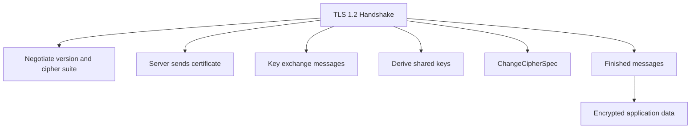

## 4. How It Works Internally

A simplified TLS 1.2 server-authentication handshake looks like this:

```text
Client -> Server: ClientHello
Server -> Client: ServerHello
Server -> Client: Certificate
Server -> Client: ServerKeyExchange      optional, depends on cipher suite
Server -> Client: ServerHelloDone
Client -> Server: ClientKeyExchange
Client -> Server: ChangeCipherSpec
Client -> Server: Finished
Server -> Client: ChangeCipherSpec
Server -> Client: Finished
Client <-> Server: Encrypted application data
```

Flow diagram:

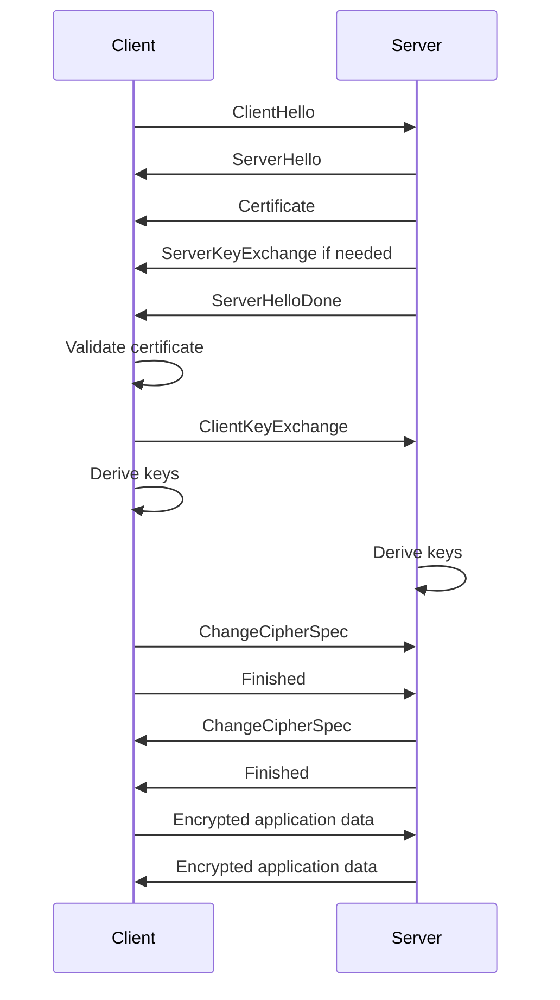

Packet-level explanation:

1. ClientHello:
   - Client proposes TLS version, cipher suites, random value, extensions, and supported features.

2. ServerHello:
   - Server chooses TLS version and cipher suite.
   - Server sends its random value.

3. Certificate:
   - Server sends certificate chain.
   - Client validates identity and trust.

4. ServerKeyExchange:
   - Used in many key exchange modes.
   - Provides server key exchange parameters.
   - Often signed to prove authenticity.

5. ServerHelloDone:
   - Server says it is done with its initial handshake messages.

6. ClientKeyExchange:
   - Client sends key exchange data.
   - Both sides now have enough information to derive shared secrets.

7. ChangeCipherSpec:
   - Side says future records will use negotiated encryption.

8. Finished:
   - Verifies that the handshake transcript was not tampered with.

9. Encrypted application data:
   - HTTP or API traffic is encrypted using symmetric keys.

TLS 1.2 versus application data:

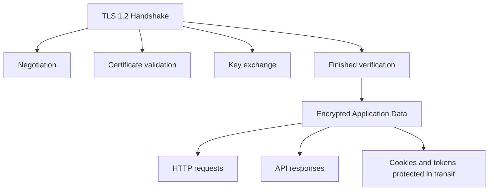

Important:

The exact messages can vary depending on cipher suite, client authentication, session resumption, and extensions. For interviews, focus on the common server-authentication flow first.

## 5. Real World Example

Human analogy:

Two people want a secure conversation:

1. One person lists the security methods they support.
2. The other selects one.
3. The second person shows an ID document.
4. Both exchange setup information.
5. Both derive the same secret.
6. Both confirm nobody changed the setup conversation.
7. They start speaking privately.

Computer/network analogy:

A legacy enterprise client connects to an API endpoint that supports TLS 1.2.

The client sends `ClientHello`. The edge server selects a TLS 1.2 cipher suite, sends its certificate chain, performs key exchange, and then both sides encrypt application data.

## 6. Advantages

TLS 1.2 is mature and widely supported.

Main advantages:

| Advantage | Why It Matters |
|---|---|
| Broad compatibility | Works with many clients and systems |
| Mature tooling | Packet captures and logs are well understood |
| Supports strong configurations | Can be secure when configured correctly |
| Certificate-based authentication | Uses PKI and X.509 certificates |
| Flexible | Supports many deployment scenarios |

For SDETs, TLS 1.2 appears frequently in compatibility testing.

## 7. Limitations

TLS 1.2 has more complexity and legacy behavior than TLS 1.3.

Main limitations:

| Limitation | Explanation |
|---|---|
| More round trips | Handshake usually takes more messages than TLS 1.3 |
| More legacy algorithms | Bad configurations may allow weak choices |
| More complex negotiation | More combinations to test |
| Some handshake data visible | TLS 1.3 encrypts more of the handshake |
| Configuration mistakes are common | Cipher suite and protocol policies matter |

SDET risk:

A service may "support TLS 1.2" but still be misconfigured if it allows weak cipher suites or invalid certificate behavior.

## 8. Why Later Technologies Were Needed

TLS 1.3 was created to simplify and improve TLS.

TLS 1.2 answers:

> How did the widely deployed TLS handshake establish secure sessions?

TLS 1.3 answers:

> How can the handshake be faster, simpler, and more secure by default?

Comparison diagram:

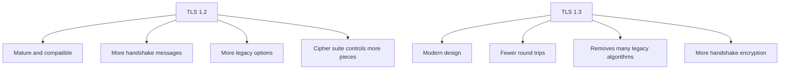

## 9. Interview Questions

### Basic Questions

1. What is TLS 1.2?
2. What is the purpose of the TLS 1.2 handshake?
3. What does ClientHello contain?
4. What does ServerHello contain?
5. When does application data become encrypted?

### Intermediate Questions

1. Why does the server send a certificate?
2. What is the role of ClientKeyExchange?
3. What is ChangeCipherSpec?
4. Why are Finished messages important?
5. Why does TLS 1.2 have more configuration complexity than TLS 1.3?

### Advanced Questions

1. How would you troubleshoot a TLS 1.2 handshake failure?
2. What negative tests would you perform for TLS 1.2 version and cipher policy?
3. How can certificate validation failure appear during a TLS 1.2 handshake?
4. Why can two clients negotiate different cipher suites with the same server?
5. How would you test that weak TLS 1.2 cipher suites are disabled?

### Follow-up Questions

1. Is TLS 1.2 always insecure?
2. Why is TLS 1.2 still supported in many systems?
3. Does TLS 1.2 always use the same handshake messages?
4. What does the Finished message protect against?
5. What improvements does TLS 1.3 make?

---

# Topic 3 - TLS 1.3

## 1. The Problem

TLS 1.2 worked well, but it carried too much historical complexity.

Problems included:

1. Too many legacy algorithms.
2. More handshake round trips.
3. More visible handshake data.
4. More configuration combinations.
5. Higher chance of misconfiguration.

Modern internet systems needed a faster and cleaner TLS protocol.

The problem TLS 1.3 solves:

> How can TLS provide secure connections with fewer round trips, fewer legacy choices, and stronger modern defaults?

## 2. Why It Was Invented

TLS 1.3 was invented to modernize TLS.

Engineers wanted:

1. Faster handshakes.
2. Less legacy cryptography.
3. Simpler cipher suite design.
4. Better privacy for handshake messages.
5. Stronger forward secrecy by default.
6. Reduced risk from dangerous old options.

TLS 1.3 is not just TLS 1.2 with a new version number. It changes the handshake design.

## 3. What It Actually Is

Simple definition:

> TLS 1.3 is the modern version of TLS that makes the handshake faster, simpler, and more secure by default.

Technical definition:

> TLS 1.3 is a version of the Transport Layer Security protocol that uses ephemeral key exchange, simplified cipher suites, encrypted handshake messages after early negotiation, and a shorter handshake to establish secure application traffic.

Important terms:

| Term | Meaning |
|---|---|
| Ephemeral key exchange | Temporary key exchange values used for a session |
| 1-RTT handshake | Handshake that can complete in one round trip in normal cases |
| EncryptedExtensions | TLS 1.3 message carrying encrypted server extensions |
| CertificateVerify | Message proving possession of certificate private key |
| Finished | Message proving handshake integrity |
| Forward secrecy | Past sessions remain protected even if long-term keys leak later, depending on design |

Concept diagram:

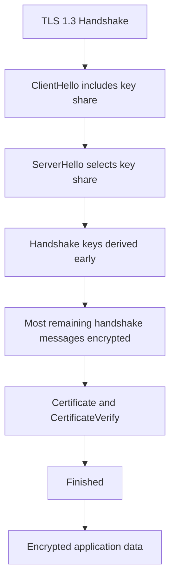

## 4. How It Works Internally

A simplified TLS 1.3 server-authentication handshake looks like this:

```text
Client -> Server: ClientHello + key share
Server -> Client: ServerHello + selected key share
Server -> Client: EncryptedExtensions
Server -> Client: Certificate
Server -> Client: CertificateVerify
Server -> Client: Finished
Client -> Server: Finished
Client <-> Server: Encrypted application data
```

Flow diagram:

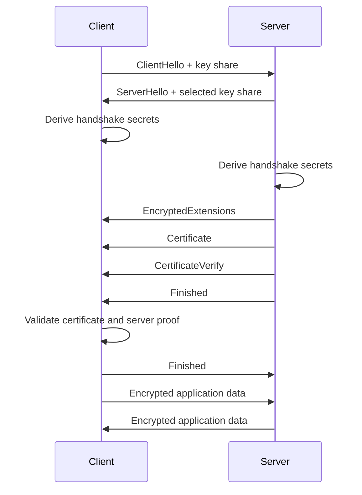

Packet-level explanation:

1. ClientHello:
   - Client proposes TLS 1.3 support, cipher suites, extensions, and key share.

2. ServerHello:
   - Server selects TLS 1.3 parameters and key share.
   - Both sides can derive handshake secrets.

3. EncryptedExtensions:
   - Server sends additional selected extensions.
   - This message is encrypted.

4. Certificate:
   - Server sends certificate chain.
   - In TLS 1.3 this is encrypted after handshake keys are available.

5. CertificateVerify:
   - Server proves it owns the private key matching the certificate.

6. Finished:
   - Server proves handshake integrity.
   - Client sends its own Finished after validation.

7. Application data:
   - Application traffic is encrypted with derived application keys.

TLS 1.2 versus TLS 1.3 handshake comparison:

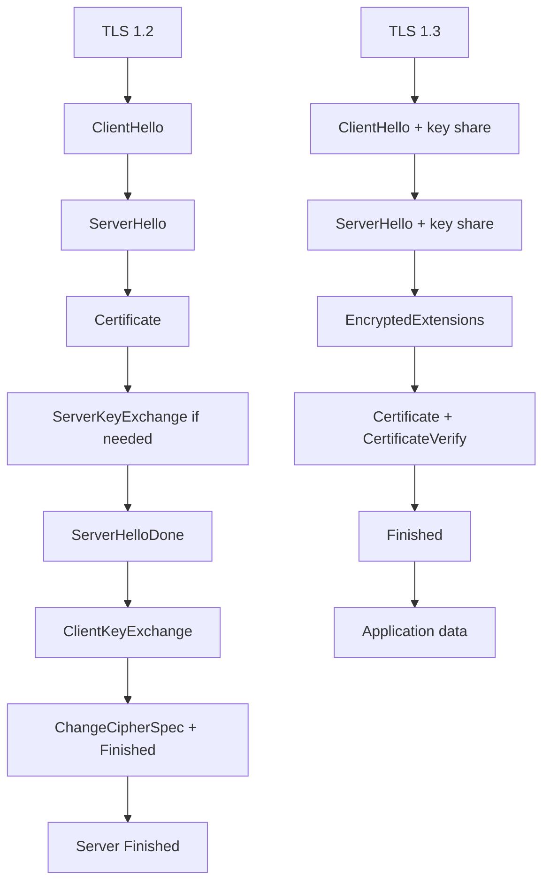

Important:

TLS 1.3 removed many old choices. This is good for security, but it can expose compatibility issues with old clients or middleboxes.

## 5. Real World Example

Human analogy:

TLS 1.2 is like a careful formal meeting with several back-and-forth steps before the private conversation starts.

TLS 1.3 is like a better-designed meeting where both sides bring the right setup material early, agree faster, and move sensitive discussion into private mode sooner.

Computer/network analogy:

A modern browser connects to a modern edge endpoint. The browser sends a TLS 1.3 ClientHello with a key share. The server replies with selected parameters and quickly encrypts the rest of the handshake. The user gets secure application traffic with less handshake latency.

## 6. Advantages

TLS 1.3 improves security and performance.

Main advantages:

| Advantage | Why It Matters |
|---|---|
| Faster handshake | Normal handshake completes with fewer round trips |
| Removes legacy algorithms | Reduces insecure configuration options |
| Forward secrecy by default | Uses ephemeral key exchange |
| More encrypted handshake | Improves privacy of handshake details |
| Simpler cipher suites | Reduces negotiation complexity |
| Better modern baseline | Good default for new systems |

For edge systems, fewer round trips can improve latency for customers worldwide.

## 7. Limitations

TLS 1.3 is modern, but deployment still needs care.

Main limitations:

| Limitation | Explanation |
|---|---|
| Old client incompatibility | Some older clients do not support TLS 1.3 |
| Middlebox issues | Some network devices historically mishandled new TLS behavior |
| Debugging differs | More handshake data is encrypted |
| Configuration still matters | Certificates, supported groups, and policies must align |
| 0-RTT has replay concerns | Early data needs careful controls if enabled |

0-RTT simple explanation:

Some TLS 1.3 deployments may allow a returning client to send early data before the full handshake finishes. This can improve performance, but early data can have replay risks. For now, remember:

> 0-RTT is powerful but must be used carefully, especially for non-idempotent requests.

Idempotent means repeating the same request has the same effect, such as a safe read request. A payment or state-changing request is usually not idempotent.

## 8. Why Later Technologies Were Needed

TLS 1.3 improves the protocol, but operations still matter.

Even with TLS 1.3, systems must manage:

1. Certificates.
2. Key rotation.
3. Expiry.
4. Revocation.
5. Client compatibility.
6. Monitoring and troubleshooting.

TLS 1.3 answers:

> How does modern TLS establish secure sessions efficiently?

Certificate lifecycle answers:

> How do we keep the certificates and keys used by TLS healthy over time?

Comparison diagram:

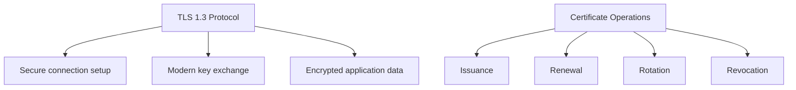

## 9. Interview Questions

### Basic Questions

1. What is TLS 1.3?
2. How is TLS 1.3 different from TLS 1.2 at a high level?
3. What is a key share?
4. What is CertificateVerify?
5. When does application data start in TLS 1.3?

### Intermediate Questions

1. Why is TLS 1.3 faster than TLS 1.2?
2. Why did TLS 1.3 remove many legacy algorithms?
3. What handshake messages are encrypted in TLS 1.3?
4. Why is ephemeral key exchange important?
5. What is the risk of 0-RTT early data?

### Advanced Questions

1. How would you test TLS 1.3 support on a service?
2. How would you verify fallback behavior from TLS 1.3 to TLS 1.2?
3. Why can TLS 1.3 be harder to inspect in packet captures?
4. What compatibility issues might appear when enabling TLS 1.3?
5. How would you design tests to ensure unsafe 0-RTT usage is disabled?

### Follow-up Questions

1. Does TLS 1.3 still use certificates?
2. Does TLS 1.3 still need PKI?
3. Is TLS 1.3 always faster in every situation?
4. Why does TLS 1.3 encrypt more of the handshake?
5. Does TLS 1.3 remove the need for certificate lifecycle management?

---

# Topic 4 - ClientHello

## 1. The Problem

A TLS server cannot choose secure connection settings unless it first knows what the client supports.

Different clients may support different:

1. TLS versions.
2. Cipher suites.
3. Signature algorithms.
4. Key exchange groups.
5. Extensions.
6. Application protocols.
7. Server names.

The problem is capability negotiation.

The client must start the handshake by saying:

> Here is what I support, and here is the server I want to reach.

## 2. Why It Was Invented

ClientHello was invented as the opening negotiation message.

Engineers needed a first message that lets the client:

1. Start the TLS handshake.
2. Offer supported protocol versions.
3. Offer supported cipher suites.
4. Provide randomness for key generation.
5. Include extensions such as SNI and ALPN.
6. In TLS 1.3, send key share information early.

Without ClientHello, the server would not know how to choose compatible security parameters.

## 3. What It Actually Is

Simple definition:

> ClientHello is the first TLS handshake message where the client tells the server what it supports.

Technical definition:

> ClientHello is a TLS handshake message sent by the client containing supported protocol versions, cipher suites, random data, extensions, and optionally key exchange information used by the server to select connection parameters.

Important terms:

| Term | Meaning |
|---|---|
| Supported versions | TLS versions the client can use |
| Cipher suites | Algorithm combinations the client supports |
| Client random | Random value used in key derivation |
| Extensions | Extra negotiation data |
| SNI | Server Name Indication, the hostname the client wants |
| ALPN | Application-Layer Protocol Negotiation, such as HTTP/1.1 or HTTP/2 |
| Key share | TLS 1.3 key exchange value sent by client |

Concept diagram:

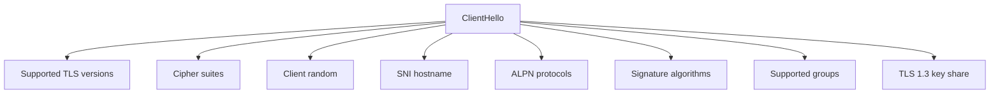

SNI matters a lot at edge scale.

SNI tells the server which hostname the client is trying to reach. This helps a server or edge endpoint select the correct certificate when many hostnames share the same IP address.

## 4. How It Works Internally

ClientHello flow:

1. Client opens a TCP connection.
2. Client creates a ClientHello.
3. Client includes supported versions and cipher suites.
4. Client includes random data.
5. Client includes extensions such as SNI and ALPN.
6. In TLS 1.3, client usually includes key share data.
7. Server receives ClientHello.
8. Server chooses compatible parameters.
9. Server responds with ServerHello.

Flow diagram:

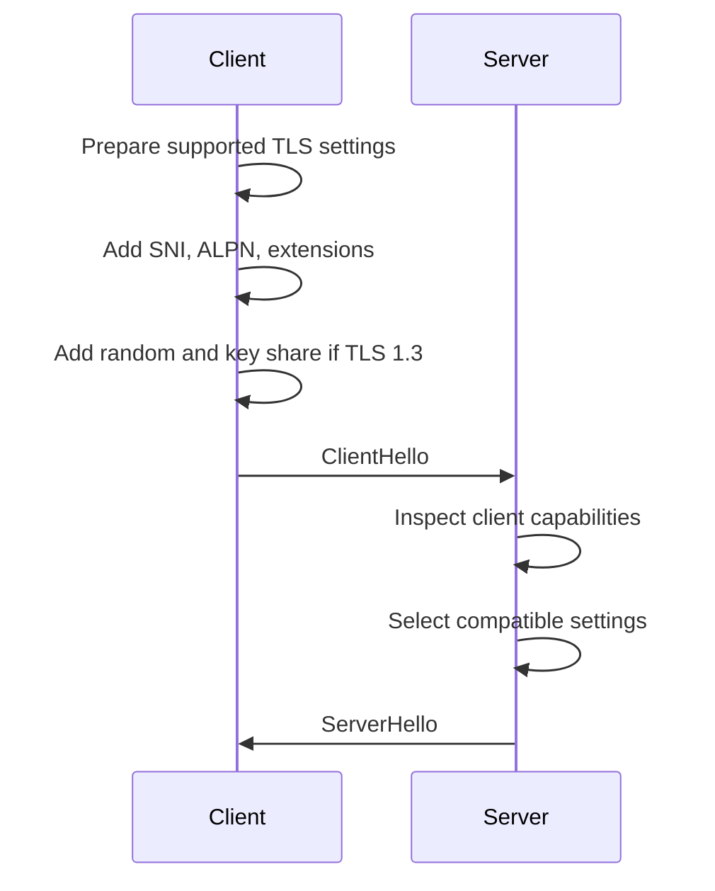

Packet-level example:

```text
ClientHello:
    Supported versions:
        TLS 1.3
        TLS 1.2

    Cipher suites:
        TLS_AES_128_GCM_SHA256
        TLS_AES_256_GCM_SHA384

    Extensions:
        SNI: api.example.com
        ALPN: h2, http/1.1
        Supported groups: x25519, secp256r1
        Signature algorithms: rsa_pss, ecdsa_secp256r1_sha256
        Key share: client ephemeral public value
```

ClientHello in TLS 1.2 versus TLS 1.3:

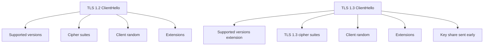

Common SDET observations:

1. Missing SNI can cause the server to return the wrong certificate.
2. Unsupported TLS version can cause handshake failure.
3. No shared cipher suite can cause handshake failure.
4. ALPN mismatch can affect whether HTTP/2 or HTTP/1.1 is selected.

## 5. Real World Example

Human analogy:

A traveler walks up to a service desk and says:

```text
I speak English and Hindi.
I can pay by card or cash.
I am here for the international counter.
I want express service if available.
```

The desk now has enough information to choose how to serve the traveler.

Computer/network analogy:

A browser connects to an Akamai edge IP that serves many customer hostnames. The browser sends SNI:

```text
SNI: shop.customer.com
```

The edge server uses that name to select the correct customer certificate.

## 6. Advantages

ClientHello makes negotiation flexible.

Main advantages:

| Advantage | Why It Matters |
|---|---|
| Starts handshake | First message that begins TLS negotiation |
| Advertises client capabilities | Server can choose compatible settings |
| Supports virtual hosting | SNI helps select correct certificate |
| Enables app protocol negotiation | ALPN selects HTTP/2 or HTTP/1.1 |
| Improves TLS 1.3 speed | Key share can be sent immediately |

For edge platforms, ClientHello is critical because many domains, policies, and certificates may be served from shared infrastructure.

## 7. Limitations

ClientHello can also expose compatibility and privacy issues.

Main limitations:

| Limitation | Explanation |
|---|---|
| SNI may be visible | Traditional TLS exposes hostname in ClientHello |
| Client support varies | Old clients may offer weak or limited options |
| Misleading assumptions | Server must not blindly accept unsafe choices |
| Large ClientHello can cause issues | Some middleboxes mishandle large handshakes |
| Missing extensions break features | Missing SNI or ALPN can change behavior |

Important:

The ClientHello advertises what the client supports. It does not mean every offered option is secure or should be selected.

The server must enforce its own security policy.

## 8. Why Later Technologies Were Needed

ClientHello offers options. The server still needs to choose.

That leads to ServerHello.

ClientHello answers:

> What can the client support, and what server name does it want?

ServerHello answers:

> What did the server choose for this connection?

Comparison diagram:

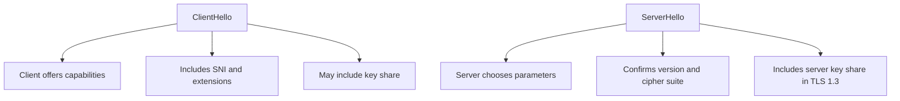

## 9. Interview Questions

### Basic Questions

1. What is ClientHello?
2. What information is inside ClientHello?
3. What is SNI?
4. What is ALPN?
5. Why does the client send supported cipher suites?

### Intermediate Questions

1. How does SNI affect certificate selection?
2. What happens if client and server have no shared TLS version?
3. What happens if client and server have no shared cipher suite?
4. Why does TLS 1.3 include key share in ClientHello?
5. How can missing ALPN affect application behavior?

### Advanced Questions

1. How would you test SNI-based certificate selection?
2. How would you debug a handshake that fails right after ClientHello?
3. What ClientHello fields are useful in packet capture analysis?
4. Why can large or unusual ClientHello messages expose middlebox issues?
5. How would you test version fallback behavior safely?

### Follow-up Questions

1. Is ClientHello encrypted?
2. Does ClientHello contain the server certificate?
3. Does SNI prove the client owns the hostname?
4. Can the server ignore offered weak cipher suites?
5. What message normally follows ClientHello?

---

# Topic 5 - ServerHello

## 1. The Problem

After receiving ClientHello, the server must make decisions.

The client may offer many versions, cipher suites, and extensions. The server must choose one compatible set that also satisfies server policy.

The problem is server-side selection.

The server must answer:

1. Which TLS version will we use?
2. Which cipher suite will we use?
3. Which key exchange parameters will we use?
4. Which extensions are accepted?
5. Can we proceed securely?

## 2. Why It Was Invented

ServerHello was invented so the server can reply with the selected handshake parameters.

Engineers needed a server message that:

1. Confirms the selected TLS version.
2. Confirms the selected cipher suite.
3. Provides server random data.
4. In TLS 1.3, provides the selected key share.
5. Moves the handshake from proposal to agreement.

Without ServerHello, the client would not know what the server selected.

## 3. What It Actually Is

Simple definition:

> ServerHello is the TLS handshake message where the server tells the client which security parameters it selected.

Technical definition:

> ServerHello is a TLS handshake message sent by the server containing the selected protocol version, cipher suite, server random, and negotiated parameters needed to continue the handshake.

Important terms:

| Term | Meaning |
|---|---|
| Selected version | TLS version chosen by server |
| Selected cipher suite | Cipher suite chosen for the connection |
| Server random | Random value used in key derivation |
| Selected group | Key exchange group chosen by server |
| Server key share | TLS 1.3 server ephemeral public value |
| Negotiated parameters | The final choices for this TLS session |

Concept diagram:

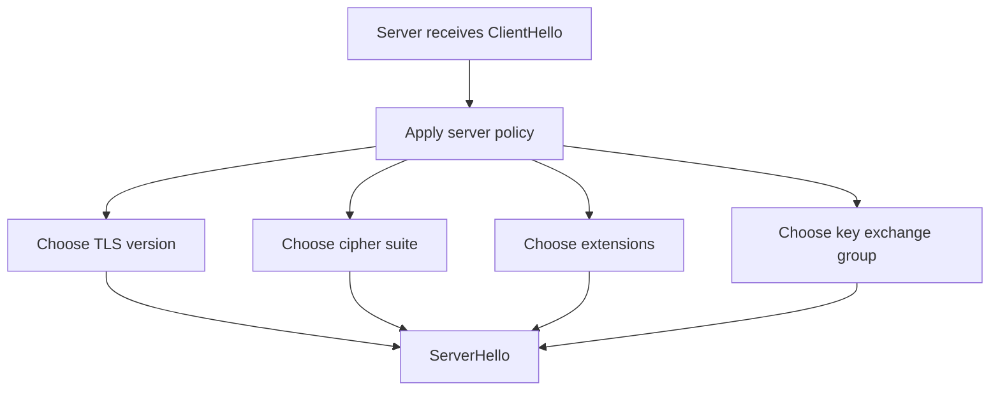

The ServerHello is the server saying:

> We will use these parameters for this connection.

## 4. How It Works Internally

ServerHello flow:

1. Server receives ClientHello.
2. Server checks the requested SNI and policy.
3. Server finds a compatible TLS version.
4. Server finds a compatible cipher suite.
5. Server chooses key exchange parameters.
6. Server creates ServerHello.
7. Server sends ServerHello to client.
8. Handshake continues with certificate and key exchange messages.

Flow diagram:

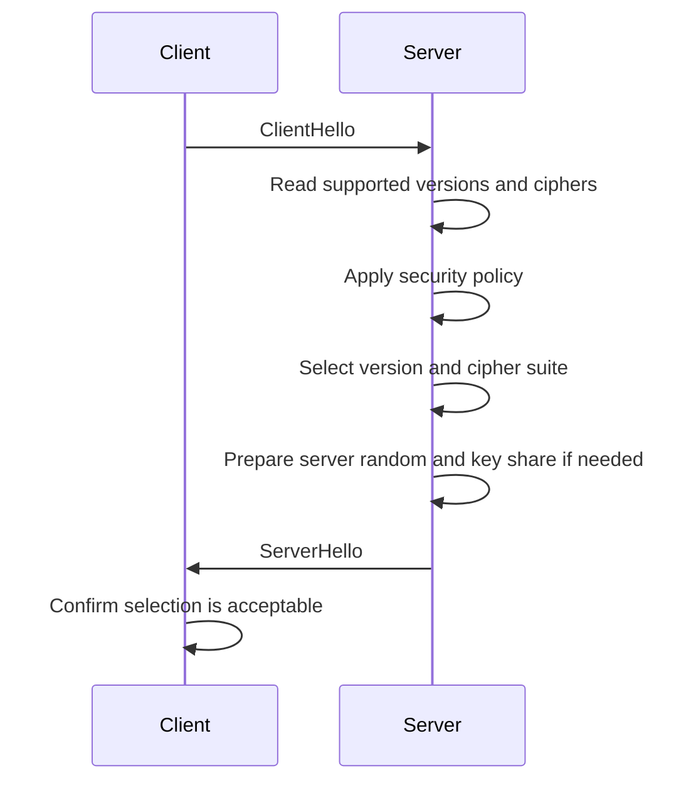

Packet-level example:

```text
Client offered:
    TLS 1.3, TLS 1.2
    TLS_AES_128_GCM_SHA256
    TLS_AES_256_GCM_SHA384
    SNI: api.example.com

ServerHello selects:
    TLS 1.3
    TLS_AES_128_GCM_SHA256
    Server random
    Server key share
```

ServerHello in TLS 1.2 versus TLS 1.3:

```mermaid
flowchart TD
    A["TLS 1.2 ServerHello"] --> A1["Selected version"]
    A --> A2["Selected cipher suite"]
    A --> A3["Server random"]
    A --> A4["Then certificate is usually sent in clear handshake"]

    B["TLS 1.3 ServerHello"] --> B1["Selected version"]
    B --> B2["Selected cipher suite"]
    B --> B3["Server random"]
    B --> B4["Selected key share"]
    B --> B5["Enables handshake encryption after this point"]
```

Important:

If the server cannot find compatible parameters, the handshake fails. A correct server should fail closed, not silently choose unsafe settings.

## 5. Real World Example

Human analogy:

The client says:

```text
I can speak English or Hindi.
I can use card or cash.
```

The server says:

```text
We will use English and card payment.
```

That is ServerHello: the server selects from the client's offered options while enforcing its own policy.

Computer/network analogy:

A client offers TLS 1.3 and TLS 1.2. The server supports TLS 1.3 and selects it. The server then sends a certificate and proves ownership of the certificate private key as the handshake continues.

## 6. Advantages

ServerHello makes negotiation explicit.

Main advantages:

| Advantage | Why It Matters |
|---|---|
| Confirms selected version | Both sides know protocol version |
| Confirms selected cipher | Both sides know algorithms |
| Applies server policy | Server can reject weak or unsupported options |
| Enables key derivation | Randoms and key shares feed later secrets |
| Moves handshake forward | Client can continue with agreed parameters |

For SDETs, ServerHello tells you what actually got negotiated, not just what was offered.

## 7. Limitations

ServerHello is only one part of the handshake.

Main limitations:

| Limitation | Explanation |
|---|---|
| Does not authenticate server alone | Certificate and proof are still needed |
| Does not validate certificate | Client performs certificate validation later |
| Bad server policy can choose weak options | Offered options must be filtered by policy |
| Compatibility can fail | No shared parameters means handshake failure |
| Logs may hide detail | Some systems do not expose selected settings clearly |

Important SDET habit:

Always distinguish:

```text
Client offered values
Server selected values
```

They are not the same.

## 8. Why Later Technologies Were Needed

ServerHello chooses parameters, but the client still needs to know whether it is talking to the real server.

That leads to Certificate Exchange.

ServerHello answers:

> What security parameters did the server choose?

Certificate Exchange answers:

> What identity is the server claiming, and can the client trust it?

Comparison diagram:

```mermaid
flowchart TD
    A["ServerHello"] --> A1["Negotiation result"]
    A --> A2["Version and cipher selection"]
    A --> A3["Key exchange parameter selection"]

    B["Certificate Exchange"] --> B1["Server identity"]
    B --> B2["Certificate chain"]
    B --> B3["Trust validation"]
```

## 9. Interview Questions

### Basic Questions

1. What is ServerHello?
2. What does ServerHello select?
3. How is ServerHello related to ClientHello?
4. What is server random?
5. What happens if the server cannot select compatible parameters?

### Intermediate Questions

1. Why should the server enforce its own TLS policy?
2. How do you determine which cipher suite was negotiated?
3. How is ServerHello different in TLS 1.2 and TLS 1.3?
4. Why is ServerHello not enough to authenticate the server?
5. How can SNI affect server-side selection?

### Advanced Questions

1. How would you test server cipher suite preference?
2. How would you verify that weak client offers are rejected?
3. What packet capture evidence shows the negotiated TLS version?
4. Why might the same server select different parameters for different clients?
5. How would you debug a handshake failure caused by no shared cipher suite?

### Follow-up Questions

1. Does ServerHello contain the certificate?
2. Does ServerHello encrypt application data?
3. Can ServerHello choose something the client did not offer?
4. What follows ServerHello in TLS 1.2?
5. What follows ServerHello in TLS 1.3?

---

# Topic 6 - Certificate Exchange

## 1. The Problem

Negotiating algorithms is not enough.

A client also needs to know:

> Am I talking to the real server, or an attacker?

Without certificate exchange, a man-in-the-middle attacker could participate in key negotiation and impersonate the server.

The problem is server authentication.

The client must validate:

1. The server certificate chain.
2. The hostname in SAN.
3. The issuer chain.
4. The trust store root.
5. The signature chain.
6. The server's proof that it controls the private key.

## 2. Why It Was Invented

Certificate exchange exists so the server can present its identity to the client.

Engineers needed TLS to use PKI and X.509 certificates during the handshake.

The server must say:

```text
Here is my certificate chain.
It contains my identity and public key.
It chains to a trusted CA.
I can prove I control the matching private key.
```

This prevents a passive public key from being blindly trusted.

## 3. What It Actually Is

Simple definition:

> Certificate Exchange is the part of the TLS handshake where the server sends its certificate chain so the client can validate the server identity.

Technical definition:

> Certificate Exchange is the TLS handshake phase in which the server provides X.509 certificates, and depending on protocol version, additional proof such as CertificateVerify, allowing the client to authenticate the server and bind key exchange to the certified identity.

Important terms:

| Term | Meaning |
|---|---|
| Leaf certificate | Server certificate for the requested service |
| Intermediate certificate | CA certificate that helps build chain |
| Certificate chain | Certificates from leaf toward root |
| CertificateVerify | TLS 1.3 message proving private key possession |
| Hostname validation | Checking requested name against SAN |
| Chain validation | Verifying issuer signatures up to trusted root |

Concept diagram:

```mermaid
flowchart TD
    A["Server Certificate Exchange"] --> B["Leaf certificate"]
    A --> C["Intermediate certificates"]
    B --> D["SAN matches requested hostname"]
    B --> E["Public key belongs to server identity"]
    C --> F["Build chain to root"]
    F --> G["Client trust store"]
    E --> H["Server proves private key possession"]
```

## 4. How It Works Internally

TLS certificate exchange differs slightly between TLS 1.2 and TLS 1.3.

TLS 1.2 simplified view:

```text
Server -> Client: Certificate
Server -> Client: ServerKeyExchange if needed
Server -> Client: ServerHelloDone
```

TLS 1.3 simplified view:

```text
Server -> Client: Certificate
Server -> Client: CertificateVerify
Server -> Client: Finished
```

Flow diagram:

```mermaid
sequenceDiagram
    participant C as Client
    participant S as Server
    participant TS as Trust Store

    S->>C: Send certificate chain
    C->>C: Parse leaf certificate
    C->>C: Check SAN against requested hostname
    C->>C: Verify certificate signatures
    C->>TS: Check chain reaches trusted root
    C->>C: Check validity and usage rules
    C->>C: Verify server proof of private key possession
    alt All checks pass
        C->>C: Server authenticated
    else Any check fails
        C->>C: Handshake fails
    end
```

Packet-level validation checklist:

```text
Certificate received:
    Leaf certificate
    Intermediate certificate(s)

Client checks:
    Is certificate parseable?
    Is SAN valid for requested hostname?
    Is certificate within validity period?
    Is the chain complete?
    Does each signature verify?
    Does chain reach trusted root?
    Is the certificate allowed for server authentication?
    Does server prove possession of private key?
```

TLS 1.2 versus TLS 1.3 certificate exchange:

```mermaid
flowchart TD
    A["TLS 1.2"] --> A1["Certificate usually visible in handshake"]
    A --> A2["ServerKeyExchange may carry signed key exchange params"]
    A --> A3["Authentication depends on certificate and handshake messages"]

    B["TLS 1.3"] --> B1["Certificate sent after handshake keys"]
    B --> B2["Certificate message is encrypted"]
    B --> B3["CertificateVerify proves private key possession"]
```

Important:

Certificate validation failure should fail the TLS handshake. A client that ignores certificate errors is removing a core security property of TLS.

## 5. Real World Example

Human analogy:

During a secure meeting, one person shows an official ID. The other person checks:

1. Is the ID issued by a trusted authority?
2. Is the name correct?
3. Is it expired?
4. Does the photo match the person?
5. Does the ID look tampered with?

Computer/network analogy:

A browser connects to `https://api.example.com`.

The server sends a certificate chain. The browser checks that:

1. SAN includes `api.example.com`.
2. The issuer chain reaches a trusted root.
3. The certificate is valid now.
4. The server proves it owns the private key.

If checks fail, the browser blocks or warns.

## 6. Advantages

Certificate exchange gives TLS authentication.

Main advantages:

| Advantage | Why It Matters |
|---|---|
| Authenticates server identity | Client can verify who it is talking to |
| Uses PKI | Scales trust through CAs and trust stores |
| Protects against impersonation | Attackers cannot simply claim a hostname |
| Supports virtual hosting | SNI plus certificate selection supports many domains |
| Enables automated validation | Clients can enforce certificate rules |

For edge systems, certificate exchange is central because the platform must present the correct certificate for the requested customer hostname.

## 7. Limitations

Certificate exchange can fail for many reasons.

Main limitations:

| Limitation | Explanation |
|---|---|
| Wrong certificate | Server presents certificate for different hostname |
| Missing intermediate | Client cannot build chain |
| Expired certificate | Certificate outside validity period |
| Unknown root | Client trust store does not trust chain |
| Unsupported algorithm | Client cannot use certificate algorithm |
| Private key mismatch | Server cannot prove possession of matching private key |

Common SDET failure:

```text
Handshake failed
```

This is too vague. You need to determine whether the failure happened because of:

1. Protocol version mismatch.
2. Cipher suite mismatch.
3. Certificate validation failure.
4. Key exchange failure.
5. Client policy failure.

## 8. Why Later Technologies Were Needed

Certificate exchange authenticates the server and binds identity to a public key.

But TLS still needs both sides to derive shared symmetric keys for encrypted application data.

That leads to key negotiation.

Certificate Exchange answers:

> Who is the server, and can I trust its certificate?

Key Negotiation answers:

> How do client and server create shared encryption keys for this session?

Comparison diagram:

```mermaid
flowchart TD
    A["Certificate Exchange"] --> A1["Server identity"]
    A --> A2["Certificate chain"]
    A --> A3["Trust validation"]
    A --> A4["Private key proof"]

    B["Key Negotiation"] --> B1["Shared secrets"]
    B --> B2["Session keys"]
    B --> B3["Encrypted application data"]
```

## 9. Interview Questions

### Basic Questions

1. Why does the server send a certificate in TLS?
2. What is a certificate chain?
3. What does the client check in the certificate?
4. What is hostname validation?
5. What happens if certificate validation fails?

### Intermediate Questions

1. How does SNI affect certificate selection?
2. Why must the server prove private key possession?
3. What is CertificateVerify in TLS 1.3?
4. Why can a missing intermediate certificate break the handshake?
5. Why is disabling certificate validation dangerous?

### Advanced Questions

1. How would you test certificate selection for multiple hostnames on one edge IP?
2. How would you debug a TLS failure caused by wrong SAN?
3. How would you create negative tests for expired, untrusted, or mismatched certificates?
4. Why might the same certificate chain pass in a browser but fail in a service client?
5. How would private key mismatch show up during TLS setup?

### Follow-up Questions

1. Does certificate exchange create symmetric keys?
2. Does a certificate contain the server private key?
3. Can a valid certificate still fail hostname validation?
4. Does TLS 1.3 still use certificates?
5. What part of TLS creates the final session keys?

---

# Topic 7 - Key Negotiation

## 1. The Problem

TLS needs fast symmetric keys to encrypt application data.

But client and server begin as strangers over an unsafe network.

They need to create shared secrets without sending the final secret directly.

The problem is secure session key establishment.

TLS key negotiation must ensure:

1. Both sides derive the same secret.
2. Network observers cannot derive the secret.
3. The secret is tied to the handshake.
4. The server identity is authenticated.
5. Final keys protect application data.

## 2. Why It Was Invented

Key negotiation exists because asymmetric operations are not ideal for encrypting all traffic.

TLS uses key negotiation to establish symmetric keys, then uses symmetric encryption for the data phase.

Engineers needed TLS to combine:

1. PKI for identity.
2. Key exchange for shared secrets.
3. Symmetric encryption for bulk traffic.
4. Handshake integrity to detect tampering.

Without key negotiation, TLS could not efficiently protect application traffic.

## 3. What It Actually Is

Simple definition:

> Key negotiation is the TLS handshake process where client and server derive shared session keys.

Technical definition:

> TLS key negotiation is the process of exchanging protocol key share data, combining it with local private values, deriving shared secrets, and expanding those secrets into handshake and application traffic keys.

Important terms:

| Term | Meaning |
|---|---|
| Shared secret | Secret value derived by both sides |
| Session key | Symmetric key used for one connection |
| Key share | Public key exchange value sent during handshake |
| Ephemeral | Temporary for this session |
| Key schedule | Process of deriving multiple TLS secrets and keys |
| Traffic keys | Keys used to encrypt TLS records |
| Forward secrecy | Past sessions remain protected even if long-term keys leak later, depending on design |

Concept diagram:

```mermaid
flowchart TD
    A["Client private value"] --> C["Key exchange calculation"]
    B["Server public key share"] --> C
    C --> D["Client shared secret"]

    E["Server private value"] --> G["Key exchange calculation"]
    F["Client public key share"] --> G
    G --> H["Server shared secret"]

    D --> I["Key derivation"]
    H --> I
    I --> J["Symmetric traffic keys"]
```

The key idea:

> TLS does not send the final session key across the network. Both sides derive it.

## 4. How It Works Internally

TLS 1.2 and TLS 1.3 perform key negotiation differently depending on configuration and version, but the beginner-level goal is the same:

```text
Exchange public key material
Combine with private values
Derive shared secret
Derive symmetric traffic keys
Encrypt application data
```

TLS 1.3 simplified flow:

1. Client sends key share in ClientHello.
2. Server sends selected key share in ServerHello.
3. Client combines its private value with server key share.
4. Server combines its private value with client key share.
5. Both derive the same shared secret.
6. Both derive handshake keys.
7. Both verify the handshake.
8. Both derive application traffic keys.

Flow diagram:

```mermaid
sequenceDiagram
    participant C as Client
    participant S as Server

    C->>C: Generate ephemeral private value
    C->>S: ClientHello with key share
    S->>S: Generate ephemeral private value
    S->>C: ServerHello with key share
    C->>C: Compute shared secret
    S->>S: Compute same shared secret
    C->>C: Derive handshake keys
    S->>S: Derive handshake keys
    C->>C: Verify handshake
    S->>S: Verify handshake
    C->>C: Derive application traffic keys
    S->>S: Derive application traffic keys
```

Packet-level thinking:

```text
Network sees:
    Client key share
    Server key share

Network does not see:
    Client private value
    Server private value
    Shared secret
    Final traffic keys
```

TLS 1.2 versus TLS 1.3 key negotiation:

```mermaid
flowchart TD
    A["TLS 1.2"] --> A1["Depends heavily on cipher suite"]
    A --> A2["ClientKeyExchange often important"]
    A --> A3["Some older modes existed"]
    A --> A4["More variation"]

    B["TLS 1.3"] --> B1["Ephemeral key exchange by design"]
    B --> B2["Key share in ClientHello and ServerHello"]
    B --> B3["Simpler key schedule"]
    B --> B4["Forward secrecy by default"]
```

Important:

Key negotiation must be authenticated. If an attacker can sit in the middle and replace key shares without detection, the connection can be compromised. TLS prevents this by tying key negotiation to certificate authentication and Finished message verification.

## 5. Real World Example

Human analogy:

Two people exchange public puzzle pieces in a room full of observers. Each person combines the other person's public piece with their own private piece. Both arrive at the same secret answer, but observers cannot calculate it because they do not have either private piece.

Computer/network analogy:

A TLS 1.3 client sends a key share. The server replies with its key share. Both sides compute the same shared secret and derive symmetric keys. Then HTTP requests and responses are encrypted with those symmetric keys.

## 6. Advantages

Key negotiation makes TLS efficient and secure.

Main advantages:

| Advantage | Why It Matters |
|---|---|
| Avoids sending final key | Session key is derived, not transmitted |
| Enables symmetric encryption | Fast protection for application data |
| Supports forward secrecy | Temporary secrets protect past sessions |
| Ties into authentication | Prevents unauthenticated key substitution |
| Works dynamically | New keys can be created per connection |

For high-traffic systems, per-session keys reduce risk and support scalable secure communication.

## 7. Limitations

Key negotiation can fail or be misconfigured.

Main limitations:

| Limitation | Explanation |
|---|---|
| Requires compatible groups | Client and server need shared key exchange support |
| Needs strong randomness | Weak private values weaken security |
| Must be authenticated | Otherwise man-in-the-middle risk exists |
| Policy matters | Weak or deprecated methods should be disabled |
| Debugging can be hard | Secrets are intentionally not visible |

Common SDET failure areas:

1. No shared supported group.
2. Unsupported TLS version.
3. Certificate authentication failure.
4. Weak algorithm accidentally enabled.
5. Server cannot prove private key possession.

## 8. Why Later Technologies Were Needed

Key negotiation completes the secure session setup, but real systems must keep certificates and keys healthy over time.

That leads to certificate lifecycle.

Key Negotiation answers:

> How do both sides derive shared session keys?

Certificate Lifecycle answers:

> How do we safely issue, renew, rotate, and revoke the certificates and keys TLS depends on?

Comparison diagram:

```mermaid
flowchart TD
    A["TLS key negotiation"] --> A1["Per-connection secrets"]
    A --> A2["Handshake-time process"]
    A --> A3["Creates traffic keys"]

    B["Certificate lifecycle"] --> B1["Longer-term operations"]
    B --> B2["Issuance, renewal, rotation"]
    B --> B3["Keeps TLS identity material valid"]
```

## 9. Interview Questions

### Basic Questions

1. What is key negotiation in TLS?
2. Why does TLS need session keys?
3. Does TLS send the final session key over the network?
4. What is a key share?
5. Why does TLS use symmetric keys for application data?

### Intermediate Questions

1. How is TLS key negotiation related to certificate authentication?
2. Why does TLS 1.3 send key share in ClientHello?
3. What does forward secrecy mean at a high level?
4. What happens if client and server have no shared key exchange group?
5. Why are Finished messages important for handshake integrity?

### Advanced Questions

1. How would you test key negotiation compatibility across clients?
2. What risks exist if weak key exchange methods are enabled?
3. How can man-in-the-middle attacks target unauthenticated key exchange?
4. How would you debug a TLS 1.3 supported group mismatch?
5. Why is strong randomness important in key negotiation?

### Follow-up Questions

1. Does certificate validation happen before trusting negotiated keys?
2. Is key negotiation the same as encryption?
3. Why not use asymmetric encryption for all application data?
4. Does forward secrecy protect future sessions?
5. What operations topic comes after TLS in the roadmap?

---

# End-to-End TLS Handshake Workflow

This workflow connects all Section 4 topics.

```mermaid
flowchart TD
    A["TCP connection established"] --> B["ClientHello"]
    B --> C["ServerHello"]
    C --> D["Certificate Exchange"]
    D --> E["Certificate validation"]
    E --> F{"Certificate valid?"}
    F -->|"No"| G["Handshake fails"]
    F -->|"Yes"| H["Key negotiation completes"]
    H --> I["Finished messages verify handshake integrity"]
    I --> J["Symmetric traffic keys ready"]
    J --> K["Encrypted application data"]
```

Simplified TLS 1.2 packet flow:

```text
Client -> Server: ClientHello
Server -> Client: ServerHello
Server -> Client: Certificate
Server -> Client: ServerKeyExchange if needed
Server -> Client: ServerHelloDone
Client -> Server: ClientKeyExchange
Client -> Server: ChangeCipherSpec
Client -> Server: Finished
Server -> Client: ChangeCipherSpec
Server -> Client: Finished
Client <-> Server: Encrypted Application Data
```

Simplified TLS 1.3 packet flow:

```text
Client -> Server: ClientHello + key share
Server -> Client: ServerHello + key share
Server -> Client: EncryptedExtensions
Server -> Client: Certificate
Server -> Client: CertificateVerify
Server -> Client: Finished
Client -> Server: Finished
Client <-> Server: Encrypted Application Data
```

## TLS Validation Checklist for SDETs

Use this checklist when testing TLS behavior:

```text
Protocol version:
    Are only allowed TLS versions enabled?
    Are obsolete SSL/TLS versions rejected?

Cipher and algorithms:
    Are weak cipher suites disabled?
    Can modern clients negotiate strong choices?

ClientHello:
    Is SNI sent correctly?
    Is ALPN negotiation correct?
    Are supported versions and groups compatible?

ServerHello:
    Did the server select expected TLS version and cipher?
    Does server policy reject weak offers?

Certificate:
    Is the correct certificate selected for SNI?
    Does SAN match hostname?
    Is the chain complete?
    Is the root trusted by the client?
    Is the certificate within validity?

Key negotiation:
    Do client and server share supported groups?
    Does handshake complete?
    Are application records encrypted after handshake?

Negative tests:
    Expired certificate should fail.
    Wrong SAN should fail.
    Unknown CA should fail.
    Missing intermediate should fail.
    Unsupported version should fail.
    Weak cipher should be rejected.
```

## Common TLS Failure Scenarios

| Failure | Likely Cause |
|---|---|
| Handshake failure immediately after ClientHello | No shared version, cipher, group, or policy rejection |
| Wrong certificate presented | Missing or wrong SNI, bad certificate mapping |
| Hostname mismatch | Requested name not present in SAN |
| Unknown CA | Chain does not reach trusted root |
| Unable to get local issuer certificate | Missing intermediate or trust store issue |
| Protocol version alert | Client/server version mismatch |
| No shared cipher | Cipher suite policy mismatch |
| CertificateVerify failure | Private key mismatch or invalid proof |
| Works with one client but not another | Different TLS versions, trust stores, ALPN, ciphers, or groups |

## Troubleshooting Flow

```mermaid
flowchart TD
    A["TLS handshake failed"] --> B{"Did ClientHello reach server?"}
    B -->|"No"| C["Check TCP/network path"]
    B -->|"Yes"| D{"Did server send ServerHello?"}
    D -->|"No"| E["Check version, cipher, SNI, server policy"]
    D -->|"Yes"| F{"Was certificate sent and valid?"}
    F -->|"No"| G["Check chain, SAN, expiry, issuer, trust store"]
    F -->|"Yes"| H{"Did key negotiation complete?"}
    H -->|"No"| I["Check key share/group/private key mismatch"]
    H -->|"Yes"| J{"Did Finished verification pass?"}
    J -->|"No"| K["Check tampering, transcript, implementation mismatch"]
    J -->|"Yes"| L["Investigate application protocol, ALPN, or app-layer error"]
```

## Section 4 Summary

TLS is the protocol that turns cryptographic foundations, PKI, and certificates into secure network communication.

The requested Section 4 topics fit together like this:

| Topic | Main Role |
|---|---|
| SSL vs TLS | Explains obsolete SSL and modern TLS |
| TLS 1.2 | Widely deployed handshake with more legacy complexity |
| TLS 1.3 | Modern faster handshake with stronger defaults |
| ClientHello | Client offers capabilities and requested server name |
| ServerHello | Server chooses connection parameters |
| Certificate Exchange | Server presents identity and proves trust |
| Key Negotiation | Both sides derive shared session keys |

The most important idea:

> TLS is not just encryption. TLS negotiates parameters, authenticates identity, derives keys, verifies the handshake, and then encrypts application data.

## Common Interview Traps

| Trap Question | Strong Answer |
|---|---|
| Is SSL the same as TLS? | No. SSL is obsolete. TLS is the modern protocol. |
| Does TLS only encrypt data? | No. It also authenticates identity, negotiates keys, and protects integrity. |
| Does a valid certificate guarantee handshake success? | No. Version, cipher, key exchange, trust store, and policy must also work. |
| Does ClientHello contain the server certificate? | No. ClientHello contains client capabilities and extensions such as SNI. |
| Does ServerHello prove server identity? | No. Certificate exchange and private key proof are needed. |
| Does TLS 1.3 remove certificates? | No. TLS 1.3 still uses certificates for authentication. |

## Beginner-Friendly Mental Model

```mermaid
flowchart TD
    A["ClientHello"] --> B["What I support"]
    B --> C["ServerHello"]
    C --> D["What we will use"]
    D --> E["Certificate Exchange"]
    E --> F["Who the server is"]
    F --> G["Key Negotiation"]
    G --> H["Create shared secrets"]
    H --> I["Finished"]
    I --> J["Handshake was not tampered with"]
    J --> K["Encrypted Application Data"]
```

## How This Prepares You for Later Sections

Section 5, Certificate Lifecycle, will explain how the certificates used in TLS are issued, renewed, rotated, and replaced.

Section 6, RSA vs ECDSA, will explain the algorithm choices that affect certificate public keys and signatures.

Section 7, Certificate Revocation, will explain how clients learn that a certificate should no longer be trusted.

Section 8, OpenSSL, will give practical commands to inspect TLS endpoints, certificates, negotiated versions, and chains.

Section 12, Wireshark and tcpdump, will show how to observe ClientHello, ServerHello, certificate exchange, and handshake failures in packet captures.

## Final Self-Check

You are ready to move to certificate lifecycle when you can answer these without memorizing:

1. Why is SSL obsolete and TLS preferred?
2. What happens in a TLS handshake before application data is sent?
3. What does ClientHello contain?
4. What does ServerHello select?
5. Why does the server send a certificate?
6. How does the client validate server identity?
7. How do client and server derive shared session keys?
8. Why is TLS 1.3 faster and simpler than TLS 1.2?
9. What would you test as an SDET for TLS handshake correctness?

If these answers feel intuitive, certificate lifecycle and TLS troubleshooting will be much easier.
