# SECTION 5 - CERTIFICATE LIFECYCLE

## Purpose of This Section

Section 1 explained cryptographic foundations.

Section 2 explained PKI and trust.

Section 3 explained X.509 certificate fields.

Section 4 explained how TLS uses certificates during secure connection setup.

Section 5 explains what happens to certificates over time.

The main question for this section is:

> How do real systems issue, renew, rotate, and revoke certificates safely without breaking secure traffic?

This section covers only:

1. Issuance
2. Renewal
3. Rotation
4. Revocation

Important boundary for this file:

This file explains certificate lifecycle concepts and SDET automation workflows. It does not deeply teach CRL, OCSP, or OCSP Stapling packet flows. Those are covered later in Section 7. It also does not teach OpenSSL command syntax; that comes later in Section 8.

## Why Section 5 Exists in the Roadmap

The earlier sections explain what certificates are and how TLS uses them. But production systems do not use one certificate forever.

Certificates expire. Keys rotate. Domains are added. Certificates are replaced. Trust may need to be removed early after compromise or mis-issuance.

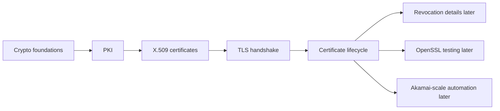

For an Akamai SDET-II interview, certificate lifecycle is especially important because the job description mentions certificate provisioning platforms, SSL/TLS, PKI workflows, and certificate lifecycle automation.

You should be able to explain:

1. Why certificates are issued.
2. Why certificates expire.
3. Why renewal must happen before expiry.
4. Why rotation must avoid downtime.
5. Why revocation exists.
6. How automation tests these workflows.

## One-Screen Mental Model

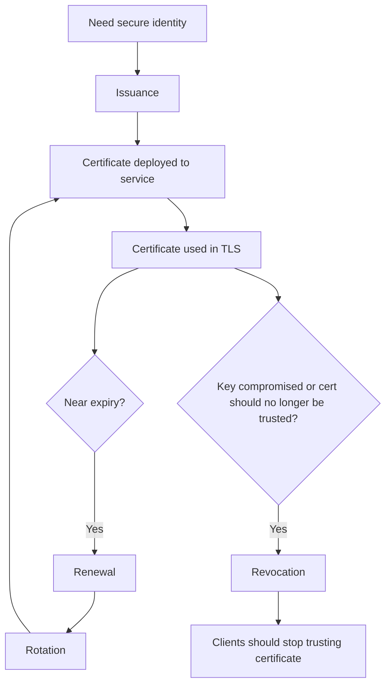

Simple definition:

> Certificate lifecycle is the full journey of a certificate from request and issuance to deployment, renewal, replacement, and early distrust if needed.

Even simpler:

> It is how certificates are born, kept healthy, replaced, and retired.

---

# Topic 1 - Issuance

## 1. The Problem

A server, service, device, or customer domain needs a certificate before clients can trust its public key during TLS.

Without issuance, the service may have:

1. No certificate.
2. A self-signed certificate that clients do not trust.
3. A certificate for the wrong identity.
4. A certificate with the wrong public key.
5. No trusted way to prove ownership of a domain or service identity.

The problem is trusted certificate creation.

For example, a new API endpoint needs to serve:

```text
https://api.customer.com
```

The platform must obtain a certificate whose SAN includes:

```text
DNS: api.customer.com
```

and whose chain is trusted by expected clients.

## 2. Why It Was Invented

Issuance exists because certificates need a controlled process before they are trusted.

Engineers needed a workflow where:

1. A key pair is created or selected.
2. A certificate request is generated.
3. Identity or domain control is validated.
4. A CA signs the certificate.
5. The certificate is returned and installed.
6. The issued certificate can be verified before use.

Without issuance controls, anyone could request a certificate for any name.

That would destroy PKI trust.

## 3. What It Actually Is

Simple definition:

> Certificate issuance is the process of creating a trusted certificate for a specific identity and public key.

Technical definition:

> Certificate issuance is a PKI workflow in which a requester submits certificate identity and public key information, the CA validates authorization or control, and the CA signs and returns an X.509 certificate according to policy.

Important terms:

| Term | Meaning |
|---|---|
| Requester | System or person asking for a certificate |
| Key pair | Public/private key pair for the certificate |
| CSR | Certificate Signing Request |
| Domain validation | Proving control of a DNS name |
| CA | Certificate Authority that signs the certificate |
| Leaf certificate | Issued certificate used by a server or service |
| Certificate chain | Leaf plus intermediate certificates |
| Provisioning platform | Automation system that manages issuance and deployment |

Concept diagram:

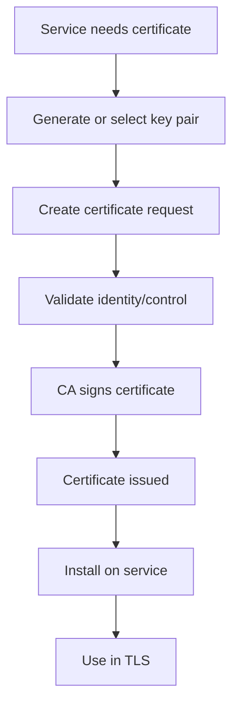

The heart of issuance is:

```text
Validated identity + public key + CA signature = issued certificate
```

## 4. How It Works Internally

A typical issuance workflow:

1. A service owner requests a certificate for one or more names.
2. The platform validates the request format and policy.
3. A key pair is generated or an existing public key is used.
4. A CSR is created with requested identity information.
5. The CA or validation system verifies domain or identity control.
6. The CA builds the certificate body.
7. The CA signs the certificate.
8. The platform receives the certificate and chain.
9. The platform validates the issued certificate.
10. The certificate and private key are deployed to the service.
11. The service starts presenting the certificate during TLS.

Flow diagram:

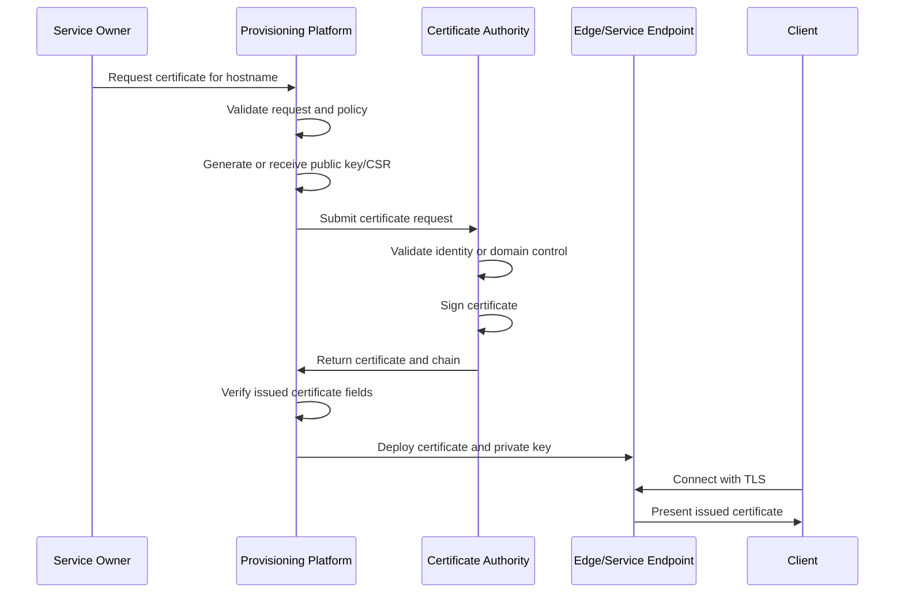

Packet-flow style thinking after issuance:

```text
Client connects to service
Service presents issued certificate
Client checks SAN
Client checks chain
Client checks trust store
Client checks validity period
Client continues TLS if validation succeeds
```

Issuance validation checklist:

```text
Requested hostname:
    api.customer.com

Issued certificate should have:
    SAN includes api.customer.com
    Expected issuer/intermediate
    Correct public key
    Valid time window
    Correct key usage
    Complete chain
```

Comparison diagram:

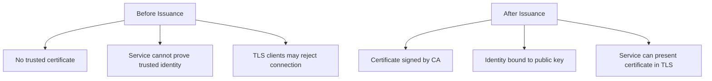

## 5. Real World Example

Human analogy:

Issuance is like applying for a passport.

You do not create your own passport and expect border officers to trust it. You submit identity documents, the authority validates them, and then the authority issues a signed official document.

Computer/network analogy:

A customer adds `shop.customer.com` to an edge delivery platform.

The platform must:

1. Verify the customer is allowed to use that hostname.
2. Obtain a certificate covering that hostname.
3. Deploy it to edge servers.
4. Ensure clients receive the correct certificate during TLS.

SDET automation example:

You write tests that call a certificate provisioning API, request a certificate for a test domain, wait for issuance, fetch the certificate from the endpoint, and verify that the SAN, issuer, chain, validity, and key match expectations.

## 6. Advantages

Issuance creates trusted identity material for secure services.

Main advantages:

| Advantage | Why It Matters |
|---|---|
| Establishes trust | Creates a CA-signed certificate |
| Enables TLS | Service can authenticate to clients |
| Supports automation | Platforms can issue certificates at scale |
| Enforces policy | Invalid or unauthorized requests can be rejected |
| Creates audit trail | Issuance events can be logged and reviewed |

For an edge platform, automated issuance makes it possible to onboard customer domains quickly and securely.

## 7. Limitations

Issuance is sensitive because mistakes create security risk.

Main limitations:

| Limitation | Explanation |
|---|---|
| Wrong SAN breaks clients | Certificate may not match requested hostname |
| Unauthorized issuance is dangerous | Attacker could get certificate for a domain they do not control |
| Key handling risk | Private keys must be protected |
| CA dependency | External CA failures can delay issuance |
| Propagation delay | Certificate may take time to deploy everywhere |
| Policy complexity | Different environments may require different rules |

Common SDET risks:

1. API accepts invalid domains.
2. API issues certificate with missing SAN.
3. Certificate is issued but not deployed.
4. Wrong certificate chain is installed.
5. Private key is mishandled.
6. Status reports success before deployment is actually ready.

## 8. Why Later Technologies Were Needed

Issued certificates are not permanent.

Every certificate has a validity period. Eventually it expires.

If the certificate is not renewed before expiry, clients reject it.

Issuance answers:

> How do we create a trusted certificate?

Renewal answers:

> How do we keep trust working before the certificate expires?

Comparison diagram:

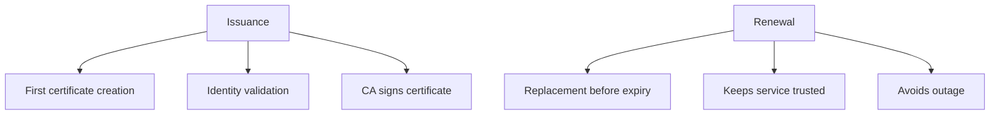

## 9. Interview Questions

### Basic Questions

1. What is certificate issuance?
2. Why does a service need a certificate?
3. What is a CSR?
4. What does a CA do during issuance?
5. What fields should be checked after a certificate is issued?

### Intermediate Questions

1. Why is domain validation important?
2. What can go wrong if SAN is wrong during issuance?
3. Why should issued certificates be validated before deployment?
4. How does issuance relate to TLS?
5. What is the difference between issuing a certificate and deploying it?

### Advanced Questions

1. How would you design an automated test for certificate issuance?
2. What negative tests would you write for unauthorized certificate requests?
3. How would you verify that issued certificate public key matches the request?
4. What failure states should a certificate provisioning API expose?
5. How would you test issuance at scale for many customer hostnames?

### Follow-up Questions

1. Does issuance mean the certificate is already deployed?
2. Does a certificate contain the private key?
3. Why is private key handling important during issuance?
4. What logs would you inspect if issuance succeeded but TLS still fails?
5. What lifecycle stage follows issuance?

---

# Topic 2 - Renewal

## 1. The Problem

Certificates expire.

Every certificate has a validity period:

```text
Not Before: certificate start time
Not After: certificate expiry time
```

After expiry, clients should reject the certificate.

The problem is continuity of trust.

If a production certificate expires, users may see errors and automated clients may fail.

Example failure:

```text
certificate has expired
```

For an edge or delivery platform, expired certificates can cause customer traffic outages.

## 2. Why It Was Invented

Renewal exists because certificates must be replaced before they expire.

Engineers needed a workflow that:

1. Monitors certificate expiry.
2. Starts renewal early.
3. Validates the renewed certificate.
4. Deploys it safely.
5. Confirms clients receive the new certificate.
6. Avoids last-minute outages.

Certificates expire intentionally because permanent certificates would increase risk.

Shorter validity periods reduce the lifetime of stale or poorly controlled certificate material.

## 3. What It Actually Is

Simple definition:

> Certificate renewal is the process of obtaining a new certificate before the old certificate expires.

Technical definition:

> Certificate renewal is a lifecycle workflow that requests and obtains a replacement certificate for the same or updated identity set before the current certificate's validity period ends, then prepares it for deployment and use.

Important terms:

| Term | Meaning |
|---|---|
| Expiry | Time after which certificate should not be trusted |
| Renewal window | Period before expiry when renewal should start |
| Replacement certificate | Newly issued certificate replacing the old one |
| Auto-renewal | Automated renewal without manual intervention |
| Grace period | Operational buffer before expiry |
| Monitoring | Tracking certificate age and renewal status |
| Renewal failure | Failure to obtain or prepare replacement certificate |

Concept diagram:

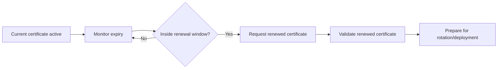

Renewal is not the same as rotation.

Renewal obtains the new certificate. Rotation switches live traffic to use it.

## 4. How It Works Internally

A typical renewal workflow:

1. Platform tracks every certificate and expiry date.
2. Platform identifies certificates entering renewal window.
3. Platform starts renewal request.
4. CA validates identity or reuses allowed validation state.
5. CA issues replacement certificate.
6. Platform validates the new certificate.
7. Platform prepares the certificate for deployment.
8. Rotation workflow installs the new certificate.
9. Monitoring confirms the endpoint presents the new certificate.

Flow diagram:

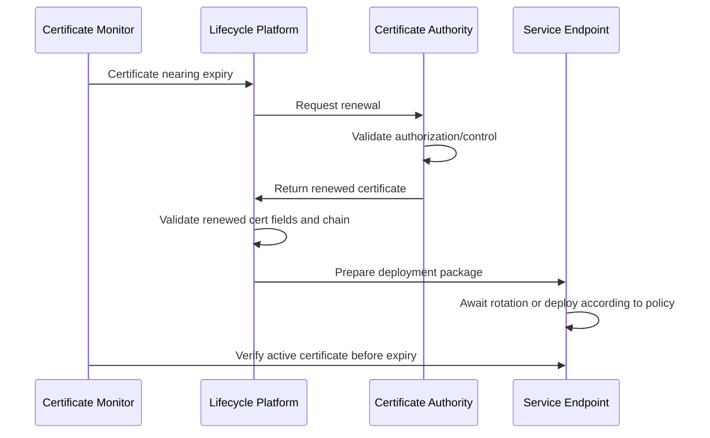

Timeline view:

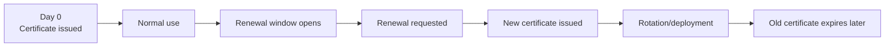

Renewal checks:

```text
Old certificate:
    SAN: api.example.com
    Expiry: soon

Renewed certificate:
    SAN: api.example.com
    New validity period
    Expected issuer
    Valid chain
    Correct key policy
```

Comparison diagram:

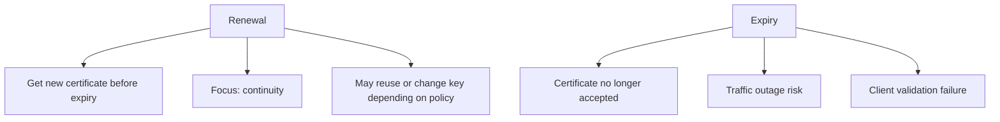

## 5. Real World Example

Human analogy:

Renewal is like renewing a passport before it expires.

You do not wait until you are standing at the airport. You renew early so travel continues without disruption.

Computer/network analogy:

A certificate for `api.customer.com` expires in 30 days. The lifecycle platform detects it, requests a new certificate, validates it, and prepares it for deployment before the old certificate expires.

SDET automation example:

You create a test certificate with a short validity period in a test environment. The automation verifies that renewal starts within the configured renewal window and that the replacement certificate has the expected SAN, issuer, and future expiry.

## 6. Advantages

Renewal prevents certificate expiry outages.

Main advantages:

| Advantage | Why It Matters |
|---|---|
| Prevents expiry failures | Keeps TLS endpoints trusted |
| Supports automation | Reduces manual operations |
| Provides operational buffer | Renewal window gives time to retry |
| Maintains service continuity | Users avoid certificate errors |
| Enables policy updates | New cert can reflect updated rules |

For high-scale platforms, automatic renewal is not optional. Manual renewal does not scale reliably.

## 7. Limitations

Renewal can fail in many ways.

Main limitations:

| Limitation | Explanation |
|---|---|
| CA unavailable | Renewal cannot complete |
| Domain validation fails | CA refuses to issue replacement |
| Wrong renewal timing | Starts too late to recover safely |
| Bad replacement certificate | New certificate missing names or wrong issuer |
| Deployment not completed | Renewal succeeded but traffic still uses old cert |
| Monitoring gaps | Teams may not notice renewal failure |

Important SDET distinction:

```text
Renewal success does not guarantee endpoint success.
```

You must also verify that the renewed certificate is deployed and presented by the service.

## 8. Why Later Technologies Were Needed

Renewal creates a new certificate, but systems still need to switch from the old certificate to the new certificate.

That leads to rotation.

Renewal answers:

> How do we obtain a replacement certificate before expiry?

Rotation answers:

> How do we safely move live traffic from old certificate to new certificate?

Comparison diagram:

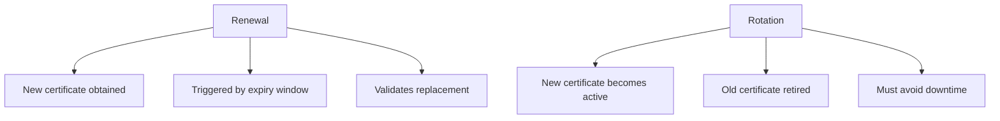

## 9. Interview Questions

### Basic Questions

1. What is certificate renewal?
2. Why do certificates expire?
3. What happens when a certificate expires?
4. What is a renewal window?
5. Is renewal the same as deployment?

### Intermediate Questions

1. Why should renewal start before expiry?
2. What should be validated on a renewed certificate?
3. Why does auto-renewal matter at scale?
4. What is the difference between renewal and rotation?
5. How can a renewal succeed but users still see an expired certificate?

### Advanced Questions

1. How would you test auto-renewal behavior?
2. What failure injection tests would you run for renewal?
3. How would you verify that renewal retries work correctly?
4. How would you test alerting for certificates close to expiry?
5. What metrics would you track for a certificate renewal platform?

### Follow-up Questions

1. Should renewal happen manually or automatically in large systems?
2. What logs would you check for renewal failure?
3. Can renewal change the certificate public key?
4. Should tests verify the endpoint after renewal?
5. What lifecycle stage activates the renewed certificate?

---

# Topic 3 - Rotation

## 1. The Problem

Renewal creates a replacement certificate, but live services still need to start using it.

If rotation is done badly, clients may see:

1. Expired certificate.
2. Wrong certificate.
3. Certificate/private key mismatch.
4. Incomplete chain.
5. TLS handshake failures.
6. Inconsistent behavior across edge locations.

The problem is safe replacement under live traffic.

At scale, a certificate may need to be deployed across many servers, regions, containers, load balancers, or edge nodes.

## 2. Why It Was Invented

Rotation exists because secrets and certificates must be replaced without breaking service.

Engineers needed a workflow that:

1. Installs new certificate material safely.
2. Ensures the private key matches the certificate.
3. Updates the certificate chain.
4. Reloads or restarts services if needed.
5. Verifies endpoints present the new certificate.
6. Allows rollback if something fails.
7. Retires old certificate material after success.

Rotation solves the operational cutover problem.

## 3. What It Actually Is

Simple definition:

> Certificate rotation is the process of replacing the active certificate used by a service with a new certificate.

Technical definition:

> Certificate rotation is an operational lifecycle process that deploys replacement certificate material, updates service configuration, transitions active traffic to the new certificate, verifies successful presentation, and retires old material according to policy.

Important terms:

| Term | Meaning |
|---|---|
| Active certificate | Certificate currently presented by service |
| Replacement certificate | New certificate that should become active |
| Deployment | Installing certificate material onto service infrastructure |
| Reload | Service updates certificate without full restart |
| Rollback | Reverting to previous known-good certificate |
| Propagation | Spread of new certificate across all serving locations |
| Zero-downtime rotation | Replacement without interrupting traffic |

Concept diagram:

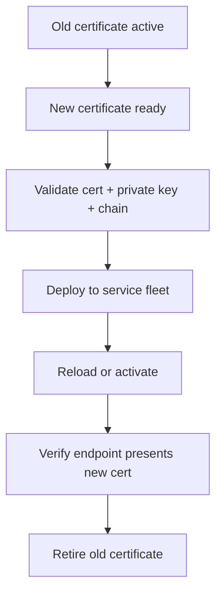

Rotation is the stage where certificate lifecycle touches live traffic most directly.

## 4. How It Works Internally

A typical rotation workflow:

1. New certificate is available.
2. New private key or key reference is available.
3. Platform validates certificate/private key match.
4. Platform validates certificate chain.
5. Platform pushes material to target systems.
6. Services reload certificate configuration.
7. Health checks verify TLS handshakes.
8. External probes verify presented certificate.
9. Traffic continues using new certificate.
10. Old certificate is archived or removed according to policy.

Flow diagram:

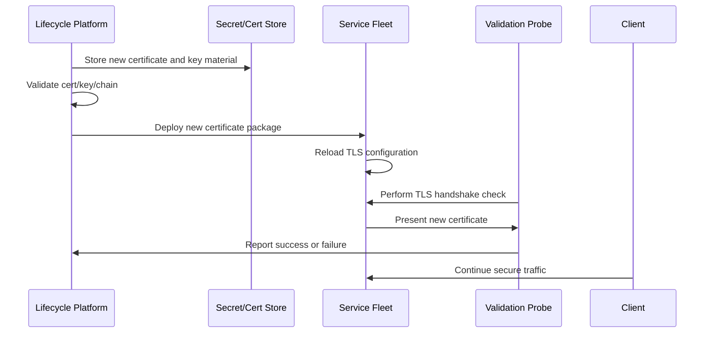

Packet-flow style validation:

```text
Probe connects to hostname with SNI
Service presents certificate
Probe checks:
    Is serial number the new one?
    Is SAN correct?
    Is chain complete?
    Is certificate not expired?
    Does handshake complete?
```

Rotation strategies:

| Strategy | Meaning |
|---|---|
| In-place reload | Service reloads new certificate without restart |
| Rolling deployment | Update one subset of fleet at a time |
| Blue-green | Prepare new environment, then shift traffic |
| Canary | Roll out to small percentage first |
| Emergency rotation | Fast replacement after key compromise or bad cert |

Comparison diagram:

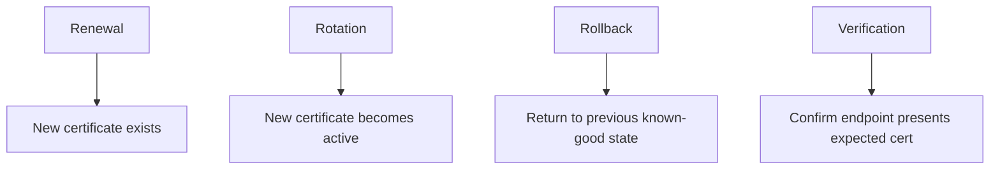

## 5. Real World Example

Human analogy:

Renewal is receiving a new passport.

Rotation is actually replacing the old passport in your travel bag before the trip.

If the new passport stays at home, having renewed it does not help at the airport.

Computer/network analogy:

A new certificate for `shop.customer.com` is issued. The edge platform deploys it to all relevant edge nodes. Probes connect with SNI `shop.customer.com` and verify that each location presents the new certificate.

SDET automation example:

You trigger certificate rotation in a staging environment and verify that:

1. The service continues accepting TLS connections.
2. The presented certificate serial number changes.
3. The SAN remains correct.
4. The certificate chain remains valid.
5. No node continues presenting the old certificate after propagation deadline.

## 6. Advantages

Rotation keeps live services secure and current.

Main advantages:

| Advantage | Why It Matters |
|---|---|
| Prevents expiry outages | New certificate replaces old one |
| Supports key hygiene | Keys can be replaced periodically |
| Enables emergency response | Compromised material can be replaced |
| Supports policy updates | New certs can use updated algorithms or issuers |
| Reduces downtime risk | Good rotation avoids service interruption |

For edge platforms, rotation must be reliable across many locations and hostnames.

## 7. Limitations

Rotation is operationally risky.

Main limitations:

| Limitation | Explanation |
|---|---|
| Partial deployment | Some nodes may serve old cert |
| Cert/key mismatch | TLS may fail if private key does not match |
| Chain mistakes | New cert may deploy with missing intermediate |
| Reload failure | Service may not pick up new cert |
| Cache behavior | Old cert may appear until all systems refresh |
| Rollback complexity | Bad rollback may reintroduce expired or compromised cert |

Common SDET risks:

1. Rotation API reports success before all nodes are updated.
2. Health check only tests service port, not certificate content.
3. Wrong SNI is used during validation.
4. Rollback restores an expired certificate.
5. Rotation works in one region but fails in another.

## 8. Why Later Technologies Were Needed

Rotation replaces certificates during normal operation.

But sometimes a certificate must stop being trusted before expiry.

Examples:

1. Private key compromise.
2. Certificate issued to wrong entity.
3. Domain ownership changed.
4. Security incident.

That leads to revocation.

Rotation answers:

> How do we safely replace the active certificate?

Revocation answers:

> How do we tell clients this certificate should no longer be trusted?

Comparison diagram:

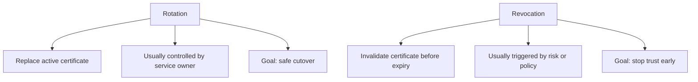

## 9. Interview Questions

### Basic Questions

1. What is certificate rotation?
2. How is rotation different from renewal?
3. Why does a service need to reload after certificate deployment?
4. What is a certificate/private key mismatch?
5. What should be verified after rotation?

### Intermediate Questions

1. Why is rotation risky in distributed systems?
2. What is zero-downtime certificate rotation?
3. Why should validation use SNI?
4. What can happen if the intermediate chain is wrong after rotation?
5. Why is rollback important?

### Advanced Questions

1. How would you design automated tests for certificate rotation?
2. How would you detect partial rotation across edge nodes?
3. What metrics would prove rotation completed successfully?
4. How would you test rollback safety?
5. How would you perform emergency rotation after private key compromise?

### Follow-up Questions

1. Can rotation happen without renewal?
2. Can renewal happen without rotation?
3. What logs would you inspect after failed rotation?
4. How do you verify the active certificate from a client point of view?
5. What lifecycle stage removes trust before expiry?

---

# Topic 4 - Revocation

## 1. The Problem

Certificates expire naturally, but sometimes waiting for expiry is unsafe.

A certificate may need to stop being trusted immediately or as soon as possible.

Reasons include:

1. Private key compromise.
2. Certificate issued incorrectly.
3. Domain no longer controlled by the certificate holder.
4. Service decommissioned.
5. CA policy violation.
6. Security incident.

The problem is early distrust.

If a compromised certificate remains trusted until expiry, attackers may impersonate the service during that time.

## 2. Why It Was Invented

Revocation exists because certificate validity is not only about dates.

Engineers needed a way to say:

> This certificate has not expired yet, but it should no longer be trusted.

Revocation solves the pain point of stopping trust before natural expiry.

It is especially important when private keys are compromised. If an attacker has the private key for a valid certificate, they may be able to impersonate the service unless that certificate is replaced and distrusted.

## 3. What It Actually Is

Simple definition:

> Certificate revocation is the process of marking a certificate as no longer trusted before it expires.

Technical definition:

> Certificate revocation is a PKI lifecycle process in which a CA or authorized system invalidates a previously issued certificate before its scheduled expiration, allowing relying parties to reject it through revocation checking mechanisms.

Important terms:

| Term | Meaning |
|---|---|
| Revocation | Early invalidation of a certificate |
| Revoked certificate | Certificate that should no longer be trusted |
| Revocation reason | Explanation such as key compromise or cessation of operation |
| Relying party | Client that validates and relies on certificate |
| Revocation status | Whether certificate is good, revoked, or unknown |
| CRL | Certificate Revocation List, covered later |
| OCSP | Online Certificate Status Protocol, covered later |

Concept diagram:

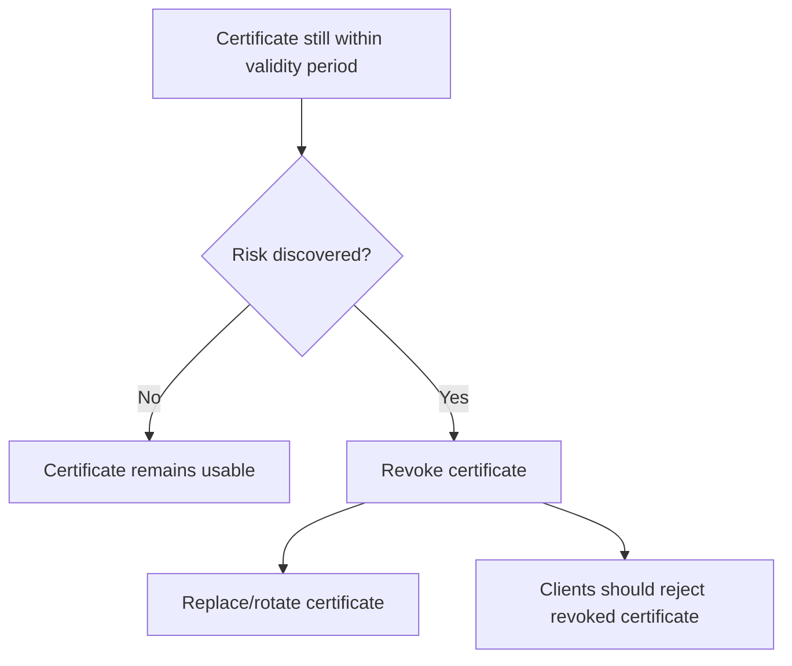

Keep the scope clear:

This section explains why revocation exists and how it fits lifecycle automation. Section 7 explains CRL, OCSP, and OCSP Stapling in detail.

## 4. How It Works Internally

A lifecycle-level revocation workflow:

1. A risk or policy trigger is detected.
2. System identifies affected certificate.
3. System confirms authorization to revoke.
4. CA records the certificate as revoked.
5. Platform initiates replacement issuance if needed.
6. Platform rotates service to a safe certificate.
7. Monitoring verifies old certificate is no longer presented.
8. Clients that perform revocation checking should reject the revoked certificate.

Flow diagram:

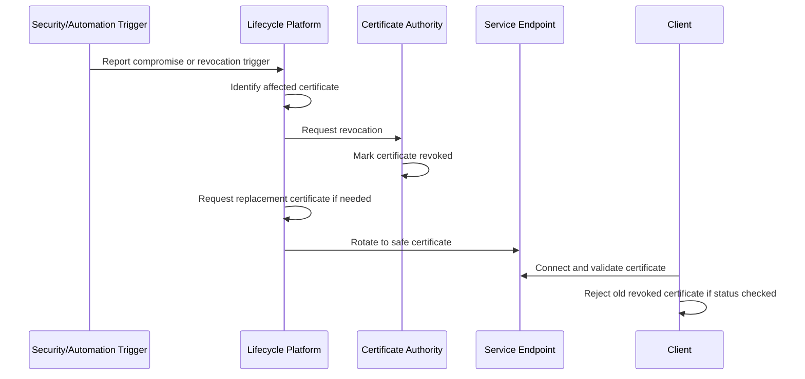

Incident response view:

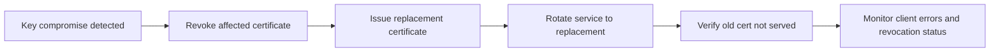

Revocation versus expiry:

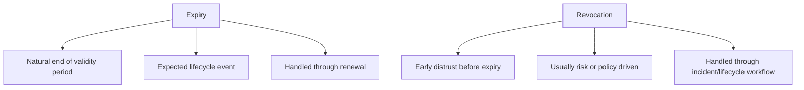

Important:

Revocation by itself does not deploy a replacement certificate. In production, revocation usually must be coordinated with issuance and rotation.

## 5. Real World Example

Human analogy:

A passport may be valid until 2030. But if it is stolen, the issuing authority can cancel it before 2030. Border officers should reject that passport even though the printed expiry date has not passed.

Computer/network analogy:

A private key for `api.example.com` is accidentally exposed in logs.

The response should include:

1. Revoke the certificate associated with that key.
2. Issue a new certificate with safe key material.
3. Rotate the service to the new certificate.
4. Verify the old certificate is not served.
5. Monitor for client validation errors.

SDET automation example:

In a test environment, you simulate a compromise event and verify that the lifecycle system marks the certificate for revocation, requests replacement issuance, rotates the endpoint, and reports correct status transitions.

## 6. Advantages

Revocation reduces the risk window after compromise or mis-issuance.

Main advantages:

| Advantage | Why It Matters |
|---|---|
| Stops trust early | Certificate can be distrusted before expiry |
| Supports incident response | Important after key compromise |
| Handles mis-issuance | Incorrect certificates can be invalidated |
| Strengthens lifecycle control | Trust is not only date-based |
| Enables policy enforcement | Certificates can be revoked for policy violations |

For security-sensitive platforms, revocation is part of responsible certificate operations.

## 7. Limitations

Revocation is important but operationally tricky.

Main limitations:

| Limitation | Explanation |
|---|---|
| Client behavior varies | Not all clients check revocation the same way |
| Status propagation takes time | Revocation information may not be seen instantly |
| Replacement still needed | Revoking without rotation can cause outage |
| Availability concerns | Revocation status systems must be reachable |
| Complexity | CRL/OCSP behavior adds more moving parts |

Common SDET risk:

A test may only verify that the CA marked a certificate revoked. That is not enough for platform behavior.

You should also verify:

1. Replacement certificate is issued.
2. Endpoint stops serving revoked certificate.
3. Monitoring detects old certificate if it appears.
4. Client behavior is understood for revocation checking.

## 8. Why Later Technologies Were Needed

Revocation is the lifecycle concept. But clients need technical mechanisms to learn revocation status.

Those mechanisms are covered later:

1. CRL.
2. OCSP.
3. OCSP Stapling.

Revocation answers:

> Why and when should a certificate stop being trusted before expiry?

CRL/OCSP answer:

> How do clients check whether a certificate has been revoked?

Comparison diagram:

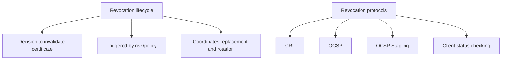

## 9. Interview Questions

### Basic Questions

1. What is certificate revocation?
2. Why would a certificate be revoked before expiry?
3. Is revocation the same as expiry?
4. What is a revoked certificate?
5. What should happen after private key compromise?

### Intermediate Questions

1. Why is revocation not enough without rotation?
2. What are common revocation reasons?
3. Why can revocation behavior differ across clients?
4. How does revocation fit into incident response?
5. What is the high-level purpose of CRL and OCSP?

### Advanced Questions

1. How would you test a certificate revocation workflow?
2. How would you verify that revoked certificates are no longer served?
3. What failure modes exist in revocation automation?
4. How would you design tests for key compromise response?
5. What metrics should a certificate lifecycle platform expose for revocation?

### Follow-up Questions

1. Does revocation automatically create a replacement certificate?
2. Does every client check revocation status the same way?
3. Why is revocation covered again in Section 7?
4. What should happen if a revoked certificate is still being served?
5. How are issuance, rotation, and revocation connected during an incident?

---

# End-to-End Certificate Lifecycle Workflow

This workflow connects all Section 5 topics.

```mermaid
flowchart TD
    A["Certificate needed"] --> B["Issuance"]
    B --> C["Validate issued certificate"]
    C --> D["Deploy certificate"]
    D --> E["TLS endpoint serves certificate"]
    E --> F["Monitor expiry and health"]
    F --> G{"Near expiry?"}
    G -->|"Yes"| H["Renewal"]
    H --> I["Validate renewed certificate"]
    I --> J["Rotation"]
    J --> E
    F --> K{"Compromise or mis-issuance?"}
    K -->|"Yes"| L["Revocation"]
    L --> M["Issue replacement"]
    M --> J
```

Step-by-step:

1. A service needs a certificate for one or more identities.
2. The platform requests issuance.
3. The CA validates identity or control.
4. The CA signs and returns a certificate.
5. The platform validates the certificate fields and chain.
6. The platform deploys the certificate and private key material.
7. The service presents the certificate during TLS.
8. Monitoring tracks expiry, chain health, and endpoint behavior.
9. Renewal starts before expiry.
10. Rotation activates the replacement certificate.
11. If risk is discovered, revocation removes trust early.
12. Replacement and rotation restore safe service.

## Lifecycle Test Matrix for SDETs

| Area | Positive Test | Negative Test |
|---|---|---|
| Issuance | Valid domain gets valid certificate | Unauthorized domain request is rejected |
| SAN | Requested names appear correctly | Missing or extra unauthorized SAN fails validation |
| Chain | Complete chain validates | Missing intermediate fails |
| Renewal | Renewal starts before expiry | CA failure triggers retry and alert |
| Rotation | Endpoint presents new certificate | Cert/private key mismatch fails safely |
| Revocation | Compromised cert is revoked and replaced | Revoked cert still served triggers alert |
| Monitoring | Expiry and deployment status visible | Stale status does not report false success |

## SDET Automation Strategy

For a certificate lifecycle platform, good automation should test both API state and real endpoint behavior.

```mermaid
flowchart TD
    A["Call lifecycle API"] --> B["Verify API status"]
    B --> C["Fetch certificate from endpoint"]
    C --> D["Validate actual certificate fields"]
    D --> E["Verify TLS handshake"]
    E --> F["Check logs, metrics, alerts"]
    F --> G["Assert lifecycle state matches reality"]
```

Important principle:

> Do not trust only control-plane status. Verify the data plane too.

Control plane means the management/API side.

Data plane means the actual traffic-serving endpoint.

Example:

```text
Control plane says:
    certificate rotation complete

Data plane must prove:
    TLS endpoint actually presents new certificate
```

## Common Certificate Lifecycle Failure Scenarios

| Failure | Likely Cause |
|---|---|
| Certificate never issued | Validation failed, CA unavailable, request invalid |
| Certificate issued with wrong SAN | Request mapping or provisioning bug |
| Renewal did not start | Monitoring or scheduler failure |
| Renewal started too late | Renewal window misconfigured |
| Endpoint still shows old certificate | Rotation or reload failed |
| Some regions show old certificate | Partial propagation |
| TLS handshake fails after rotation | Cert/private key mismatch or bad chain |
| Revoked certificate still served | Rotation incomplete or stale configuration |
| API says success but endpoint fails | Control-plane/data-plane mismatch |

## Troubleshooting Flow

```mermaid
flowchart TD
    A["Certificate lifecycle issue"] --> B{"Was certificate issued?"}
    B -->|"No"| C["Check request, validation, CA errors"]
    B -->|"Yes"| D{"Is issued cert correct?"}
    D -->|"No"| E["Check SAN, issuer, key, validity, policy"]
    D -->|"Yes"| F{"Is endpoint serving it?"}
    F -->|"No"| G["Check deployment, reload, propagation"]
    F -->|"Yes"| H{"Is cert near expiry?"}
    H -->|"Yes"| I["Check renewal scheduler, retry, alerts"]
    H -->|"No"| J{"Was cert revoked or compromised?"}
    J -->|"Yes"| K["Check revocation, replacement, emergency rotation"]
    J -->|"No"| L["Check client trust store, TLS policy, network path"]
```

## Section 5 Summary

Certificate lifecycle is the operational system that keeps certificate-based trust working over time.

The four requested topics fit together like this:

| Topic | Main Role |
|---|---|
| Issuance | Create a trusted certificate |
| Renewal | Obtain replacement before expiry |
| Rotation | Activate replacement safely |
| Revocation | Stop trusting a certificate before expiry |

The most important idea:

> Certificate lifecycle is not just about creating certificates. It is about keeping secure traffic working safely across time, failure, scale, and incidents.

## Common Interview Traps

| Trap Question | Strong Answer |
|---|---|
| Is renewal the same as rotation? | No. Renewal obtains a new certificate. Rotation makes it active on the service. |
| Does issuance mean TLS is working? | Not necessarily. The certificate must be deployed and validated at the endpoint. |
| Does revocation automatically fix a compromised service? | No. You also need replacement issuance, rotation, and verification. |
| Is certificate expiry only a security issue? | It is also a reliability issue because clients reject expired certificates. |
| Should automation trust API status only? | No. It should verify the actual TLS endpoint too. |

## Beginner-Friendly Mental Model

```mermaid
flowchart TD
    A["Issuance"] --> B["Get certificate"]
    B --> C["Deploy and use in TLS"]
    C --> D["Renewal"]
    D --> E["Get new certificate before expiry"]
    E --> F["Rotation"]
    F --> G["Switch live service to new certificate"]
    C --> H["Revocation"]
    H --> I["Stop trusting bad certificate early"]
    I --> E
```

## How This Prepares You for Later Sections

Section 6, RSA vs ECDSA, will explain algorithm choices that affect certificate keys, signatures, performance, and migration decisions.

Section 7, Certificate Revocation, will go deeper into CRL, OCSP, and OCSP Stapling.

Section 8, OpenSSL, will show practical commands to generate, inspect, and verify certificate material.

Section 10, Distributed Systems, will explain why lifecycle automation becomes harder across load balancers, reverse proxies, CDNs, failover, and replication.

Section 13, Akamai-Specific System Design, will connect certificate lifecycle to edge servers and large-scale customer traffic.

## Final Self-Check

You are ready to move to RSA vs ECDSA when you can answer these without memorizing:

1. What happens during certificate issuance?
2. Why do certificates need renewal?
3. Why is renewal different from rotation?
4. How do you verify that rotation really succeeded?
5. Why does revocation exist?
6. Why is revocation not enough without replacement and rotation?
7. What certificate lifecycle failures can cause TLS outages?
8. How would an SDET test a certificate provisioning platform end to end?

If these answers feel intuitive, the next sections will be much easier to connect to real-world certificate platforms.
