# SECTION 6 - RSA VS ECDSA

## Purpose of This Section

Section 1 explained public/private keys and digital signatures.

Section 2 explained PKI and certificate trust.

Section 3 explained where public keys and signatures appear inside X.509 certificates.

Section 4 explained how TLS uses certificates during the handshake.

Section 5 explained how certificates are issued, renewed, rotated, and revoked.

Section 6 explains a practical question you will see in security interviews and real certificate platforms:

> Should a certificate use RSA or ECDSA, and why are many modern systems moving toward ECDSA?

This section covers only:

1. RSA and ECDSA at a high level
2. Mathematical foundations
3. Key sizes
4. Performance
5. Security
6. Why modern companies migrate to ECDSA

Important boundary for this file:

This file explains RSA vs ECDSA for interview and SDET understanding. It avoids proof-heavy mathematics. It does not teach OpenSSL commands, TLS packet captures, certificate revocation protocols, or CDN architecture. Those are handled in other sections.

## Why Section 6 Exists in the Roadmap

You already know that certificates contain public keys and signatures.

Now you need to understand what kind of public key and signature algorithm the certificate uses.

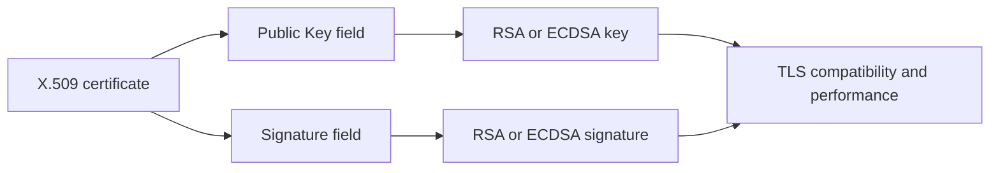

For an Akamai SDET-II interview, this matters because edge systems terminate massive volumes of TLS traffic. Algorithm choice affects:

1. CPU usage.
2. Handshake latency.
3. Certificate size.
4. Bandwidth.
5. Client compatibility.
6. Security policy.
7. Migration strategy.

## One-Screen Mental Model

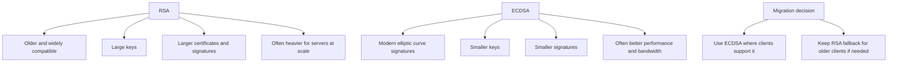

Simple definition:

> RSA and ECDSA are asymmetric cryptographic algorithms used with certificates and digital signatures.

Even simpler:

> They are two different ways for a server or CA to prove, using a private key, that it owns or approved something.

---

# Topic 1 - RSA and ECDSA High-Level Comparison

## 1. The Problem

Certificates need public keys and signatures.

But there is not only one algorithm for public/private key cryptography.

Real systems must choose algorithms that balance:

1. Security.
2. Performance.
3. Certificate size.
4. Client compatibility.
5. Operational risk.
6. Industry policy.

The problem is algorithm choice.

If you choose an algorithm that is too old, too weak, too slow, or unsupported by clients, TLS traffic can fail or become inefficient.

## 2. Why It Was Invented

RSA was invented to provide public-key encryption and digital signatures using mathematics based on large numbers.

ECDSA was invented later to provide digital signatures using elliptic curve cryptography, allowing similar security with much smaller keys.

Engineers needed:

1. RSA for broad public-key cryptography and compatibility.
2. ECDSA for efficient signatures with smaller keys.
3. A migration path as internet traffic grew and performance mattered more.

RSA became widely adopted first.

ECDSA became attractive later because modern systems need strong security with less CPU, smaller certificates, and lower bandwidth overhead.

## 3. What It Actually Is

Simple definition:

> RSA and ECDSA are two different asymmetric signature algorithms used in certificates and TLS.

Technical definition:

> RSA is an asymmetric cryptographic algorithm based on the difficulty of factoring large composite numbers, while ECDSA is a digital signature algorithm based on elliptic curve discrete logarithm problems.

Important terms:

| Term | Meaning |
|---|---|
| RSA | Public-key algorithm used for encryption and signatures |
| ECDSA | Elliptic Curve Digital Signature Algorithm |
| Asymmetric cryptography | Uses public/private key pairs |
| Signature algorithm | Algorithm used to create and verify digital signatures |
| Public key algorithm | Algorithm type of a certificate public key |
| Certificate algorithm | The algorithm used by the certificate key or issuer signature |
| Compatibility | Whether clients support the algorithm |

Concept diagram:

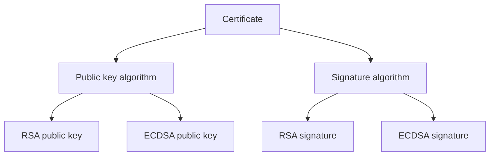

Important:

A certificate can involve algorithm choices in more than one place:

1. The subject public key algorithm.
2. The issuer signature algorithm.
3. The TLS handshake signature algorithm.

For beginner understanding, focus on this:

> RSA and ECDSA are choices for public keys and signatures used by certificates and TLS.

## 4. How It Works Internally

At a high level, both RSA and ECDSA support the same signature pattern:

1. Owner has a private key.
2. Owner has a public key.
3. Owner signs data using the private key.
4. Verifier checks signature using the public key.
5. If verification succeeds, the data was signed by the matching private key.

Flow diagram:

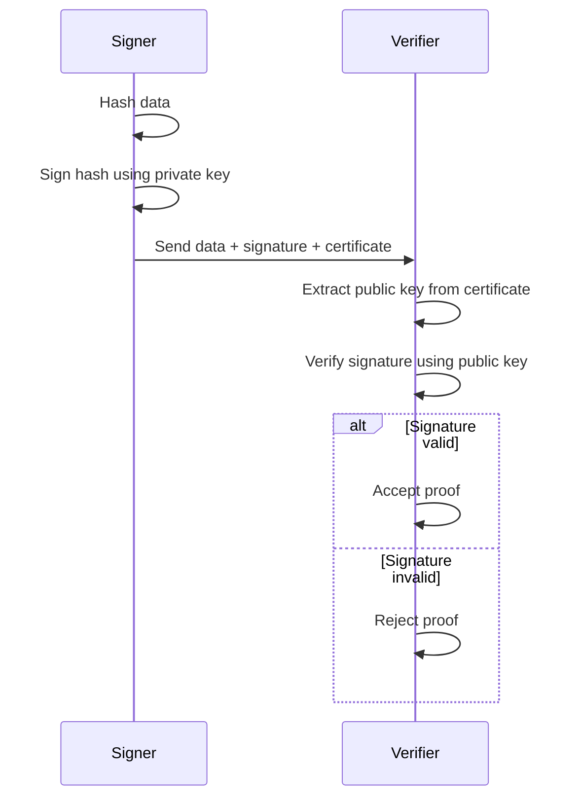

Where they differ:

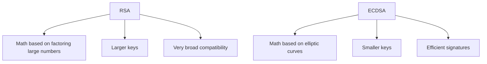

Packet-flow style thinking during TLS:

```text
ClientHello:
    Client says which signature algorithms it supports

Server:
    Selects certificate compatible with client

Certificate:
    Contains RSA or ECDSA public key

Handshake:
    Server proves private key possession using supported signature algorithm

Client:
    Verifies proof using certificate public key
```

## 5. Real World Example

Human analogy:

RSA and ECDSA are like two types of official seals.

Both can prove approval, but one seal is older and larger, while the other is newer and more compact. If every inspection office understands the newer compact seal, it is more efficient. But if some older offices do not understand it, you may still need the older seal as a fallback.

Computer/network analogy:

A TLS server may have:

1. An RSA certificate for older clients.
2. An ECDSA certificate for modern clients.

When a client connects, the server uses the ClientHello to determine what the client supports and selects the best compatible certificate.

## 6. Advantages

High-level advantages:

| Algorithm | Main Advantages |
|---|---|
| RSA | Very widely supported, familiar, mature tooling |
| ECDSA | Smaller keys, smaller signatures, often better performance at scale |

RSA is still useful because compatibility matters.

ECDSA is attractive because efficiency matters.

For edge systems, supporting both may be useful during migration:

```text
Modern client -> ECDSA certificate
Older client  -> RSA certificate
```

## 7. Limitations

High-level limitations:

| Algorithm | Main Limitations |
|---|---|
| RSA | Larger keys and signatures, heavier at scale, bigger certificates |
| ECDSA | Requires good randomness, older client compatibility may be weaker |

Important:

ECDSA is not automatically better in every environment. The correct choice depends on:

1. Client support.
2. Performance goals.
3. Security policy.
4. Certificate authority support.
5. Operational maturity.

## 8. Why Later Technologies Were Needed

This comparison gives the big picture, but interviews often ask why smaller keys can still be secure.

That leads to mathematical foundations.

High-level comparison answers:

> What are RSA and ECDSA used for?

Mathematical foundations answer:

> Why do they have different key sizes and performance characteristics?

Comparison diagram:

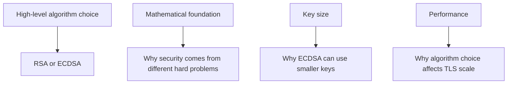

## 9. Interview Questions

### Basic Questions

1. What is RSA?
2. What is ECDSA?
3. Are RSA and ECDSA symmetric or asymmetric algorithms?
4. Where do RSA and ECDSA appear in certificates?
5. Why might a server have both RSA and ECDSA certificates?

### Intermediate Questions

1. Why is ECDSA often considered more efficient than RSA?
2. Why is RSA still used if ECDSA is efficient?
3. How does ClientHello affect RSA/ECDSA certificate selection?
4. What does signature algorithm compatibility mean?
5. What is the difference between a public key algorithm and a signature algorithm?

### Advanced Questions

1. How would you test RSA and ECDSA certificate selection on a TLS endpoint?
2. How would you verify that older clients still work during ECDSA migration?
3. What operational risks exist when supporting dual certificates?
4. How can certificate algorithm choice affect edge performance?
5. What telemetry would help decide whether RSA fallback is still needed?

### Follow-up Questions

1. Does ECDSA encrypt application data?
2. Does RSA always mean insecure?
3. Can one TLS endpoint support both RSA and ECDSA?
4. Why is algorithm migration gradual in large systems?
5. What topic explains why ECDSA keys are smaller?

---

# Topic 2 - Mathematical Foundations

## 1. The Problem

People often hear:

```text
RSA 2048-bit key
ECDSA 256-bit key
```

and assume RSA must be stronger because 2048 is larger than 256.

That is wrong.

The problem is misunderstanding key size across different algorithms.

Key sizes cannot be compared directly unless the algorithms are based on the same mathematical problem.

RSA and ECDSA are based on different hard problems, so their key sizes mean different things.

## 2. Why It Was Invented

RSA and ECDSA were invented from different mathematical ideas.

RSA uses arithmetic with very large numbers. Its security is tied to the difficulty of factoring a large number into the two prime numbers used to create it.

ECDSA uses elliptic curve mathematics. Its security is tied to the difficulty of solving the elliptic curve discrete logarithm problem.

Engineers created these systems because they needed public/private key cryptography where:

1. Creating keys is feasible.
2. Signing with private key is feasible.
3. Verifying with public key is feasible.
4. Recovering the private key from the public key is infeasible.

## 3. What It Actually Is

Simple definition:

> RSA and ECDSA are secure because they are easy to use in one direction but extremely hard to reverse without the private key.

Technical definition:

> RSA security relies on the computational difficulty of factoring large composite integers, while ECDSA security relies on the difficulty of deriving an elliptic curve private scalar from its public curve point.

Important terms:

| Term | Meaning |
|---|---|
| Hard problem | Math problem easy one way but hard to reverse |
| Prime number | Number divisible only by 1 and itself |
| Factoring | Breaking a large number into smaller factors |
| Elliptic curve | Special mathematical curve used in ECC |
| Discrete logarithm | Hard reverse problem behind many public-key systems |
| Scalar | Secret number used as an elliptic curve private key |
| Curve point | Public value derived from elliptic curve math |

Concept diagram:

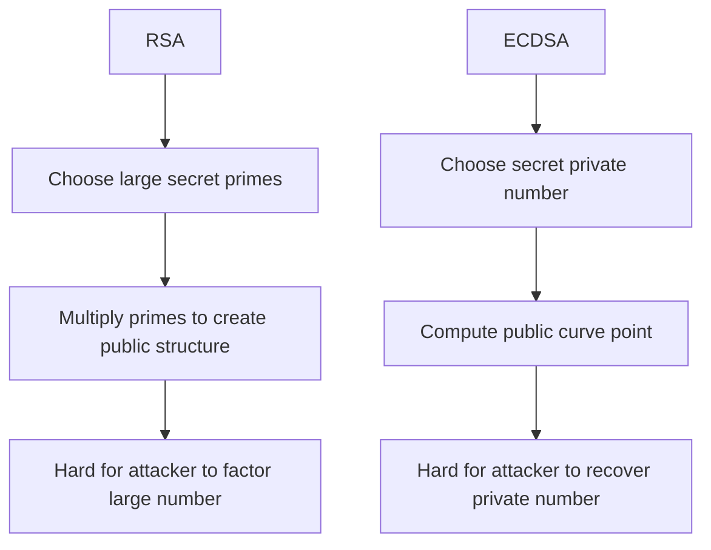

The goal is the same:

> Public key can be shared, but private key should remain infeasible to recover.

## 4. How It Works Internally

RSA intuition:

1. Pick two very large prime numbers.
2. Multiply them together.
3. The product is part of the public key structure.
4. Multiplication is easy.
5. Factoring the product back into the original primes is extremely hard when the numbers are large enough.
6. The private key depends on those secret prime numbers.

ECDSA intuition:

1. Pick a secret number as the private key.
2. Use elliptic curve math to compute a public point.
3. Going from private key to public key is efficient.
4. Going from public key back to private key is computationally infeasible when the curve is strong.
5. Signatures prove knowledge of the private key without revealing it.

Flow diagram:

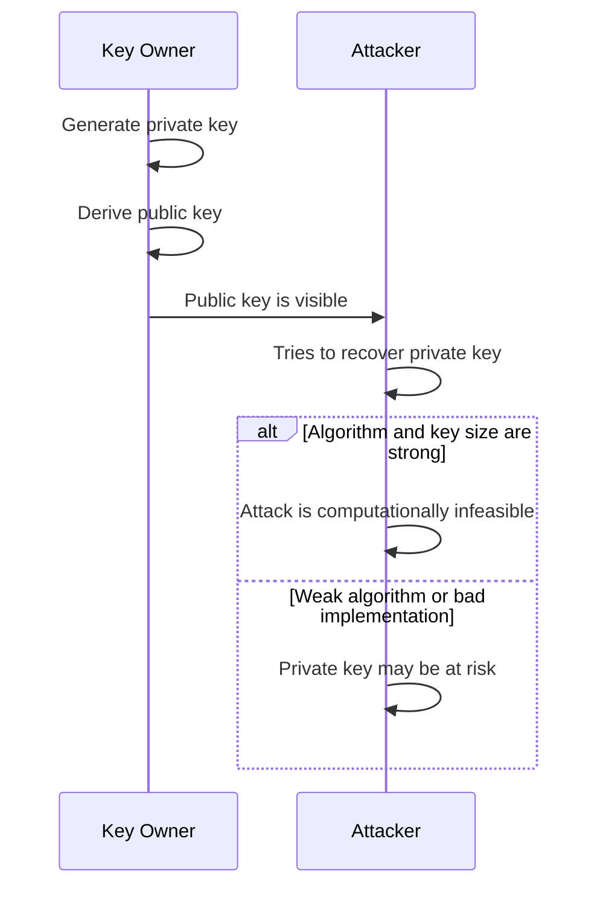

Comparison diagram:

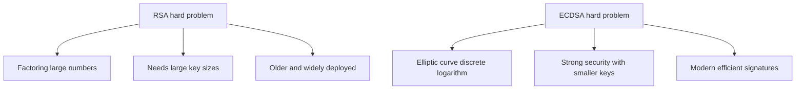

Important:

You do not need to solve the math in an interview. You need to explain the intuition clearly:

```text
RSA and ECDSA are based on different hard mathematical problems.
Because the problems are different, equivalent security uses different key sizes.
```

## 5. Real World Example

Human analogy:

Two safes may have different lock designs.

One safe uses a huge mechanical key. Another uses a compact biometric lock. You cannot judge security only by physical key size because the lock mechanisms are different.

Computer/network analogy:

An RSA 2048-bit certificate and an ECDSA P-256 certificate can provide roughly comparable security levels even though the key sizes look very different. The algorithms are based on different math, so direct bit-count comparison is misleading.

## 6. Advantages

Understanding the math foundation helps avoid bad assumptions.

Main advantages:

| Understanding | Why It Matters |
|---|---|
| Different hard problems | Explains why key sizes differ |
| One-way intuition | Explains public/private key safety |
| Equivalent security | Helps compare algorithms correctly |
| Interview clarity | Avoids "2048 is always stronger than 256" mistake |
| Testing insight | Helps understand policy and algorithm choices |

For SDETs, this helps interpret certificate policies and algorithm migration requirements.

## 7. Limitations

High-level math intuition is not enough to implement cryptography.

Main limitations:

| Limitation | Explanation |
|---|---|
| Implementation details are delicate | Crypto code should use proven libraries |
| Curve choice matters | Not every curve is equally accepted |
| Randomness matters | ECDSA signing can fail badly with poor nonce handling |
| Policy matters | Organizations define allowed algorithms |
| Quantum threat is separate | Large future quantum computers would affect RSA and ECC differently from today's assumptions |

Important SDET rule:

> Do not implement RSA or ECDSA yourself in test frameworks. Use trusted libraries and test system behavior.

## 8. Why Later Technologies Were Needed

Once you understand that the math problems differ, key size differences become easier to understand.

Mathematical foundations answer:

> Why are RSA and ECDSA not compared by raw bit count?

Key sizes answer:

> What key sizes are commonly used and how do they compare in practice?

Comparison diagram:

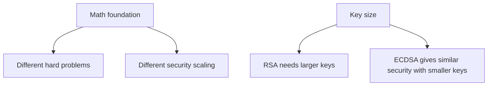

## 9. Interview Questions

### Basic Questions

1. What mathematical problem is RSA based on?
2. What mathematical idea is ECDSA based on?
3. Why is 2048-bit RSA not directly comparable to 256-bit ECDSA?
4. What does "hard problem" mean in cryptography?
5. Why should you avoid implementing crypto math yourself?

### Intermediate Questions

1. Why can ECDSA use smaller keys than RSA?
2. What does it mean that public-key math is easy one way and hard to reverse?
3. How would you explain RSA factoring intuition to a beginner?
4. How would you explain elliptic curve intuition without heavy math?
5. Why does algorithm policy matter even if the math is strong?

### Advanced Questions

1. What risks exist if ECDSA randomness is bad?
2. Why should SDET automation rely on libraries for cryptographic operations?
3. How can unsupported curves cause client compatibility failures?
4. What is the difference between algorithm strength and implementation security?
5. How would you test that a platform rejects disallowed key algorithms?

### Follow-up Questions

1. Does a larger key always mean better security?
2. Does ECDSA use the same math as RSA?
3. Why are equivalent security levels important?
4. How does math foundation affect certificate size?
5. What topic should follow mathematical foundations?

---

# Topic 3 - Key Sizes

## 1. The Problem

Security teams and certificate platforms must choose allowed key sizes.

Too small:

```text
Weak security or rejected by policy
```

Too large:

```text
More CPU, larger certificates, slower handshakes
```

The problem is choosing key sizes that provide strong security without unnecessary cost.

RSA and ECDSA key sizes look very different, so SDETs must understand how to compare them correctly.

## 2. Why It Was Invented

Key size policies exist because cryptographic strength changes with algorithm and attack capability.

Engineers needed standard security levels so organizations could say:

1. This key size is too weak.
2. This key size is acceptable.
3. This key size is stronger than needed for this use case.
4. This algorithm is preferred for performance or policy.

RSA needed larger keys as computing power increased.

ECDSA became attractive because it provides strong security with smaller keys.

## 3. What It Actually Is

Simple definition:

> Key size is the length of the cryptographic key, but its meaning depends on the algorithm.

Technical definition:

> Key size is the number of bits in a cryptographic key parameter, used as one input to estimating security strength, performance, storage size, and protocol overhead for a given algorithm.

Important terms:

| Term | Meaning |
|---|---|
| Bit | Basic unit of binary data |
| Key size | Number of bits in key material |
| Security level | Approximate work needed to break the key |
| RSA 2048 | Common RSA key size |
| RSA 3072 | Larger RSA key size for stronger security |
| P-256 | Common elliptic curve around 256-bit size |
| P-384 | Larger elliptic curve around 384-bit size |

Concept diagram:

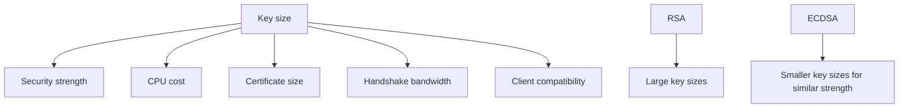

Simple comparison:

| Approximate Security Level | RSA Key Size | ECDSA Curve |
|---|---|---|
| Common modern baseline | RSA 2048 | P-256 |
| Higher security | RSA 3072 | P-256 or P-384 depending on policy |
| Stronger long-term profile | RSA 7680 | P-384 |

Do not memorize this table as exact universal law. Use it as interview intuition:

> ECDSA provides similar security with much smaller keys.

## 4. How It Works Internally

Key size affects several parts of the certificate and TLS ecosystem:

1. Certificate public key field.
2. Signature size.
3. Certificate chain size.
4. Handshake bytes sent over the network.
5. CPU required for signing or verification.
6. Client compatibility and policy.

Flow diagram:

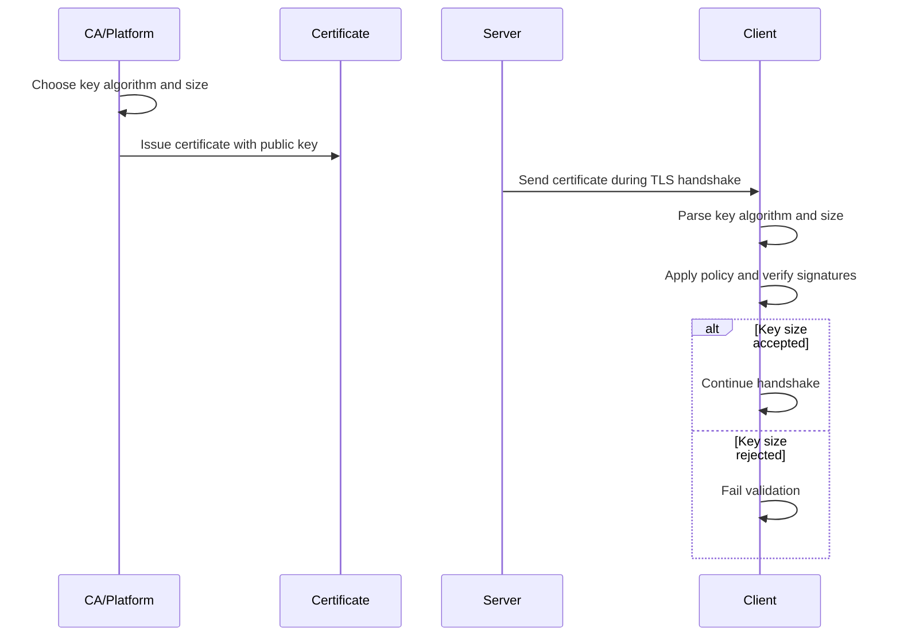

Key size effect comparison:

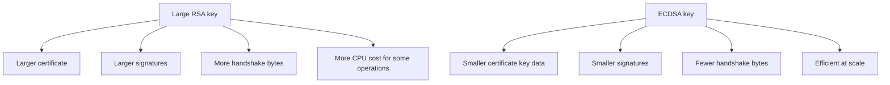

Packet-flow thinking:

```text
TLS handshake sends certificate chain
Certificate chain contains public keys and signatures
Larger key/signature material means more bytes
More bytes matter at high traffic volume and high latency links
```

## 5. Real World Example

Human analogy:

Imagine two ID cards provide the same trust level.

One is a large paper document with many pages. The other is a compact smart card. If millions of people must present IDs every day, the compact version is easier to carry, scan, and process.

Computer/network analogy:

At edge scale, a few hundred extra bytes per TLS handshake can matter when multiplied by millions or billions of connections. ECDSA certificates and signatures can reduce handshake size compared with RSA.

## 6. Advantages

Smaller secure keys can improve efficiency.

Main advantages of ECDSA key size:

| Advantage | Why It Matters |
|---|---|
| Smaller public keys | Smaller certificates |
| Smaller signatures | Less handshake bandwidth |
| Similar security with fewer bits | Better efficiency |
| Better fit for mobile/edge | Useful where latency and bandwidth matter |
| Cleaner modern policy | Aligns with modern crypto migration goals |

Main RSA key size advantage:

| Advantage | Why It Matters |
|---|---|
| Familiar sizes | Easy policy and tooling support |
| Broad compatibility | Older clients often support RSA |
| Operational familiarity | Teams understand RSA deployment well |

## 7. Limitations

Key size alone does not decide security.

Main limitations:

| Limitation | Explanation |
|---|---|
| Algorithm matters | 256-bit ECDSA is not same as 256-bit RSA |
| Implementation matters | Bad crypto implementation can break strong algorithms |
| Client support matters | Some clients may not support ECDSA curves |
| Policy varies | Organizations may require specific sizes |
| Larger is not always better | Oversized keys can hurt performance without practical benefit |

Important SDET warning:

Do not write tests that compare raw key sizes across algorithms as if bigger always means stronger.

Better test logic:

```text
If algorithm is RSA, enforce allowed RSA sizes.
If algorithm is ECDSA, enforce allowed curves.
```

## 8. Why Later Technologies Were Needed

Key size explains certificate and handshake size.

But performance also depends on signing and verification costs.

Key sizes answer:

> How large are the keys and signatures?

Performance answers:

> How expensive are the cryptographic operations at runtime?

Comparison diagram:

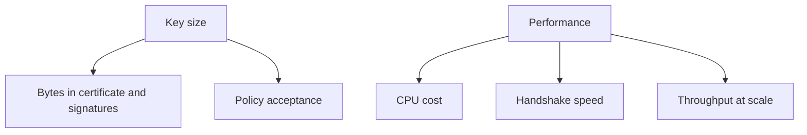

## 9. Interview Questions

### Basic Questions

1. What is key size?
2. Why are RSA keys larger than ECDSA keys for similar security?
3. What is a common RSA key size?
4. What is a common ECDSA curve?
5. Why should raw bit sizes not be compared directly across algorithms?

### Intermediate Questions

1. How does key size affect TLS handshake size?
2. Why might a larger RSA key create more overhead?
3. How should tests validate allowed key sizes?
4. Why can ECDSA reduce certificate size?
5. What client compatibility issues can appear with ECDSA curves?

### Advanced Questions

1. How would you test a certificate platform's key size policy?
2. How would you detect that a service accidentally issued weak RSA certificates?
3. What telemetry would show handshake byte savings after ECDSA adoption?
4. Why might an organization move from RSA 2048 to ECDSA P-256?
5. How can certificate chain size affect edge performance?

### Follow-up Questions

1. Is RSA 4096 always better than RSA 2048?
2. Is P-256 weaker just because 256 is smaller than 2048?
3. Should key size tests be algorithm-specific?
4. Does key size affect certificate storage?
5. What topic explains runtime cost?

---

# Topic 4 - Performance

## 1. The Problem

TLS handshakes require cryptographic operations.

At small scale, the difference between RSA and ECDSA may seem minor.

At edge scale, small differences become large:

```text
Small CPU cost per handshake x millions of handshakes = major infrastructure cost
```

The problem is cryptographic performance at scale.

Systems need secure algorithms that do not waste CPU, bandwidth, or latency.

## 2. Why It Was Invented

Performance optimization became critical because secure traffic became the default.

Modern platforms must handle:

1. Many TLS handshakes per second.
2. Many customer domains.
3. Global latency requirements.
4. Mobile and low-bandwidth clients.
5. CPU-sensitive edge infrastructure.

ECDSA became attractive because it can reduce certificate size and often reduce server-side signing cost compared with large RSA keys.

RSA remained common because it was widely supported and familiar.

## 3. What It Actually Is

Simple definition:

> Performance means how much CPU, bandwidth, and time an algorithm costs during certificate validation and TLS handshakes.

Technical definition:

> Cryptographic performance is the computational and network overhead introduced by key generation, signing, verification, certificate transmission, and handshake processing for a selected algorithm and key size.

Important terms:

| Term | Meaning |
|---|---|
| Signing cost | CPU needed to create a signature |
| Verification cost | CPU needed to verify a signature |
| Handshake latency | Time added by TLS setup |
| Handshake size | Bytes exchanged during setup |
| Throughput | Number of handshakes or connections handled per second |
| CPU utilization | Processing load on server/client |
| Offload | Moving crypto work to special hardware or edge layer |

Concept diagram:

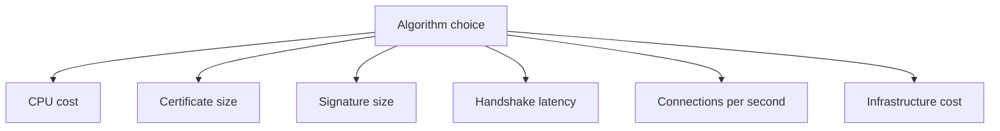

## 4. How It Works Internally

Performance impact appears in several places:

1. Certificate chain transmission.
2. Server signing operation during handshake.
3. Client signature verification.
4. Key generation in provisioning workflows.
5. Load on TLS termination infrastructure.

Flow diagram:

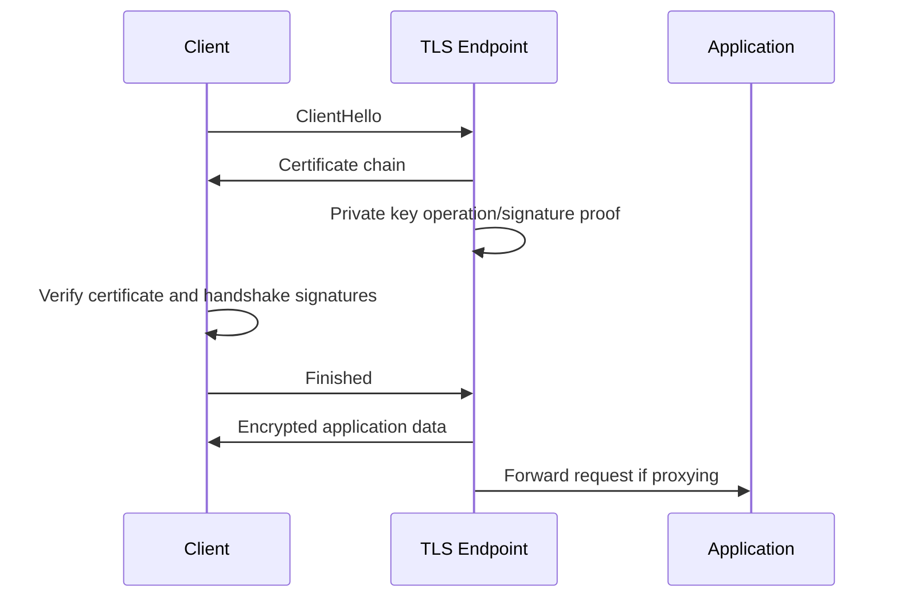

RSA versus ECDSA performance comparison:

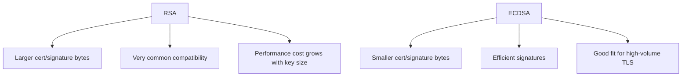

General practical pattern:

| Area | RSA | ECDSA |
|---|---|---|
| Certificate size | Larger | Smaller |
| Signature size | Larger | Smaller |
| Server signing | Often heavier, especially with larger keys | Often faster |
| Client verification | RSA verification can be fast | ECDSA verification can be costlier than signing |
| Bandwidth | More bytes | Fewer bytes |
| Compatibility | Excellent | Good modern support, weaker with old clients |

Do not treat this table as a benchmark result for every system. Real performance depends on libraries, hardware, key sizes, curves, and traffic patterns.

Packet-flow thinking:

```text
During TLS handshake:
    Certificate bytes cross the network
    Server performs private-key proof
    Client verifies certificates and signatures

At high scale:
    Smaller bytes and cheaper operations reduce cost
```

## 5. Real World Example

Human analogy:

Imagine a checkpoint that verifies IDs for millions of people daily.

If one ID format takes even slightly longer to scan and uses more paper, the total queue and resource cost becomes noticeable.

Computer/network analogy:

An edge server terminates TLS for many customer hostnames. If ECDSA reduces handshake size and server CPU per handshake, the platform can handle more secure connections with the same hardware, assuming clients support ECDSA.

## 6. Advantages

ECDSA performance advantages:

| Advantage | Why It Matters |
|---|---|
| Smaller handshake data | Reduces network overhead |
| Efficient server signing | Helps TLS termination scale |
| Smaller certificates | Better for mobile and high-latency networks |
| Lower infrastructure cost | More connections per CPU budget |
| Better modern fit | Aligns with high-volume HTTPS traffic |

RSA performance advantages:

| Advantage | Why It Matters |
|---|---|
| Fast verification in many implementations | Useful for some client validation paths |
| Mature hardware/software support | Predictable behavior |
| Broad compatibility | Reduces fallback complexity for old clients |

## 7. Limitations

Performance is not the only decision.

Main limitations:

| Limitation | Explanation |
|---|---|
| Benchmarking varies | Results depend on library, CPU, and key size |
| Compatibility matters | ECDSA may fail for old clients |
| Client cost matters too | Server efficiency is not the whole story |
| Operational complexity | Dual RSA/ECDSA certificates require correct selection |
| Security policy wins | Fast but disallowed algorithms cannot be used |

Important SDET mindset:

If a migration claims "ECDSA is faster," test the actual system:

1. Handshake success rate.
2. Negotiated certificate type.
3. CPU usage.
4. Handshake latency.
5. Error rate for older clients.
6. Certificate selection correctness.

## 8. Why Later Technologies Were Needed

Performance explains why ECDSA is attractive, but security must also be considered.

Performance answers:

> Which algorithm is more efficient in our environment?

Security answers:

> Which algorithm and configuration are safe enough under current policy?

Comparison diagram:

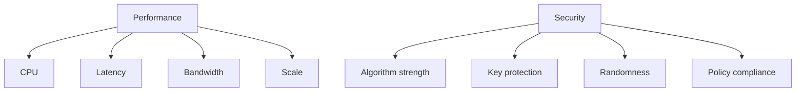

## 9. Interview Questions

### Basic Questions

1. Why does algorithm choice affect TLS performance?
2. Which usually has smaller signatures, RSA or ECDSA?
3. Why does certificate size matter in TLS?
4. What is handshake latency?
5. Why does performance matter more at edge scale?

### Intermediate Questions

1. Why can ECDSA reduce server CPU cost?
2. Why is RSA still useful from a compatibility perspective?
3. What metrics would you measure during RSA to ECDSA migration?
4. Why can smaller certificate chains improve TLS performance?
5. Why should performance claims be benchmarked in the actual environment?

### Advanced Questions

1. How would you design a performance test comparing RSA and ECDSA endpoints?
2. How would you ensure test clients actually negotiate ECDSA?
3. What could make ECDSA migration appear successful while older clients fail?
4. How can dual-certificate selection affect performance results?
5. What edge metrics would indicate improved TLS efficiency?

### Follow-up Questions

1. Is ECDSA always faster for every operation?
2. Does performance matter if traffic volume is low?
3. Can hardware acceleration affect RSA vs ECDSA decisions?
4. Why should SDETs measure both success rate and latency?
5. What topic must be considered along with performance?

---

# Topic 5 - Security

## 1. The Problem

An algorithm can be fast but still unsafe if:

1. Key sizes are weak.
2. Randomness is broken.
3. Old padding or signature schemes are used incorrectly.
4. Clients accept disallowed algorithms.
5. Private keys are exposed.
6. Certificate validation is skipped.

The problem is secure algorithm use, not just algorithm name.

Saying "we use RSA" or "we use ECDSA" is not enough. You must know whether the configuration is safe.

## 2. Why It Was Invented

Security policies exist because cryptography ages and implementations make mistakes.

Engineers needed rules that define:

1. Allowed algorithms.
2. Minimum RSA key sizes.
3. Allowed elliptic curves.
4. Allowed signature algorithms.
5. Key rotation requirements.
6. Validation behavior.

RSA and ECDSA can both be secure when used correctly.

They can both be unsafe when used badly.

## 3. What It Actually Is

Simple definition:

> Security is whether the algorithm, key size, implementation, and operational handling resist realistic attacks.

Technical definition:

> Cryptographic security depends on the strength of the underlying hard problem, approved parameters, correct implementation, strong randomness, private key protection, and correct protocol validation.

Important terms:

| Term | Meaning |
|---|---|
| Algorithm strength | Resistance of the algorithm to known attacks |
| Parameter | Key size, curve, padding, or mode choice |
| Randomness | Unpredictable values needed for secure key generation/signing |
| Private key protection | Preventing unauthorized key access |
| Padding | Structured data added in some RSA operations |
| Policy compliance | Meeting organizational or industry rules |
| Deprecation | Marking an algorithm or parameter as no longer acceptable |

Concept diagram:

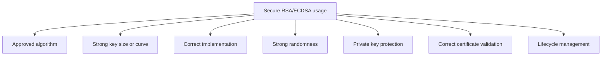

## 4. How It Works Internally

Security review flow:

1. Identify certificate public key algorithm.
2. Identify key size or curve.
3. Identify signature algorithm.
4. Check whether values are allowed by policy.
5. Check whether private key is protected.
6. Check whether implementation uses trusted libraries.
7. Check whether TLS clients validate certificates correctly.
8. Check lifecycle: renewal, rotation, and revocation readiness.

Flow diagram:

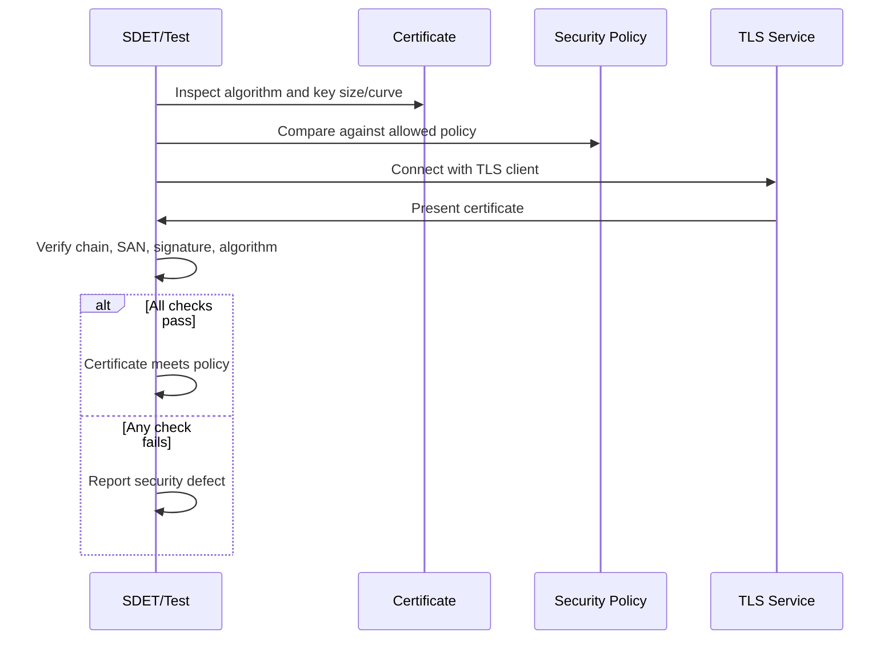

RSA security concerns:

1. Key size must be strong enough.
2. Old or unsafe padding choices must be avoided.
3. Very old RSA keys should be rotated.
4. Private key must be protected.

ECDSA security concerns:

1. Approved curve must be used.
2. Signing randomness or nonce generation must be safe.
3. Private key must be protected.
4. Client support must be verified.

Comparison diagram:

```mermaid
flowchart TD
    A["RSA security"] --> A1["Minimum key size"]
    A --> A2["Safe signature scheme"]
    A --> A3["Private key protection"]
    A --> A4["Legacy policy risk"]

    B["ECDSA security"] --> B1["Approved curve"]
    B --> B2["Safe nonce/randomness"]
    B --> B3["Private key protection"]
    B --> B4["Compatibility validation"]
```

Important:

ECDSA signatures require a per-signature value. If that value is reused or predictable in unsafe implementations, the private key can be exposed. Trusted crypto libraries handle this; do not invent signing code.

## 5. Real World Example

Human analogy:

Two lock brands may both be secure, but only if installed correctly, with strong keys, and not left under the doormat.

The brand name alone does not guarantee safety.

Computer/network analogy:

A platform may enforce:

```text
RSA certificates must use at least 2048-bit keys.
ECDSA certificates must use approved curves such as P-256.
Certificates using deprecated algorithms are rejected.
Private keys must not be exportable or logged.
```

SDET automation example:

You test certificate issuance APIs by requesting disallowed algorithms and verifying the platform rejects them with clear errors.

## 6. Advantages

Security-aware algorithm policy prevents weak certificates from entering production.

Main advantages:

| Advantage | Why It Matters |
|---|---|
| Prevents weak key usage | Reduces risk of cryptographic compromise |
| Enforces consistency | All services follow approved standards |
| Supports compliance | Meets internal and external requirements |
| Improves incident response | Known policies simplify investigation |
| Reduces legacy exposure | Old algorithms can be phased out |

For SDETs, policy-driven testing is a strong interview point.

## 7. Limitations

Security policy can create operational challenges.

Main limitations:

| Limitation | Explanation |
|---|---|
| Strict policy can break old clients | Some clients may not support modern algorithms |
| Migration takes time | Certificates, clients, and services must align |
| False confidence is possible | Passing algorithm checks does not prove whole system security |
| Monitoring required | New weak certs must be detected continuously |
| Implementation bugs still matter | Correct policy cannot fix broken crypto code |

Important SDET mindset:

Security testing must include both positive and negative tests.

Positive:

```text
Allowed RSA/ECDSA certificates are accepted.
```

Negative:

```text
Weak RSA key is rejected.
Unsupported curve is rejected.
Deprecated signature algorithm is rejected.
```

## 8. Why Later Technologies Were Needed

Security and performance together explain migration pressure.

Security answers:

> Which algorithms and parameters are acceptable?

Migration answers:

> How do companies safely move from RSA-heavy deployments to ECDSA without breaking clients?

Comparison diagram:

```mermaid
flowchart TD
    A["Security"] --> A1["Allowed algorithms"]
    A --> A2["Allowed key sizes/curves"]
    A --> A3["Private key protection"]

    B["Migration"] --> B1["Client compatibility"]
    B --> B2["Dual certificate support"]
    B --> B3["Gradual rollout"]
    B --> B4["Telemetry and fallback"]
```

## 9. Interview Questions

### Basic Questions

1. Can RSA be secure?
2. Can ECDSA be insecure if implemented badly?
3. Why does private key protection matter?
4. What is an approved curve?
5. Why is algorithm name alone not enough to prove security?

### Intermediate Questions

1. What security risks exist with weak RSA keys?
2. Why is randomness important for ECDSA?
3. What should a certificate policy enforce?
4. Why should disallowed algorithms be rejected during issuance?
5. How can old client compatibility conflict with security policy?

### Advanced Questions

1. How would you test a platform's cryptographic policy enforcement?
2. What negative tests would you write for RSA and ECDSA issuance?
3. How would you detect weak certificates already deployed?
4. What incident risks exist if ECDSA nonce generation is flawed?
5. How do lifecycle controls support algorithm security?

### Follow-up Questions

1. Is ECDSA automatically secure just because it is modern?
2. Is RSA automatically insecure because it is older?
3. Why should crypto libraries be trusted and maintained?
4. What is the relationship between security and migration?
5. What topic explains why companies move to ECDSA?

---

# Topic 6 - Why Companies Migrate to ECDSA

## 1. The Problem

Companies with high TLS traffic need secure connections at massive scale.

RSA-only deployments can create avoidable costs:

1. Larger certificates.
2. Larger signatures.
3. More handshake bytes.
4. More server CPU for private key operations.
5. Higher latency in some environments.
6. More infrastructure cost.

The problem is scaling secure traffic efficiently while maintaining compatibility.

## 2. Why It Was Invented

ECDSA was not invented only for migration. It was created as an efficient elliptic curve signature algorithm.

Migration to ECDSA became attractive because modern companies need:

1. Strong security.
2. Lower handshake overhead.
3. Better performance.
4. Smaller certificates.
5. Better mobile and edge efficiency.
6. Modern cryptographic posture.

As client support improved, ECDSA became practical for public internet use.

## 3. What It Actually Is

Simple definition:

> ECDSA migration means gradually moving certificate and TLS deployments from RSA-only toward ECDSA where clients support it.

Technical definition:

> ECDSA migration is an operational cryptographic transition in which systems issue, deploy, negotiate, and monitor ECDSA certificates and signatures, often while maintaining RSA fallback for clients that lack ECDSA support.

Important terms:

| Term | Meaning |
|---|---|
| Migration | Controlled move from one technology choice to another |
| Dual certificate | Supporting both RSA and ECDSA certificates |
| Fallback | Using RSA when client cannot use ECDSA |
| Client capability | Algorithms advertised by client |
| Telemetry | Data showing client support, errors, and performance |
| Rollout | Gradual deployment process |
| Compatibility matrix | List of clients and supported algorithms |

Concept diagram:

```mermaid
flowchart TD
    A["Client connects"] --> B["ClientHello advertises capabilities"]
    B --> C{"Client supports ECDSA?"}
    C -->|"Yes"| D["Serve ECDSA certificate"]
    C -->|"No"| E["Serve RSA certificate fallback"]
    D --> F["Efficient modern handshake"]
    E --> G["Compatibility preserved"]
```

The most common migration model:

```text
Prefer ECDSA for modern clients.
Keep RSA fallback for older clients.
Use telemetry to decide when fallback can be reduced.
```

## 4. How It Works Internally

An ECDSA migration workflow:

1. Measure current client support for ECDSA.
2. Confirm certificate authority supports ECDSA issuance.
3. Update certificate provisioning platform to issue ECDSA certificates.
4. Configure TLS endpoints to support RSA and ECDSA certificates.
5. Use ClientHello signature algorithm support to select certificate.
6. Roll out gradually.
7. Monitor handshake success, error rates, and performance.
8. Keep RSA fallback if required.
9. Eventually reduce RSA usage if telemetry allows.

Flow diagram:

```mermaid
sequenceDiagram
    participant Client as Client
    participant Edge as TLS Endpoint
    participant Store as Cert Store
    participant Metrics as Telemetry

    Client->>Edge: ClientHello with supported algorithms
    Edge->>Store: Select compatible certificate
    alt Client supports ECDSA
        Store->>Edge: ECDSA certificate
    else Client lacks ECDSA support
        Store->>Edge: RSA certificate
    end
    Edge->>Client: TLS handshake with selected certificate
    Edge->>Metrics: Report algorithm, success/failure, latency
```

Migration comparison:

```mermaid
flowchart TD
    A["RSA-only"] --> A1["Maximum legacy compatibility"]
    A --> A2["Higher size/CPU overhead"]

    B["ECDSA-only"] --> B1["Efficient modern posture"]
    B --> B2["May break old clients"]

    C["Dual RSA + ECDSA"] --> C1["Best compatibility during migration"]
    C --> C2["More operational complexity"]
    C --> C3["Requires correct certificate selection"]
```

SDET migration checks:

```text
Modern client:
    Should receive ECDSA certificate

Legacy client:
    Should receive RSA certificate if fallback is required

Metrics:
    Should record selected algorithm
    Should track handshake failures by client type
    Should show performance impact
```

## 5. Real World Example

Human analogy:

A company introduces digital ID cards because they are faster to scan. But some old checkpoints still only accept paper IDs. During migration, employees carry both. Modern checkpoints use digital IDs, while old checkpoints still accept paper.

Computer/network analogy:

An edge platform stores both RSA and ECDSA certificates for `shop.customer.com`.

A modern browser advertises ECDSA support in ClientHello, so the edge serves the ECDSA certificate.

An old client does not support ECDSA, so the edge serves the RSA certificate.

SDET automation example:

You create two test clients:

1. One that supports ECDSA.
2. One that only supports RSA.

Then you verify that the endpoint selects the expected certificate and completes the handshake in both cases.

## 6. Advantages

ECDSA migration advantages:

| Advantage | Why It Matters |
|---|---|
| Lower handshake overhead | Smaller certificates and signatures |
| Better server efficiency | Helps high-volume TLS termination |
| Strong modern security | Good security with smaller keys |
| Better mobile/edge fit | Less bandwidth and latency overhead |
| Future-oriented posture | Aligns with modern cryptographic standards |

Dual deployment advantages:

| Advantage | Why It Matters |
|---|---|
| Preserves compatibility | Older clients can still connect |
| Enables gradual rollout | Lower migration risk |
| Supports measurement | Telemetry shows real client behavior |
| Reduces outage risk | Fallback path remains available |

## 7. Limitations

ECDSA migration has real operational risks.

Main limitations:

| Limitation | Explanation |
|---|---|
| Older clients may fail | Not every client supports ECDSA |
| Dual certificates add complexity | More issuance, renewal, rotation, and monitoring |
| Certificate selection bugs | Wrong cert may be served for client capabilities |
| Telemetry gaps | Hard to know when RSA fallback is safe to remove |
| CA and tooling support needed | Full lifecycle must support ECDSA |

Common SDET risks:

1. ECDSA certificate issued but not selected.
2. RSA fallback removed too early.
3. Renewal works for RSA but fails for ECDSA.
4. Rotation updates one algorithm certificate but not the other.
5. Metrics do not show which algorithm was negotiated.

## 8. Why Later Technologies Were Needed

ECDSA migration connects algorithm choice back to lifecycle and TLS operations.

After this section, the roadmap moves to certificate revocation details.

Why?

Because once certificates are issued and deployed, systems must also know how to stop trusting them when something goes wrong.

ECDSA migration answers:

> Why and how do modern systems move toward ECDSA?

Certificate revocation answers:

> How do clients learn that a certificate should no longer be trusted?

Comparison diagram:

```mermaid
flowchart TD
    A["Algorithm migration"] --> A1["RSA to ECDSA"]
    A --> A2["Performance and security modernization"]
    A --> A3["Compatibility management"]

    B["Revocation"] --> B1["Early distrust"]
    B --> B2["CRL/OCSP mechanisms"]
    B --> B3["Incident response"]
```

## 9. Interview Questions

### Basic Questions

1. Why are companies migrating to ECDSA?
2. Why not remove RSA immediately?
3. What is dual certificate support?
4. How does ClientHello help select RSA or ECDSA?
5. What is RSA fallback?

### Intermediate Questions

1. What metrics would you monitor during ECDSA rollout?
2. What client compatibility issues can appear during migration?
3. How does ECDSA reduce handshake overhead?
4. Why does lifecycle automation need to support both RSA and ECDSA during migration?
5. What could go wrong if only modern clients are tested?

### Advanced Questions

1. How would you design an end-to-end ECDSA migration test plan?
2. How would you validate dual certificate selection at an edge endpoint?
3. How would you decide whether it is safe to reduce RSA fallback?
4. What failure scenarios would you inject during migration?
5. How would you test renewal and rotation for both RSA and ECDSA certificates?

### Follow-up Questions

1. Does ECDSA migration change TLS application data encryption?
2. Can the same hostname have both RSA and ECDSA certificates?
3. How can telemetry prevent migration outages?
4. What should happen when a client does not support ECDSA?
5. What is the next roadmap topic after RSA vs ECDSA?

---

# End-to-End RSA vs ECDSA Decision Workflow

This workflow connects all Section 6 topics.

```mermaid
flowchart TD
    A["Need certificate for TLS service"] --> B["Check security policy"]
    B --> C["Check client compatibility"]
    C --> D{"Modern clients mostly support ECDSA?"}
    D -->|"Yes"| E["Issue ECDSA certificate"]
    D -->|"No or mixed"| F["Issue RSA + ECDSA dual certificates"]
    E --> G["Deploy and test TLS"]
    F --> G
    G --> H["Monitor negotiated algorithm"]
    H --> I["Measure CPU, latency, errors"]
    I --> J{"Fallback still needed?"}
    J -->|"Yes"| K["Keep RSA fallback"]
    J -->|"No"| L["Prefer or move toward ECDSA-only policy"]
```

Step-by-step:

1. Define allowed algorithms and key sizes.
2. Measure client support.
3. Decide RSA-only, ECDSA-only, or dual certificate mode.
4. Issue certificates using approved algorithms.
5. Deploy certificates safely.
6. Verify TLS selection with different client capabilities.
7. Monitor handshake success and performance.
8. Keep RSA fallback until telemetry proves it is safe to reduce.
9. Continue lifecycle automation for all active certificate types.

## RSA vs ECDSA SDET Test Matrix

| Area | RSA Test | ECDSA Test | Dual-Cert Test |
|---|---|---|---|
| Issuance | RSA allowed sizes accepted | Approved curves accepted | Both certs issued for same hostname |
| Negative policy | Weak RSA rejected | Unsupported curve rejected | Wrong combination rejected |
| TLS selection | RSA-only client succeeds | ECDSA-capable client gets ECDSA | Correct cert chosen by ClientHello |
| Renewal | RSA renewal works | ECDSA renewal works | Both renewal paths monitored |
| Rotation | RSA cert rotates safely | ECDSA cert rotates safely | No partial algorithm rotation |
| Metrics | RSA usage recorded | ECDSA usage recorded | Algorithm selection visible |
| Compatibility | Old clients work | Modern clients work | Fallback works as expected |

## Common RSA vs ECDSA Failure Scenarios

| Failure | Likely Cause |
|---|---|
| Old client fails after migration | RSA fallback removed too early |
| Modern client still gets RSA | Server selection logic not using ECDSA |
| ECDSA certificate issued but TLS fails | Client lacks curve/signature support or chain issue |
| Renewal succeeds for RSA only | Lifecycle automation missing ECDSA path |
| Rotation updates RSA but not ECDSA | Dual certificate deployment bug |
| Metrics show unknown algorithm | Telemetry missing negotiated certificate type |
| Policy rejects certificate | Key size or curve not allowed |

## Troubleshooting Flow

```mermaid
flowchart TD
    A["RSA/ECDSA issue"] --> B{"Did certificate issue successfully?"}
    B -->|"No"| C["Check key size, curve, CA support, policy"]
    B -->|"Yes"| D{"Does TLS handshake succeed?"}
    D -->|"No"| E["Check client algorithm support, chain, SAN, private key"]
    D -->|"Yes"| F{"Was expected cert selected?"}
    F -->|"No"| G["Check ClientHello signature algorithms and server selection logic"]
    F -->|"Yes"| H{"Performance changed as expected?"}
    H -->|"No"| I["Check traffic mix, metrics, hardware, cert chain size"]
    H -->|"Yes"| J["Monitor compatibility and lifecycle health"]
```

## Section 6 Summary

RSA and ECDSA are both asymmetric cryptographic algorithms used with certificates and TLS signatures.

The requested Section 6 topics fit together like this:

| Topic | Main Role |
|---|---|
| RSA vs ECDSA overview | Explains what the algorithms are used for |
| Mathematical foundations | Explains why their key sizes differ |
| Key sizes | Explains size and security-level tradeoffs |
| Performance | Explains CPU, bandwidth, and scale impact |
| Security | Explains safe parameters and implementation concerns |
| ECDSA migration | Explains why modern companies prefer ECDSA where possible |

The most important idea:

> ECDSA is attractive because it provides strong security with smaller keys and signatures, but migration must respect client compatibility.

## Common Interview Traps

| Trap Question | Strong Answer |
|---|---|
| Is 2048-bit RSA automatically stronger than 256-bit ECDSA? | No. Different algorithms use different hard problems, so key sizes are not directly comparable. |
| Is RSA obsolete everywhere? | No. RSA is still widely supported, but many systems prefer ECDSA for efficiency where clients support it. |
| Is ECDSA always safe? | It must use approved curves, trusted libraries, strong randomness, and proper key protection. |
| Can one endpoint support both RSA and ECDSA? | Yes. Many systems use dual certificates and select based on client capabilities. |
| Does ECDSA change symmetric encryption of application data? | No. It affects certificate/signature behavior, not the bulk data encryption algorithm directly. |

## Beginner-Friendly Mental Model

```mermaid
flowchart TD
    A["Need TLS certificate"] --> B{"Client compatibility known?"}
    B -->|"Modern clients"| C["Prefer ECDSA"]
    B -->|"Mixed or old clients"| D["Support RSA fallback"]
    C --> E["Smaller keys/signatures"]
    C --> F["Better scale efficiency"]
    D --> G["Compatibility preserved"]
    E --> H["Monitor performance"]
    F --> H
    G --> H
```

## How This Prepares You for Later Sections

Section 7, Certificate Revocation, will explain CRL, OCSP, and OCSP Stapling, which determine whether a certificate should still be trusted before expiry.

Section 8, OpenSSL, will show practical commands to generate RSA and ECDSA keys, inspect certificates, and verify certificate algorithms.

Section 10, Distributed Systems, will explain why algorithm choice matters at scale across load balancers, reverse proxies, and CDNs.

Section 13, Akamai-Specific System Design, will connect RSA/ECDSA certificate selection to edge traffic, customer hostnames, and global TLS termination.

## Final Self-Check

You are ready to move to Certificate Revocation when you can answer these without memorizing:

1. What are RSA and ECDSA used for in certificates and TLS?
2. Why are RSA and ECDSA key sizes not directly comparable?
3. Why can ECDSA use smaller keys?
4. How does algorithm choice affect TLS performance?
5. What security risks exist with RSA and ECDSA?
6. Why do companies migrate to ECDSA?
7. Why is RSA fallback often still needed?
8. How would an SDET test RSA/ECDSA certificate selection and migration?

If these answers feel intuitive, you are ready to study revocation mechanisms in detail.
